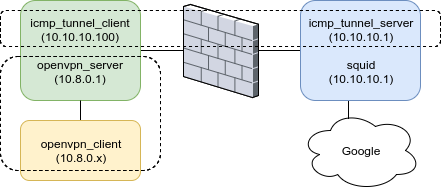

## Doc Objective
- Create ICMP tunnel
- Configure OpenVPN client with adding routing to ICMP tunnel server, so that OpenVPN client knows where to route

#### Reference Docs
- https://github.com/albertzak/hanstunnel
- [http://code.gerade.org/hans/](http://code.gerade.org/hans/)
- http://thomer.com/icmptx/
- [https://labs.mwrinfosecurity.com/tools/pivot-with-ping/](https://labs.mwrinfosecurity.com/tools/pivot-with-ping/)
- https://github.com/jamesbarlow/icmptunnel

## Architecture



## Steps

#### Install hans
- Download from [source](https://sourceforge.net/projects/hanstunnel/files/source/)

- Install on __both__ server and client
```
tar -xzvf hans-version.tar.gz
cd hans-version
make
```

- Run as server by root (blue one)
```
sudo ./hans -s 10.10.10.0 -p password
[sudo] echo 1 > /proc/sys/net/ipv4/icmp_echo_ignore_all
```

- Run as client by root (green one)
```
sudo ./hans -c SERVER_IP -p password
```

where ```SERVER_IP``` is tunnel_server's public IP. Now you can ping between server (blue) and client (green)

- (optional) Add route on a VPN client (yellow one) manually
```
ip route add 10.10.10.0/24 dev tun0
```
Then you can ping between server (blue) and VPN_client (yellow)

#### Modify ```/etc/openvpn/server.conf``` on OpenVPN Server
```
push "route 10.0.0.0 255.255.0.0"
push "route 10.10.10.0 255.255.255.0"
```

Restart OpenVPN server to take effective

#### Questions:

- In output of ```ip r```, what is ```inet 10.8.0.6 peer 10.8.0.5/32``` and its relationship?

```
14: tun0: <POINTOPOINT,MULTICAST,NOARP,UP,LOWER_UP> mtu 1500 qdisc fq_codel state UNKNOWN group default qlen 100
    link/none
    inet 10.8.0.6 peer 10.8.0.5/32 scope global tun0
       valid_lft forever preferred_lft forever
    inet6 fe80::7f26:def3:b4e5:3055/64 scope link stable-privacy
       valid_lft forever preferred_lft forever
```

- Why is output NIC ```ens32``` instead of ```tun0``` in iptables rules

```
iptables -t nat -A POSTROUTING -o ens32 -s 10.10.10.0/24 -j MASQUERADE
```
