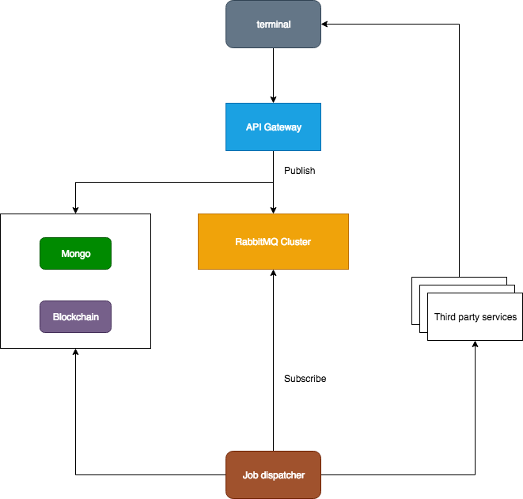

## Doc Objective
- Deploy RabbitMQ by Swarm to labeled (dedicated) nodes
- Store queue data in persistent volume


#### Why RabbitMQ

- Upstream doesn't mind whether downstream run successfully or not. For example, our API service would call lots of third part services, such as SMS service, blockchain service, etc. But It should run as normal even if these services failed.

- Upstream do care about the result of the downstream, but it will take too long. In our case, API service save one record into MongoDB, then our client receive this event and review it, response a comment finally, if we didn't use MQ, the final result would depends on us and our client.

#### How to use

The most important feature is __decouple__.

<center></center>


#### Reference Documents
- [Ephemeral cluster](https://github.com/docker-library/rabbitmq/issues/122)
- [Persistent cluster from Kuznero](http://www.kuznero.com/posts/docker/rabbitmq-cluster.html)
- [Sample yaml from Bitnami](https://libraries.io/github/bitnami/bitnami-docker-rabbitmq)

#### Pre- requisite
- Docker Swarm pre- configured
- Requires 3 docker containers in RabbitMQ cluster

## Steps

#### Create persistent volume on each rabbitmq node respectively

```
mkdir -p /data/rabbitmq
```

#### Add labels to all container nodes

```shell
docker node update --label-add host=0 x6tatdw3tdwz60b9de8tr5afc
docker node update --label-add host=1 ukke4vc1seshcm7v0gcpc0hru
...
```

where ```x6tatdw3tdwz60b9de8tr5afc``` and ```ukke4vc1seshcm7v0gcpc0hru``` are ```host0``` and ```host1``` respectively. Do the same on all other nodes.

and where ```host``` of ```host=0``` is a variable of label

#### Create a Swarm stack yaml
```shell
ubuntu@host6:/data/yaml$ cat rabbitmq.yaml
```

```yaml
version: "3"

networks:
  rabbitmq:

services:
  rabbitmq1:
    image: rabbitmq:3.6.12-management
    networks:
      - rabbitmq
    ports:
      - 15672:15672
      - 5672:5672
    volumes:
      - /data/rabbitmq:/var/lib/rabbitmq
    environment:
      RABBITMQ_ERLANG_COOKIE: 'ilovebeam'
      RABBITMQ_DEFAULT_USER: 'rabbit'
      RABBITMQ_DEFAULT_PASS: 'secret_pass'
    deploy:
      placement:
        constraints: [node.labels.host==6]
      replicas: 1

  rabbitmq2:
    image: rabbitmq:3.6.12-management
    networks:
      - rabbitmq
    volumes:
      - /data/rabbitmq:/var/lib/rabbitmq
    environment:
      RABBITMQ_ERLANG_COOKIE: 'ilovebeam'
      RABBITMQ_DEFAULT_USER: 'rabbit'
      RABBITMQ_DEFAULT_PASS: 'secret_pass'
    deploy:
      placement:
        constraints: [node.labels.host==5]

  rabbitmq3:
    image: rabbitmq:3.6.12-management
    networks:
      - rabbitmq
    volumes:
      - /data/rabbitmq:/var/lib/rabbitmq
    environment:
      RABBITMQ_ERLANG_COOKIE: 'ilovebeam'
      RABBITMQ_DEFAULT_USER: 'rabbit'
      RABBITMQ_DEFAULT_PASS: 'secret_pass'
    deploy:
      placement:
        constraints: [node.labels.host==4]
```

#### Deploy stack
```shell
docker stack deploy --compose-file=rabbitmq.yaml rabbitmq
```

#### Check deployment status
```shell
docker stack ls
docker stack ps rabbitmq
```

The output tells on which node the containers are deployed.

```shell
ubuntu@host6:/data/yaml$ docker stack ps rabbitmq
ID                  NAME                   IMAGE                        NODE                DESIRED STATE       CURRENT STATE          ERROR               PORTS
o47dnqgn1whh        rabbitmq_rabbitmq2.1   rabbitmq:3.6.12-management   host5               Running             Running 14 hours ago                       
1hrqjtplng45        rabbitmq_rabbitmq1.1   rabbitmq:3.6.12-management   host6               Running             Running 14 hours ago                       
6gsjkjlr7w1j        rabbitmq_rabbitmq3.1   rabbitmq:3.6.12-management   fabric              Running             Running 14 hours ago                       
```

#### Setup Rabbitmq cluster
Join the 2nd and 3rd rabbitmq nodes with the 1st node

- Stop_app on the 2nd container (on host5 in our case)

```
docker exec -it $(docker ps -qf name=rabbit) /bin/bash -c "rabbitmqctl stop_app"
```

- Join the 2nd node with the 1st one

```
docker exec -it $(docker ps -qf name=rabbit) /bin/bash -c "rabbitmqctl join_cluster rabbit@c0662a357e8b"
```

where ```c0662a357e8b``` is the 1st rabbitmq container ID

- Start_app on the 2nd container

```
docker exec -it $(docker ps -qf name=rabbit) /bin/bash -c "rabbitmqctl start_app"
```

- Repeat the above steps for the 3rd rabbitmq node

- Check the cluster status on the 1st container

```
docker exec -it $(docker ps -qf name=rabbit) /bin/bash -c "rabbitmqctl cluster_status"
Cluster status of node rabbit@c0662a357e8b
[{nodes,[{disc,[rabbit@8462de11ee97,rabbit@8d4231c663e8,
                rabbit@c0662a357e8b]}]},
 {running_nodes,[rabbit@8462de11ee97,rabbit@8d4231c663e8,rabbit@c0662a357e8b]},
 {cluster_name,<<"rabbit@c0662a357e8b">>},
 {partitions,[]},
 {alarms,[{rabbit@8462de11ee97,[]},
          {rabbit@8d4231c663e8,[]},
          {rabbit@c0662a357e8b,[]}]}]
```

<br>
<br>
__End of Steps__
<br>
<br>

The following document describes how to create a cluster of __ephemeral__ rabbitmq for reference. I just want to demonstrate how ```docker service scale``` works

#### Create a RabbitMQ service

- Create an overlay network for queue cluster
```
docker network create --driver overlay rabbitcluster  
```

- Check the created network
```shell
docker network inspect rabbitcluster
```

- Create a docker service on one of Swarm Manager
```shell
docker service create --name rabbitmq \
  -e RABBITMQ_ERLANG_COOKIE='whateveryoulike' \
  --network rabbitcluster rabbitmq
```

- Define the scale
```shell
docker service scale rabbitmq=3
```

- Check the created service
```shell
docker service list
ID                  NAME                MODE                REPLICAS            IMAGE               PORTS
5ql1dneb39ph        rabbitmq            replicated          3/3                 rabbitmq:latest
```

- Check service ps
```shell
docker service ps rabbitmq
ID                  NAME                IMAGE               NODE                DESIRED STATE       CURRENT STATE        ERROR               PORTS
9scy14kq3fm7        rabbitmq.1          rabbitmq:latest     firstbox            Running             Running 3 days ago                       
xqph3gpfmtpq        rabbitmq.2          rabbitmq:latest     host6               Running             Running 3 days ago                       
950gh5c2tqmk        rabbitmq.3          rabbitmq:latest     host3               Running             Running 3 days ago                       
```

You would have to log into particular node to figure out MQ's container iD. In our case, ```rabbitmq.2``` container ID is ```1cce0c6d87c1``` running on host6

#### Join the 2nd and 3rd RabbitMQ nodes into the 1st node
- Stop & reset the 3rd RabbitMQ node then join the 1st one

```shell
  docker exec -i -t 3148eaa70072 /bin/bash -c "rabbitmqctl stop_app"
  docker exec -i -t 3148eaa70072 /bin/bash -c "rabbitmqctl reset"
  docker exec -i -t 3148eaa70072 /bin/bash -c "rabbitmqctl join_cluster rabbit@1cce0c6d87c1"
  docker exec -i -t 3148eaa70072 /bin/bash -c "rabbitmqctl start_app"
```

where ```3148eaa70072``` is the 3rd RabbitMQ container ID and ```1cce0c6d87c1``` is the node ID on which 1st RabbitMQ node is running

- Repeat the above step on the 2nd RabbitMQ node

```2224958c1c80``` is the 2nd node on which ```rabbitmq.3``` is running

- Check RabbitMQ status

```shell
  ubuntu@host6:~$ docker exec -i -t 1cce0c6d87c1 /bin/bash -c "rabbitmqctl cluster_status"
  Cluster status of node rabbit@1cce0c6d87c1
  [{nodes,[{disc,[rabbit@1cce0c6d87c1,rabbit@2224958c1c80,
                  rabbit@3148eaa70072]}]},
  {running_nodes,[rabbit@2224958c1c80,rabbit@3148eaa70072,rabbit@1cce0c6d87c1]},
  {cluster_name,<<"rabbit@1cce0c6d87c1">>},
  {partitions,[]},
  {alarms,[{rabbit@2224958c1c80,[]},
          {rabbit@3148eaa70072,[]},
          {rabbit@1cce0c6d87c1,[]}]}]
```
