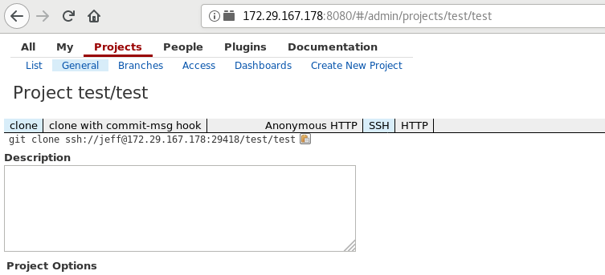
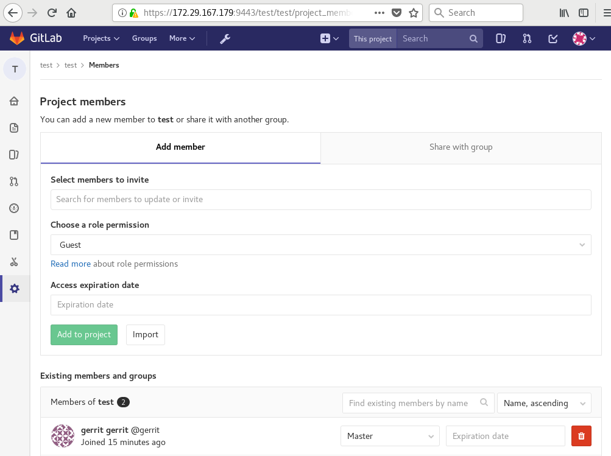

# Gerrit Review integrated with OpenLDAP and Gitlab

## Document Objective
- Deploy and configure Gerrit
- Integrate Gerrit with OpenLDAP
- Sync with Gitlab

#### Reference
- [https://github.com/fabric8io/docker-gerrit](https://github.com/fabric8io/docker-gerrit)
- [https://github.com/openfrontier/docker-gerrit](https://github.com/openfrontier/docker-gerrit)
- [https://that.guru/blog/how-to-use-git-review/](https://that.guru/blog/how-to-use-git-review/)

## Steps

#### Copy ```/home/gerrit``` on local volume

Since the container image used in this instruction requires to execute a command while launching, its path ```/home/gerrit``` needs to be copied on volume once, or the following __error__ message would occur

```shell
ubuntu@cm03:/data/gerrit$ docker run --detach --name gerrit2 -e AUTH_TYPE='LDAP' -e LDAP_SERVER="10.0.1.2" -e GIT_SERVER_IP="10.0.1.2" -e GIT_SERVER_PORT="9443" -e GIT_SERVER_USER="root" -e GIT_SERVER_PASSWORD="password" -p 0.0.0.0:8080:8080 -p 29418:29418 -v /data/gerrit:/home/gerrit docker.io/fabric8/gerrit:latest
ff90480aab619800811a3a48ee2dc065f673928a2504b1329a2a6465a3443508
docker: Error response from daemon: oci runtime error: container_linux.go:265: starting container process caused "exec: \"/home/gerrit/bin/conf-and-run-gerrit.sh\": stat /home/gerrit/bin/conf-and-run-gerrit.sh: no such file or directory".
```

- Launch the container image with volume specified

```shell
docker run --detach --name gerrit2 \
  -e AUTH_TYPE='LDAP' \
  -e LDAP_SERVER="172.29.167.177" \
  -e GIT_SERVER_IP="172.29.167.179" \
  -e GIT_SERVER_PORT="9443" \
  -e GIT_SERVER_USER="root" \
  -e GIT_SERVER_PASSWORD="password" \
  -p 0.0.0.0:8080:8080 -p 29418:29418 docker.io/fabric8/gerrit:latest
```

- Copy container:```/home/gerrit``` to local volume
```shell
sudo docker cp gerrit2:/home/gerrit /data/gerrit/
```

- Stop and remove launched container
```shell
docker stop gerrit2; docker rm gerrit2
```

- Launch through compose file

```shell
ubuntu@cm06:/data/yaml$ cat gerrit.yaml
version: '3'

services:
  gerrit:
    # restart: always
    image: docker.io/fabric8/gerrit:latest
    networks:
    - gerrit
    ports:
    - 0.0.0.0:8080:8080
    - 29418:29418
    environment:
    - AUTH_TYPE='LDAP'
    - LDAP_SERVER="172.29.167.177"
    - GIT_SERVER_IP="172.29.167.179"
    - GIT_SERVER_PORT="9443"
    - GIT_SERVER_USER="root"
    - GIT_SERVER_PASSWORD="git_root_secret"
    volumes:
    - "/etc/timezone:/etc/timezone:ro"
    - "/etc/localtime:/etc/localtime:ro"
    - /data/gerrit/gerrit:/home/gerrit
    - /data/gerrit/ssh:/root/.ssh
    deploy:
      placement:
        constraints: [node.labels.host==cm03]
      replicas: 1

networks:
  gerrit:
```

#### Integrate with OpenLDAP

- Edit ```/data/gerrit/site/etc/gerrit.config``` on container host

```shell
ubuntu@cm03:/data/gerrit/site/etc$ cat gerrit.config
[gerrit]
	basePath = git
	canonicalWebUrl = http://172.29.167.178:8080/
[database]
	type = H2
	database = db/ReviewDB
[index]
	type = LUCENE
[auth]
	type = LDAP
[sendemail]
	smtpServer = localhost
[container]
	user = gerrit
	javaHome = /usr/lib/jvm/java-7-openjdk-amd64/jre
[sshd]
	listenAddress = *:29418
[httpd]
	listenUrl = http://*:8080/
[cache]
	directory = cache
[download]
  command = checkout
  command = cherry_pick
  command = pull
  command = format_patch
  scheme = ssh
  scheme = http
  scheme = anon_http
  scheme = anon_git
  scheme = repo_download
[ldap]
	server = ldap://172.29.167.177
	accountBase = dc=devops,dc=org
	groupBase = dc=devops,dc=org
```

Restart container then you can access

__http://172.29.167.178:8080/#/q/status:open__

#### Configure to Sync with Gitlab

###### Configuration Settings

- In __Gerrit__ container, create a pair of SSH keys for user ```gerrit``` in ```~/.ssh/```.

```shell
mkdir -p ~/.ssh

root@11bcedbff9ee:~/.ssh# pwd
/root/.ssh
root@11bcedbff9ee:~/.ssh# ls
id_rsa  id_rsa.pub  known_hosts
```

- Create a user ```gerrit``` in __Gitlab__ and grant it ```admin``` access. Then login as ```gerrit``` and add SSH public key in __Gitlab__

In Gitlab UI, Settings > SSH Keys > Add an SSH key

- Add __Gitlab__ ssh public key into __Gerrit__ ```/root/.ssh/known_hosts```

```
ssh-keyscan -t rsa -p 9022 172.29.167.179 >> ~/.ssh/known_hosts
```

where ```172.29.167.179``` is running __Gitlab__

- Modify ```replication.config```

```shell
root@e720f17f756d:/home/gerrit/site/etc# cat replication.config
[remote "gitlab"]
url = ssh://git@172.29.167.179:9022/${name}.git
push = +refs/heads/*:refs/heads/*
    push = +refs/tags/*:refs/tags/*
    push = +refs/changes/*:refs/changes/*
    timtout = 30
    threads = 3
```

- Check the log during sync on container host

```
tailf /data/gerrit/gerrit/site/logs/replication_log
```

###### Add your personal SSH public key in __Gerrit__

Login UI, Settings > SSH Public Keys > Add key

###### Create a Sample Project and Sync

- Create a project in __Gerrit__, named ```test/test```

<center></center>

=\^\.\^=

- Create the __exactly same__ group/ project in __Gitlab__ and add ```gerrit``` user into the project as __master__ so ```gerrit``` user has permission to push

<center></center>

###### Setup your local repo (use Linux as example)

- Add ```KexAlgorithms +diffie-hellman-group1-sha1``` as a param of SSH, This is part of ```~/.ssh/config```

```shell
Host cm03		172.29.167.178
	Hostname	172.29.167.178
	User		ubuntu
	Port		22
	IdentityFile	~/.ssh/id_rsa
	KexAlgorithms +diffie-hellman-group1-sha1
```

- Follow the steps to clone, setup repo, create new file, then submit

```
git clone ssh://jeff@172.29.167.178:29418/test/test

[jeff@fedora test]$ touch README.md
[jeff@fedora test]$ vi README.md
[jeff@fedora test]$ git add --all; git commit --message "1st sync at gerrit"
[master (root-commit) bc3b410] 1st sync at gerrit
 1 file changed, 1 insertion(+)
 create mode 100644 README.md

[jeff@fedora test]$ git review
No '.gitreview' file found in this repository. We don't know where
your gerrit is. Please manually create a remote named "gerrit" and try
again.

[jeff@fedora test] git remote add gerrit ssh://jeff@172.29.167.178:29418/test/test

[jeff@fedora test]$ git review
```

###### Hints

- Set correct localtime and timezone in ``` /data/gerrit/gerrit/site/logs/replication_log```

```
- "/etc/timezone:/etc/timezone:ro"
- "/etc/localtime:/etc/localtime:ro"
```

- Checkout 
```
[jeff@fedora test]$ git remote -v
origin	ssh://jeff@172.29.167.178:29418/test/test (fetch)
origin	ssh://jeff@172.29.167.178:29418/test/test (push)
[jeff@fedora test]$ git remote rename origin gerrit
[jeff@fedora test]$ git remote -v
gerrit	ssh://jeff@172.29.167.178:29418/test/test (fetch)
gerrit	ssh://jeff@172.29.167.178:29418/test/test (push)
[jeff@fedora test]$ git checkout -b test/test
Switched to a new branch 'test/test'
[jeff@fedora test]$ git commit -as
On branch test/test
nothing to commit, working tree clean
[jeff@fedora test]$ git remote update
Fetching gerrit
```
