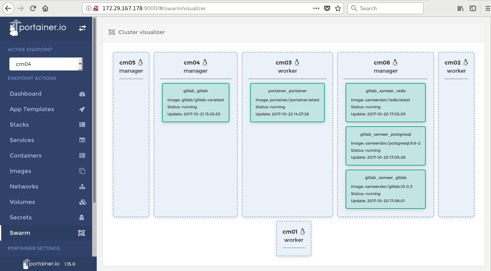

# Portainer for Docker Swarm Cluster

## Document Objective
- Deploy and configure Portainer
- View all swarm cluster

#### Pre- requisite
- You have an existing working docker swarm

## Steps

- Create a compose file

```
ubuntu@cm06:/data/yaml$ cat portainer.yaml
version: '3'

services:
  portainer:
    image: portainer/portainer
    networks:
    - portainer
    ports:
    - "9000:9000"
    volumes:
    - portainer:/var/run/docker.sock
    deploy:
      placement:
        constraints: [node.labels.host==cm02]
      replicas: 1

networks:
  portainer:

volumes:
  portainer:
```

Then
```
docker stack deploy -c portainer.yaml portainer
```

Then you can access __http://172.29.167.177:9000__


<center></center>

You can see the volume was created during stack deploy, which can be listed and inspected

```
ubuntu@cm02:~$ docker ps -a
CONTAINER ID        IMAGE                        COMMAND             CREATED             STATUS              PORTS               NAMES
754e00b5ee8f        portainer/portainer:latest   "/portainer"        8 minutes ago       Up 8 minutes        9000/tcp            portainer_portainer.1.wn1dot6trebhg29gzjlm98ybf
ubuntu@cm02:~$ docker volume ls
DRIVER              VOLUME NAME
local               03e9fd7b817b219cca169191f69ee2504dd81a6c7b4f8682c6b86d2bf1fe5a6e
local               portainer_portainer

```
