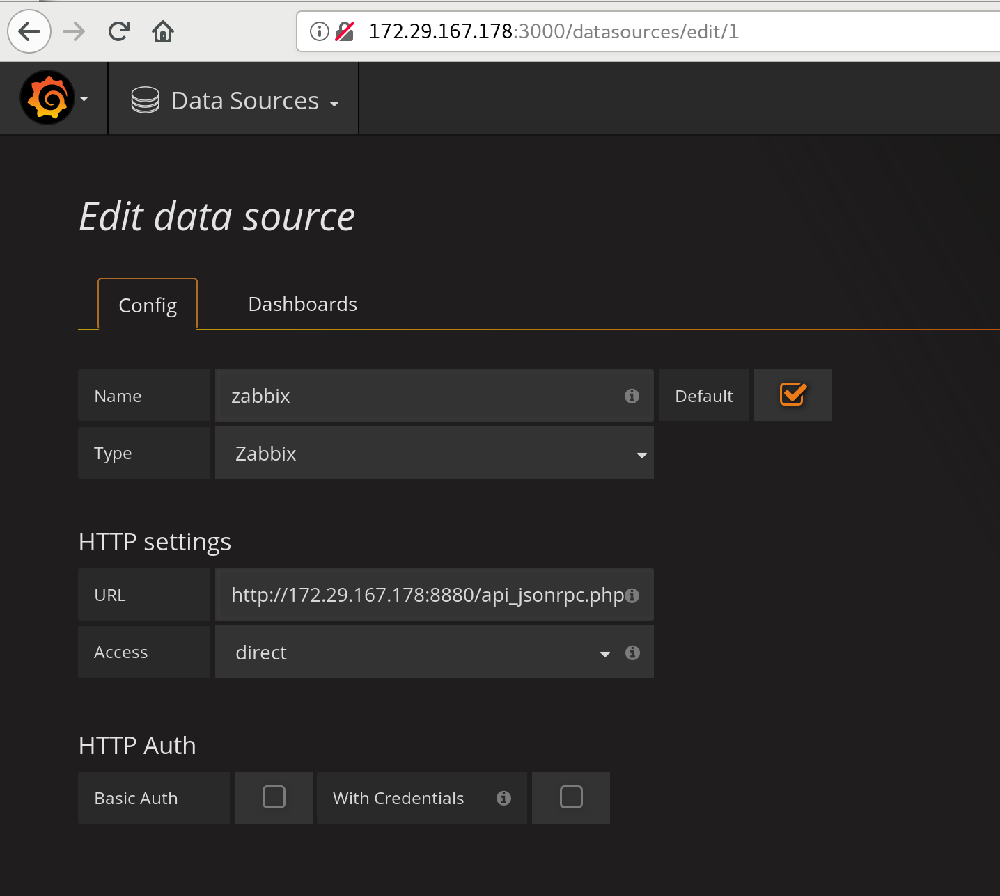
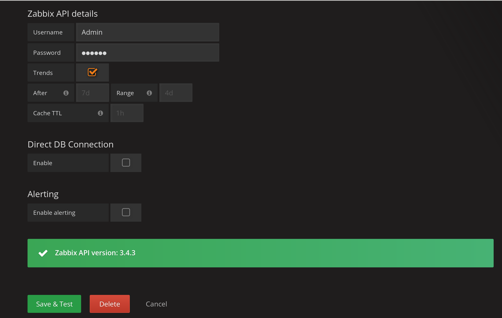

# Grafana

## Document Objective
- Launch Grafana through docker stack
- Integrate Grafana with the existing OpenLDAP

## Deployment

- Compose yaml

```
version: "3"

services:
  grafana:
    image: grafana/grafana
    hostname: grafana
    environment:
    - GF_SERVER_ROOT_URL=http://172.29.167.177
    - GF_SECURITY_ADMIN_PASSWORD=secret
    - GF_INSTALL_PLUGINS=grafana-clock-panel,grafana-simple-json-datasource
    volumes:
    - grafana_lib:/var/lib/grafana
    - grafana_etc:/etc/grafana
    ports:
    - 3000:3000
    deploy:
      placement:
        constraints: [node.labels.host==cm02]
      replicas: 1

volumes:
  grafana_lib:
  grafana_etc:
```

- Launch

```
docker stack deploy -c /data/yaml/grafana.yaml grafana
```

- Configure OpenLDAP part in Grafana

1\. grafana.ini ([Download](../conf/grafana/grafana.ini))

```
root@cm02:/data/docker/volumes/grafana_grafana_etc/_data# cat grafana.ini

...
#################################### Auth LDAP ##########################
[auth.ldap]
enabled = true
config_file = /etc/grafana/ldap.toml
allow_sign_up = true
...
```

2\. ldap.toml ([Download](../conf/grafana/ldap.toml))

```
root@cm02:/data/docker/volumes/grafana_grafana_etc/_data# cat ldap.toml
# To troubleshoot and get more log info enable ldap debug logging in grafana.ini
# [log]
# filters = ldap:debug

[[servers]]
# Ldap server host (specify multiple hosts space separated)
host = "172.29.167.177"
# Default port is 389 or 636 if use_ssl = true
port = 389
# Set to true if ldap server supports TLS
use_ssl = false
# Set to true if connect ldap server with STARTTLS pattern (create connection in insecure, then upgrade to secure connection with TLS)
start_tls = false
# set to true if you want to skip ssl cert validation
ssl_skip_verify = false
# set to the path to your root CA certificate or leave unset to use system defaults
# root_ca_cert = "/path/to/certificate.crt"

# Search user bind dn
bind_dn = "cn=admin,dc=devops,dc=org"
# Search user bind password
# If the password contains # or ; you have to wrap it with trippel quotes. Ex """#password;"""
bind_password = 'ldap_admin_pass'

# User search filter, for example "(cn=%s)" or "(sAMAccountName=%s)" or "(uid=%s)"
#search_filter = "(cn=%s)"
search_filter = "(uid=%s)"

# An array of base dns to search through
search_base_dns = ["dc=devops,dc=org"]
...
```

- Log in via web, by using LDAP user

[http://172.29.167.178:3000/login](http://172.29.167.178:3000/login)

## Integrate with Zabbix

Follow the instruction to configure

[DigitalOcean: install and configure Grafana with Zabbix](https://www.digitalocean.com/community/tutorials/how-to-install-and-configure-grafana-to-plot-beautiful-graphs-from-zabbix-on-centos-7)

[Grafana official doc](https://grafana.com/plugins/alexanderzobnin-zabbix-app/installation)

- Install Zabbix plugin

```
grafana-cli plugins install alexanderzobnin-zabbix-app
```

Need to restart Grafana container, by re- run ```stack deploy```, as plugin installed in ```/var/lib``` already configured in persistent volume.

- Configure plugin



<br>
<br>


