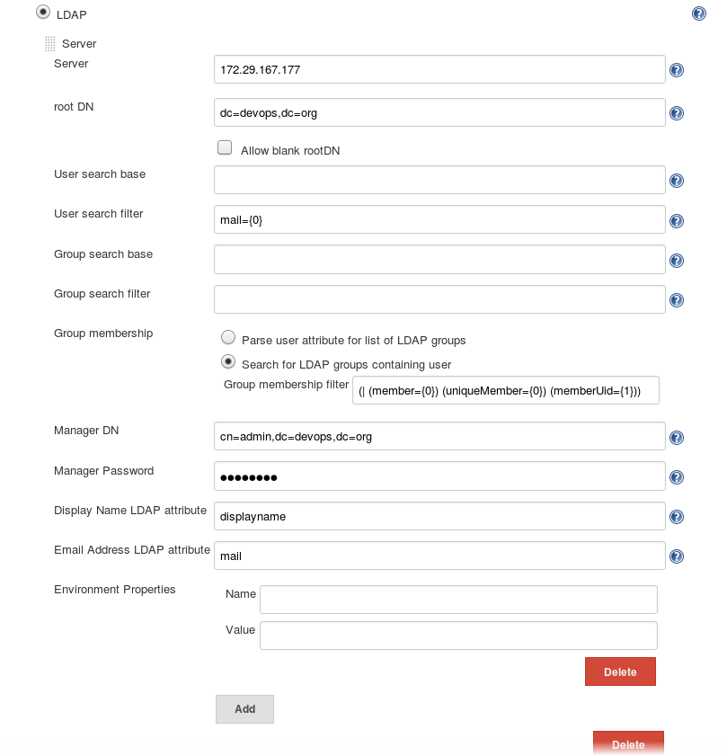
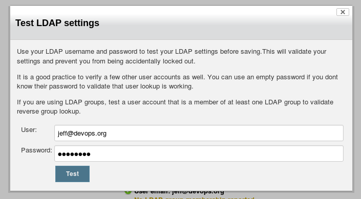
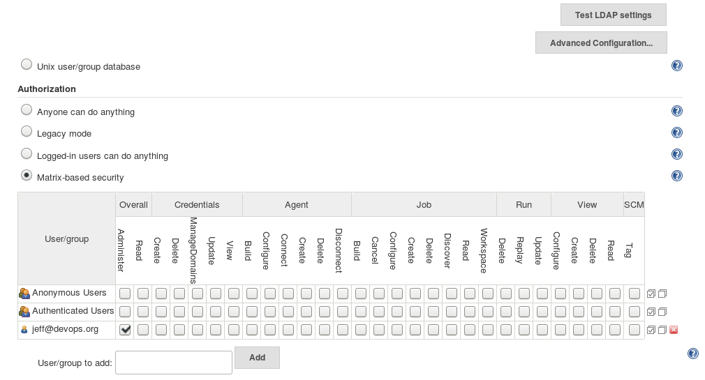
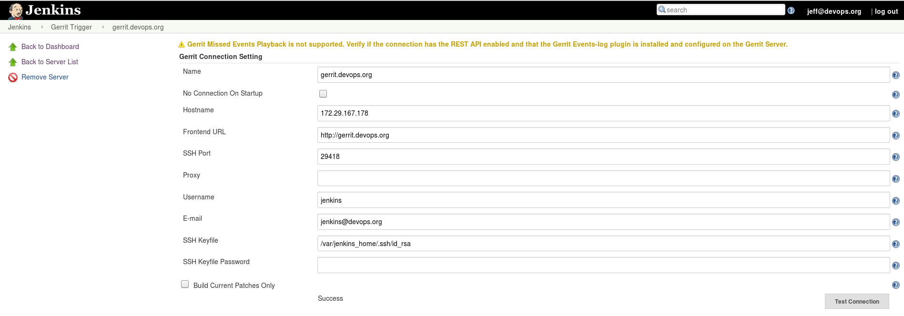
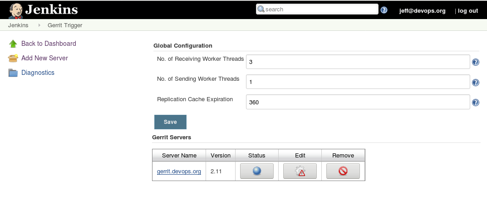

# Jenkins Tutorial

## Document Objective
* Initialize Jenkins
* Install plugins
* Authentication integrate with an existing OpenLDAP

## Installation

- Download image from docker hub:

  ```shell
  docker pull jenkins/jenkins
  ```

- Launch jenkins container, make sure you have created the volume directory:

  ```shell
  docker run -p 8082:8080 -p 50000:50000 -v ~/data/jenkins/:/var/jenkins_home --name jenkins -d jenkins/jenkins
  ```

- docker-compose.yaml

```
version: "3.3"

services:
  jenkins:
    image: jenkins/jenkins
    networks:
      - jenkins
    ports:
      - '8082:8080'
      - '50000:50000'
    hostname: "jenkins"
    volumes:
      - jenkins_home:/var/jenkins_home
    deploy:
      placement:
        constraints: [node.labels.host==3]
      replicas: 1

networks:
  jenkins:

volumes:
  jenkins_home:
```

## Installation and Configuration

#### Initialization

- Go to `http://<IP>:8082`, (the default port is ```8080```) the page will show as the following:

- Copy the initial password from ```/var/jenkins_home/secrets/initialAdminPassword``` and paste it into __Administrator password__, then click __Continue__ button, you'll see the following:

- Click __Install suggested plugins__. Keep it running until it finishes
- Set admin username and password

#### Integation with OpenLDAP

> Note: consult with OpenLDAP configuration with StartTLS
> Work- around reference > https://issues.jenkins-ci.org/browse/JENKINS-43994

Go to __Manage Jenkins__ > __Configure Global Security__ > __LDAP__

- change "User search filter": ```mail={0}```
- in "Search for LDAP groups containing user":```(| (member={0}) (uniqueMember={0}) (memberUid={1}))```

<center></center>

<center></center>

#### Grant specific user administrator access

<center></center>

## Generate Jenkins' SSH Keys

Place keys under ```/var/jenkins_home/.ssh```

```
$ docker volume inspect jenkins_jenkins_home
[
    {
        "CreatedAt": "2018-03-16T16:30:13+08:00",
        "Driver": "local",
        "Labels": {
            "com.docker.stack.namespace": "jenkins"
        },
        "Mountpoint": "/data/docker/volumes/jenkins_jenkins_home/_data",
        "Name": "jenkins_jenkins_home",
        "Options": {},
        "Scope": "local"
    }
]

$ sudo ls /data/docker/volumes/jenkins_jenkins_home/_data/.ssh/
authorized_keys  id_rsa  id_rsa.pub  known_hosts
```

## Create Gerrit- related Jobs

#### Install ```Gerrit Trigger``` plugin

- Pre- requisites
  - (optional) Create ```jenkins``` user in OpenLDAP
  - On __Jenkins__@```/var/jenkins_home/.ssh/``` server, Generate an SSH key
  - Go to __Gerrit__ server (where is installed on ```172.29.167.178```) to add ```jenkins``` user and grant administrator access.
  - Copy and paste such SSH key into ```jenkins``` user on __Gerrit__ server

- Go to __Manage Jenkins__ > __Manage Plugins__ > __Available__ tab > search and choose ```Gerrit Trigger``` > click __Install without restart__

- After finishing, go back to __Manage Jenkins__ > __Gerrit Trigger__ > __Add New Server__ > follow the instruction to complete the setup. Then hit __Test Connection__. You should see __Success__. Click __Save__

<center></center>

- Click button under __Status__

<center></center>

#### Install Git- related Plugins
