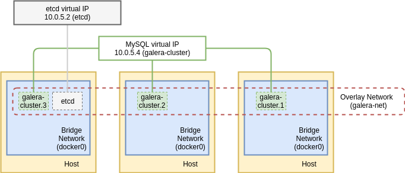

#### Document Objective
- Official MariaDB image
- Built- in Galera plugin
- Create a master- master MariaDB cluster with ```etcd```

#### Reference

Reference doc > https://coreos.com/etcd/docs/latest/v2/docker_guide.html

## Architecture



## Deployment

- Export ```etcd``` IP on Swarm manager node, where to launch all the following services
```
export HostIP="10.0.0.17"
```

- Create an overlay network

```
docker network create galera-net --driver=overlay
```

- Create service of ```etcd``` on any Swarm manager node

> ```node.labels.host==01``` is the same node of ```HostIP```

```
docker service create --name etcd --replicas 1 --network galera-net \
  --constraint node.labels.host==01 \
  -p 4001:4001 -p 2380:2380 -p 2379:2379 \
  quay.io/coreos/etcd:v2.3.8 \
  -name etcd0 \
  -advertise-client-urls http://${HostIP}:2379,http://${HostIP}:4001 \
  -listen-client-urls http://0.0.0.0:2379,http://0.0.0.0:4001 \
  -initial-advertise-peer-urls http://${HostIP}:2380 \
  -listen-peer-urls http://0.0.0.0:2380 \
  -initial-cluster-token etcd-cluster-1 \
  -initial-cluster etcd0=http://${HostIP}:2380 \
  -initial-cluster-state new
```

- Inspect ```etcd``` service

```
docker service inspect etcd
```

```
"VirtualIPs": [
    {
        "NetworkID": "s63pwshpmek9y3ra4vfey72zl",
        "Addr": "10.255.0.31/16"
    },
    {
        "NetworkID": "n6wnomdecm17kroae3ocwj2og",
        "Addr": "10.0.5.2/24"
    }
]
```

Where ```10.0.5.2/24``` is IP of ```etcd```

- Lauch ```mysql-galera``` cluster

```
docker service create --name mysql-galera --replicas 3 --network galera-net \
  -p 13306:3306 \
  -e MYSQL_ROOT_PASSWORD=mysecret \
  -e DISCOVERY_SERVICE=$HostIP:2379 \
  -e XTRABACKUP_PASSWORD=mysecret \
  -e CLUSTER_NAME=mysql_galera \
  perconalab/percona-xtradb-cluster:5.6
```

- After lauching finishes, check the cluster status

```
docker exec -it $(docker ps -f name=mysql | awk '{print $1}' | grep -v CONTAINER) \
  mysql -uroot -pmysecret -hlocalhost -e "show status like '%wsrep_incoming%'"
```

```
+--------------------------+-------------------------------------------+
| Variable_name            | Value                                     |
+--------------------------+-------------------------------------------+
| wsrep_incoming_addresses | 10.0.5.7:3306,10.0.5.6:3306,10.0.5.5:3306 |
+--------------------------+-------------------------------------------+
```

- Inspect service of ```mysql-galera```

```
docker service inspect mysql-galera
```

```
"VirtualIPs": [
    {
        "NetworkID": "s63pwshpmek9y3ra4vfey72zl",
        "Addr": "10.255.0.33/16"
    },
    {
        "NetworkID": "n6wnomdecm17kroae3ocwj2og",
        "Addr": "10.0.5.4/24"
    }
]
```
