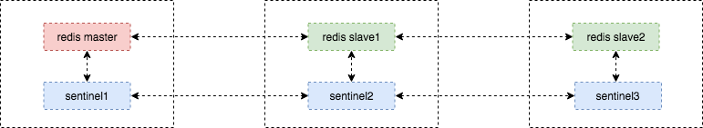
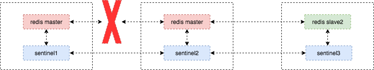
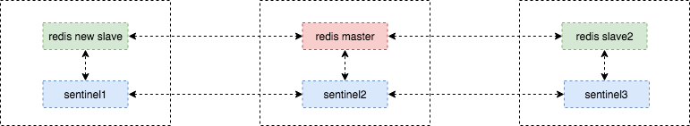

# Redis HA in Docker

> This document was created, tested and written by my colleague, Alex.

## Introduction

This document explains how to set up a high-available redis master-slave cluster base on `redis sentinel`, you can review sentinel official document https://redis.io/topics/sentinel. The following content will lead you to set up them both in test env(one node) and production environment(distributed).

## Architecture

The architecture looks like this:

<center></center>

So what will happen when the master shutdown?

- Sentinal will prompt a proper slave to be a master

<center></center>

- If start the master again, the master will become a slave then join the new master

<center></center>

## Running on One Node

```sh
cd sentinel
docker build -t sentinel
./start.sh
```

## Running on Distributed Env(Docker Swarm)

- Build image in every node

```sh
cd sentinel
docker build -t sentinel .
```

- Update `redis-ha.yaml`

```yaml
version: "3.3"

services:
  redis-master:
    image: redis:3.2
    networks:
      - outside
    hostname: "redis-master"
    deploy:
      placement:
        constraints: [node.labels.host==6]
      replicas: 1

  redis-slave1:
    image: redis:3.2
    networks:
      - outside
    hostname: "redis-slave1"
    depends_on:
      - redis-master
    command: ["redis-server", "--slaveof", "redis-master", "6379"]
    deploy:
      placement:
        constraints: [node.labels.host==5]
      replicas: 1

  redis-slave2:
    image: redis:3.2
    networks:
      - outside
    hostname: "redis-slave2"
    depends_on:
      - redis-master
    command: ["redis-server", "--slaveof", "redis-master", "6379"]
    deploy:
      placement:
        constraints: [node.labels.host==4]
      replicas: 1

  sentinel1:
    image: sentinel
    networks:
      - outside
    hostname: "sentinel1"
    depends_on:
      - redis-master
      - redis-slave1
      - redis-slave2
    environment:
      - SENTINEL_DOWN_AFTER:10000
      - SENTINEL_FAILOVER:10000
      - SENTINEL_QUORUM:2
      - MASTER_IP=redis-master
    deploy:
      placement:
        constraints: [node.labels.host==6]
      replicas: 1

  sentinel2:
    image: sentinel
    networks:
      - outside
    hostname: "sentinel2"
    depends_on:
      - redis-master
      - redis-slave1
      - redis-slave2
    environment:
      - SENTINEL_DOWN_AFTER:10000
      - SENTINEL_FAILOVER:10000
      - SENTINEL_QUORUM:2
      - MASTER_IP=redis-master
    deploy:
      placement:
        constraints: [node.labels.host==5]
      replicas: 1

  sentinel3:
    image: sentinel
    networks:
      - outside
    hostname: "sentinel3"
    depends_on:
      - redis-master
      - redis-slave1
      - redis-slave2
    environment:
      - SENTINEL_DOWN_AFTER:10000
      - SENTINEL_FAILOVER:10000
      - SENTINEL_QUORUM:2
      - MASTER_IP=redis-master
    deploy:
      placement:
        constraints: [node.labels.host==4]
      replicas: 1

networks:
  outside:
    external:
      name: "host"
```

replace MASTER_IP, deploy, redis-master parameters with your own environment value.

- Deploy this stack

```sh
docker deploy -c redis-ha.yaml redis-ha
```

## How Does Client Connect to Them(Java)

references: https://dzone.com/articles/high-availability-with-redis-sentinels-connecting
