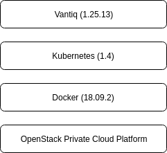
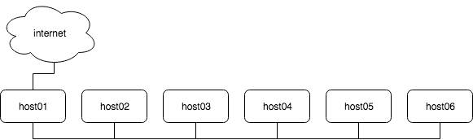

<!--

<br>
<br>
-->

# Deploy Kubernetes on a Private OpenStack Cloud
<!-- TOC depthFrom:2 depthTo:2 withLinks:1 updateOnSave:1 orderedList:0 -->

- [Objective](#objective)
- [Existing Environment](#existing-environment)
- [Security Hardening](#security-hardening)
- [Architecture Overview and Network Topology](#architecture-overview-and-network-topology)
- [Install and Configure Docker](#install-and-configure-docker)
- [Install and Configure Kubernetes](#install-and-configure-kubernetes)
- [Install and Configure Docker and K8S on other Nodes](#install-and-configure-docker-and-k8s-on-other-nodes)
- [Exception Received during Deployment](#exception-received-during-deployment)
- [Appendix](#appendix)

<!-- /TOC -->

## Objective
- Create a standard Kubernetes cluster for production on a standard OpenStack cloud environment without Magnum
- Specify how to create Persistent Volume and Persistent Volume Claim
- Harden the system while connecting to the internet
- Create iptables postrouting rule to enable all nodes access to internet through the 1st machine which has internet access

## Existing Environment

CPU 核 | Memory (G) 内存 | OS Disk (G) | IP | External Disk (G) 外挂磁盘
-- | -- | -- | -- | --
4 | 16 | 40 | 10.100.100.11 |
4 | 16 | 40 | 10.100.100.12 | 530 (MongoDB)
4 | 16 | 40 | 10.100.100.13 | 530 (MongoDB)
4 | 16 | 40 | 10.100.100.14 | 20 (Postgres for KeyCloak)/ 20 (Grafana)/ 20 (GrafanaDB)/ 165 (InfluxDB) 分别生成，共3个
4 | 16 | 40 | 10.100.100.15 |
4 | 16 | 40 | 10.100.100.16 |

> Notice: since the size of disks become a little smaller around 10% after being mounted as persistent volume (PV), so need to give a little more space for this tolerance

## Security Hardening

#### Operating System on Virtual Machine

```
root@vantiq01:~# cat /etc/lsb-release
DISTRIB_ID=Ubuntu
DISTRIB_RELEASE=18.04
DISTRIB_CODENAME=bionic
DISTRIB_DESCRIPTION="Ubuntu 18.04.1 LTS"
```

#### Update Hostname
```
hostnamectl set-hostname vantiq01
```

#### Turn-on Firewall
```
ufw allow ssh
ufw enable
```

#### Modify ```ufw``` on 1st host which has access to the world
```
sudo ufw status numbered
Status: active

     To                         Action      From
     --                         ------      ----
[ 1] OpenSSH                    ALLOW IN    Anywhere
[ 2] 22/tcp                     ALLOW IN    Anywhere
[ 3] 6443                       ALLOW IN    Anywhere
```

Generally, the iptables rule should allow the following access requirements

1. Request from ```10.100.100.0/24``` to ```10.100.100.11:6443```
2. Request from ```10.224.0.0/24``` to  ```10.100.100.11:6443``` by ```flannel```
3. The incoming from random Github IPs to ```10.100.100.11:6443```, associated to outgoing traffic when image download is initialized


#### Harden SSHd, then ```systemctl restart sshd.service```
```
PermitRootLogin prohibit-password

PasswordAuthentication no
PermitEmptyPasswords no
```

#### Create a non-root user and grant it ```sudo``` permission
```
adduser ubuntu
usermod -aG sudo ubuntu
```

#### ~~Disable IPv6 on Ubuntu~~

__IPv6 has been tested in production environment. So I decided to leave it enabled.__

> Reference > https://www.configserverfirewall.com/ubuntu-linux/ubuntu-disable-ipv6/

Open the ```/etc/default/grub```, Modify ```GRUB_CMDLINE_LINUX``` and  ```GRUB_CMDLINE_LINUX_DEFAULT``` to append ipv6.disable=1:
```
GRUB_CMDLINE_LINUX="ipv6.disable=1"
GRUB_CMDLINE_LINUX_DEFAULT="ipv6.disable=1"
```

Then
```
update-grub
systemctl reboot
```

or edit ```/etc/sysctl.conf```

```
net.ipv6.conf.all.disable_ipv6 = 1
net.ipv6.conf.default.disable_ipv6 = 1
net.ipv6.conf.lo.disable_ipv6 = 1
net.ipv6.conf.eth0.disable_ipv6 = 1
```

Note: ```eth0``` is the network interface. Then

```
sysctl -p
```

Check whether ipv6 disabled
```
for i in {1..4}; do ssh root@vantiq0$i "cat /proc/sys/net/ipv6/conf/all/disable_ipv6"; done
```

## Architecture Overview and Network Topology

#### Environment Stack

<center></center>

#### Network Topology
We're given total 6 virtual machines and one of 6 has access to internet



#### Update ```/etc/hosts``` on 1st host
```
10.100.100.11	vantiq01	vantiq01
10.100.100.12	vantiq02	vantiq02
10.100.100.13	vantiq03	vantiq03
10.100.100.14	vantiq04	vantiq04
10.100.100.15	vantiq05	vantiq05
10.100.100.16	vantiq06	vantiq06
```

#### Setup all hostnames by using ```hostnamectl set-hostname```

In Bash shell, run
```
for i in {2..6}; do ssh root@vantiq0$i -i ~/.ssh/Vantiq-key.pem "hostnamectl set-hostname vantiq0$i"; done
```

```
for i in {2..6}; do ssh root@vantiq0$i -i ~/.ssh/Vantiq-key.pem "hostname"; done
```

#### Setup network to allow other hosts go internet
Since the 1st host is the only one allowed to access internet and others are off the world, here are the steps to route network requests from other hosts through the 1st one to internet

On the 1st host as ```gateway```, use ```POSTROUTING``` rule to ```MASQUERADE``` all traffic from ```10.100.100.0/24``` pass through ```10.100.100.11``` to reach outside. If ```ufw``` is on, need to define a rule for incoming traffic from ```10.100.100.0/24```

```
iptables -t nat -A POSTROUTING -s 10.100.100.0/24 -j MASQUERADE
ufw allow in on eth0 from 10.100.100.0/24
```

Update 1st host's ```/etc/default/ufw``` configuration to allow forward, then ```systemctl restart ufw.service```
```
DEFAULT_FORWARD_POLICY="ACCEPT"
```

On other hosts
```
ip r add default via 10.100.100.11 dev eth0
```

> Note: you might have to delete the pre-configured default gateway. Caution: be careful when you do this and you know what exactly you're doing!

#### Block Device for Mount

```
for i in {2..4}; do ssh root@vantiq0$i -i ~/.ssh/Vantiq-key.pem 'hostname; lsblk'; done
vantiq02
NAME   MAJ:MIN RM  SIZE RO TYPE MOUNTPOINT
vda    252:0    0   40G  0 disk
└─vda1 252:1    0   40G  0 part /
vdb    252:16   0  530G  0 disk
└─vdb1 252:17   0  530G  0 part
vantiq03
NAME   MAJ:MIN RM  SIZE RO TYPE MOUNTPOINT
vda    252:0    0   40G  0 disk
└─vda1 252:1    0   40G  0 part /
vdb    252:16   0  530G  0 disk
vantiq04
NAME   MAJ:MIN RM  SIZE RO TYPE MOUNTPOINT
vda    252:0    0   40G  0 disk
└─vda1 252:1    0   40G  0 part /
vdb    252:16   0   20G  0 disk
vdc    252:32   0  160G  0 disk
vdg    252:96   0   20G  0 disk
```

## Install and Configure Docker

#### Install
> Reference > https://docs.docker.com/install/linux/docker-ce/ubuntu/

```
sudo apt install apt-transport-https ca-certificates curl software-properties-common
curl -fsSL https://download.docker.com/linux/ubuntu/gpg | sudo apt-key add -
sudo add-apt-repository "deb [arch=amd64] https://download.docker.com/linux/ubuntu $(lsb_release -cs) stable"
sudo apt update
sudo apt install docker-ce
```

#### (optional) Use China alternative image repo for performance purpose. Modify ```/etc/docker/daemon.json```
> Reference > https://www.docker-cn.com/registry-mirror
```
{
  "registry-mirrors": ["https://registry.docker-cn.com"]
}
```

#### Using ```systemd``` to control the Docker daemon
Overriding Defaults for the Docker Daemon

```
sudo systemctl edit docker
```

The above command generates ```/etc/systemd/system/docker.service.d``` and ```override.conf``` under it

```
[Service]
ExecStart=
ExecStart=/usr/bin/dockerd -H tcp://0.0.0.0:2375 -H unix:///var/run/docker.sock
```

```
systemctl daemon-reload
systemctl restart docker.service
```

Remember to do this on all other hosts

Bonus: if you prefer ```vi``` as default editor on Ubuntu, run ```update-alternatives --config editor```

#### Grant non-root to control Docker
```
sudo gpasswd -a $USER docker
```

## Install and Configure Kubernetes

> Reference > https://kubernetes.io/docs/reference/kubectl/cheatsheet/

#### Using China alternative repo for workaround of ```gcr.io``` unaccessible
```
apt-get update && apt-get install -y apt-transport-https
curl https://mirrors.aliyun.com/kubernetes/apt/doc/apt-key.gpg | apt-key add -
cat <<EOF >/etc/apt/sources.list.d/kubernetes.list
deb https://mirrors.aliyun.com/kubernetes/apt/ kubernetes-xenial main EOF
apt-get update
apt-get install -y kubelet kubeadm kubectl
```

#### Pull Images by using alternative repo when ```gcr.io``` unavailable in China

```
images=(
    kube-proxy:v1.14.1
    kube-apiserver:v1.14.1
    kube-controller-manager:v1.14.1
    kube-scheduler:v1.14.1
    pause:3.1
    etcd:3.3.10
    coredns:1.3.1
    defaultbackend:1.4
)

for imageName in ${images[@]} ; do
    docker pull registry.cn-hangzhou.aliyuncs.com/google_containers/$imageName
    docker tag registry.cn-hangzhou.aliyuncs.com/google_containers/$imageName k8s.gcr.io/$imageName
    docker rmi registry.cn-hangzhou.aliyuncs.com/google_containers/$imageName
done
```

You will also need ```defaultbackend``` image later as well

#### Start K8S by root

Check network pre-requisite before proceeding
> Reference > https://github.com/coreos/flannel/blob/master/Documentation/kubernetes.md
and https://kubernetes.io/docs/setup/independent/create-cluster-kubeadm/

Ensure you pass ```--pod-network-cidr``` param during ```kubeadm init```, which is required by ```flannel``` network

```
kubeadm init --pod-network-cidr=10.244.0.0/16
```

To specify an alternative repo
```
kubeadm init --pod-network-cidr=10.244.0.0/16 --image-repository registry.cn-hangzhou.aliyuncs.com/google_containers
```

#### Grant non-root user access to control K8S
```
mkdir -p $HOME/.kube
sudo cp -i /etc/kubernetes/admin.conf $HOME/.kube/config
sudo chown $(id -u):$(id -g) $HOME/.kube/config
```

- ```kubectl``` AutoComplete
```
source <(kubectl completion bash)
echo "source <(kubectl completion bash)" >> ~/.bashrc
```

#### Check the status by non-root user
```
kubectl get pods -o wide --all-namespaces
```

And the output looks like
```
NAMESPACE     NAME                               READY   STATUS    RESTARTS   AGE   IP              NODE       NOMINATED NODE   READINESS GATES
kube-system   coredns-86c58d9df4-k9s4z           0/1     Pending   0          12m   <none>          <none>     <none>           <none>
kube-system   coredns-86c58d9df4-nqs4d           0/1     Pending   0          12m   <none>          <none>     <none>           <none>
kube-system   etcd-vantiq01                      1/1     Running   0          11m   10.100.100.11   vantiq01   <none>           <none>
kube-system   kube-apiserver-vantiq01            1/1     Running   0          11m   10.100.100.11   vantiq01   <none>           <none>
kube-system   kube-controller-manager-vantiq01   1/1     Running   0          10m   10.100.100.11   vantiq01   <none>           <none>
kube-system   kube-proxy-4dghc                   1/1     Running   0          12m   10.100.100.11   vantiq01   <none>           <none>
kube-system   kube-scheduler-vantiq01            1/1     Running   0          11m   10.100.100.11   vantiq01   <none>           <none>
```

#### Install ```flannel``` network
> Reference > https://kubernetes.io/docs/setup/independent/create-cluster-kubeadm/

- Pre-requisite
	- For flannel to work correctly, you MUST pass ```--pod-network-cidr=10.244.0.0/16``` to ```kubeadm init```.
	- Set ```/proc/sys/net/bridge/bridge-nf-call-iptables``` to ```1``` by running ```sysctl net.bridge.bridge-nf-call-iptables=1``` to pass bridged IPv4 traffic to iptables’ chains. ...

```
kubectl apply -f https://raw.githubusercontent.com/coreos/flannel/master/Documentation/kube-flannel.yml
```

- After install, check status
```
kubectl get pods --all-namespaces
```

```
NAMESPACE     NAME                               READY   STATUS    RESTARTS   AGE
kube-system   coredns-86c58d9df4-d56gz           1/1     Running   1          91m
kube-system   coredns-86c58d9df4-vkshj           1/1     Running   1          91m
kube-system   etcd-vantiq01                      1/1     Running   0          90m
kube-system   kube-apiserver-vantiq01            1/1     Running   0          90m
kube-system   kube-controller-manager-vantiq01   1/1     Running   0          90m
kube-system   kube-flannel-ds-amd64-kc8m2        1/1     Running   0          6m10s
kube-system   kube-proxy-sbsp6                   1/1     Running   0          91m
kube-system   kube-scheduler-vantiq01            1/1     Running   0          90m
```

## Install and Configure Docker and K8S on other Nodes

#### Install Docker

```
for i in {2..6}; do ssh root@vantiq0$i -i ~/.ssh/Vantiq-key.pem "apt install apt-transport-https ca-certificates curl software-properties-common"; done

for i in {2..6}; do ssh root@vantiq0$i -i ~/.ssh/Vantiq-key.pem "curl -fsSL https://download.docker.com/linux/ubuntu/gpg | sudo apt-key add -"; done

for i in {2..6}; do ssh root@vantiq0$i -i ~/.ssh/Vantiq-key.pem 'add-apt-repository "deb [arch=amd64] https://download.docker.com/linux/ubuntu $(lsb_release -cs) stable"'; done

for i in {2..6}; do ssh root@vantiq0$i -i ~/.ssh/Vantiq-key.pem 'hostname; apt install docker-ce'; done
```

> Note: you should NOT pass ```-y``` when installing to prevent automatically upgrade without your permission

- Check ```docker --version```

```
for i in {1..6}; do ssh root@vantiq0$i -i ~/.ssh/Vantiq-key.pem 'hostname; docker --version'; done
```

- Copy ```/etc/docker/daemon.json``` (if using alternative docker repo) from host01 to all other hosts then restart docker
```
for i in {2..6}; do scp -i ~/.ssh/Vantiq-key.pem /etc/docker/daemon.json root@vantiq0$i:/etc/docker/; done
for i in {1..6}; do ssh root@vantiq0$i -i ~/.ssh/Vantiq-key.pem 'hostname; systemctl restart docker.service'; done
```

> Example of ```/etc/docker/daemon.json```

```
{
  "registry-mirrors": ["https://registry.docker-cn.com"]
}
```

- Update ```/etc/systemd/system/docker.service.d/override.conf```

```
for i in {2..6}; do ssh root@vantiq0$i -i ~/.ssh/Vantiq-key.pem 'mkdir -p /etc/systemd/system/docker.service.d/'; done
for i in {2..6}; do scp -i ~/.ssh/Vantiq-key.pem /etc/systemd/system/docker.service.d/override.conf root@vantiq0$i:/etc/systemd/system/docker.service.d/; done
for i in {2..4}; do ssh root@vantiq0$i -i ~/.ssh/Vantiq-key.pem 'systemctl daemon-reload; systemctl restart docker.service'; done
```

> Example of ```/etc/systemd/system/docker.service.d/override.conf```
```
[Service]
ExecStart=
ExecStart=/usr/bin/dockerd -H tcp://0.0.0.0:2375 -H unix:///var/run/docker.sock
```


#### Install and Configure K8S on other Nodes
- Copy ```/etc/apt/sources.list.d/kubernetes.list``` to other hosts
```
for i in {2..6}; do scp -i ~/.ssh/Vantiq-key.pem kubernetes.list root@vantiq0$i:/etc/apt/sources.list.d/; done
for i in {2..6}; do ssh root@vantiq0$i -i ~/.ssh/Vantiq-key.pem 'curl https://mirrors.aliyun.com/kubernetes/apt/doc/apt-key.gpg | apt-key add -'; done
for i in {2..6}; do ssh root@vantiq0$i -i ~/.ssh/Vantiq-key.pem 'apt update'; done
```

- Install K8S on other Nodes
```
for i in {2..6}; do ssh root@vantiq0$i -i ~/.ssh/Vantiq-key.pem 'apt install kubelet kubeadm kubectl'; done
```

- Pull docker images on each of hosts, including ```flannel```

```
images=(
    kube-apiserver:v1.14.0
    kube-controller-manager:v1.14.0
    kube-scheduler:v1.14.0
    kube-proxy:v1.14.0
    pause:3.1
    etcd:3.3.10
    coredns:1.3.1
    defaultbackend:1.4
    flannel:v0.10.0
)

for imageName in ${images[@]} ; do
    docker pull registry.cn-hangzhou.aliyuncs.com/google_containers/$imageName
    docker tag  registry.cn-hangzhou.aliyuncs.com/google_containers/$imageName k8s.gcr.io/$imageName
    docker rmi  registry.cn-hangzhou.aliyuncs.com/google_containers/$imageName
done
```

Since I couldn't find ```flannel:v0.11.0``` at the time I create this document, I use ```flannel:v0.10.0``` instead. And this is the workaround to pull any images from alternative repo instead of ```quay.io``` when need through __GFW__

```
docker pull registry.cn-hangzhou.aliyuncs.com/kuberimages/flannel:v0.10.0-amd64
docker tag  registry.cn-hangzhou.aliyuncs.com/kuberimages/flannel:v0.10.0-amd64 quay.io/coreos/flannel:v0.10.0-amd64
```

- Join K8S cluster

```
kubeadm join 10.100.100.11:6443 --token 7li01q.z4d1rcdlowkr7m42     --discovery-token-ca-cert-hash sha256:bbad2c92df60b77d1bb91c5cc56c762b4a736ca942d4c5674eae8b8a634b91f8
```

> Tips: in case you receive the following error message
```
[preflight] FYI: You can look at this config file with 'kubectl -n kube-system get cm kubeadm-config -oyaml'
error execution phase preflight: unable to fetch the kubeadm-config ConfigMap: failed to get config map: Unauthorized
```

It indicates the token expires already by checking
```
date
Sun Mar 31 20:17:58 CST 2019

kubeadm token list
TOKEN                     TTL         EXPIRES                     USAGES                   DESCRIPTION                                                EXTRA GROUPS
7li01q.z4d1rcdlowkr7m42   <invalid>   2019-03-30T18:49:00+08:00   authentication,signing   The default bootstrap token generated by 'kubeadm init'.   system:bootstrappers:kubeadm:default-node-token
```

Then create a new one
```
kubeadm token create
bgd6cx.2x0fxxqw6cx3l0q4
```

And re-join with the new token

- Label Nodes in Cluster

eg.
```
ubuntu@vantiq01:~$ kubectl label node vantiq03 node-role.kubernetes.io/worker=worker
```

## Appendix

#### Exception Received during Deployment ```coredns``` STATUS= ```CrashLoopBackOff```

Cause: Network Configuration on Ubuntu 18.04

Symptom:
```
ubuntu@vantiq01:/etc$ kubectl get pods -n=kube-system
NAME                               READY   STATUS             RESTARTS   AGE
coredns-fb8b8dccf-5kz2v            0/1     CrashLoopBackOff   741        2d20h
coredns-fb8b8dccf-8ggcf            0/1     CrashLoopBackOff   741        2d20h
...
```

> Reference > Some explanation from official web
https://kubernetes.io/docs/setup/independent/troubleshooting-kubeadm/#coredns-pods-have-crashloopbackoff-or-error-state

> The proposed workaround
https://github.com/coredns/coredns/tree/master/plugin/loop#troubleshooting-loops-in-kubernetes-clusters

> and another good summary and fix
https://stackoverflow.com/questions/53075796/coredns-pods-have-crashloopbackoff-or-error-state/53414041#53414041


- Use ```systemd-resolved.service``` which is by default shipped in Ubuntu 18.04 on each of nodes

- Update ```/run/systemd/resolve/resolv.conf``` with correct DNS on each of nodes

- Restart ```systemd-resolved.service``` on each of nodes
```
sudo systemctl restart systemd-resolved.service
```

- Update softlink of ```/etc/resolv.conf``` on each of nodes
```
ln -s /run/systemd/resolve/resolv.conf /etc/resolv.conf
```

- Comment out ```loop``` in

> Reference > https://stackoverflow.com/questions/52645473/coredns-fails-to-run-in-kubernetes-cluster

```
kubectl -n kube-system edit configmap coredns
```

- Delete and restart ```coredns``` pod to take the change effective, then check their status again (warning: make sure you know what you're doing)

```
kubectl -n kube-system delete pod -l k8s-app=kube-dns
```

#### Update ```dnsConfig``` in ```coredns```

```
kubectl -n kube-system edit deployment.apps/coredns
```

Update the correct DNS

> Reference > https://kubernetes.io/docs/concepts/services-networking/dns-pod-service/

```
dnsConfig:
  nameservers:
  - 172.16.51.100
  options:
  - name: ndots
    value: "5"
  searches:
  - cptheat.com
dnsPolicy: Default
```

#### Install Tiller

You can search and use alternative image from dockerhub. For example

```
docker search tiller
```

Then pick one available from list

```
docker pull sapcc/tiller:v2.12.2
docker tag sapcc/tiller:v2.12.2 gcr.io/kubernetes-helm/tiller:v2.12.2
```

```
./helm init --upgrade -i registry.cn-hangzhou.aliyuncs.com/google_containers/tiller:v2.12.2 \
  --stable-repo-url https://kubernetes.oss-cn-hangzhou.aliyuncs.com/charts
```

(Optional) alternative stable repo update

```
helm repo remove stable

helm repo add stable http://mirror.azure.cn/kubernetes/charts/
helm repo add incubator http://mirror.azure.cn/kubernetes/charts-incubator/
```

#### Connect Private Git Repo by using Personal Token

```
ubuntu@vantiq01:~/k8sdeploy_tools/.git$ cp config config.orig
ubuntu@vantiq01:~/k8sdeploy_tools/.git$ git remote rm origin
ubuntu@vantiq01:~/k8sdeploy_tools/.git$ cat config
[core]
	repositoryformatversion = 0
	filemode = true
	bare = false
	logallrefupdates = true
[branch "master"]
ubuntu@vantiq01:~/k8sdeploy_tools/.git$ git remote add origin https://j3ffyang:<PERSONAL_TOKEN>@github.com/Vantiq/k8sdeploy_setup.git

ubuntu@vantiq01:~/k8sdeploy_tools/.git$ git remote get-url origin
https://j3ffyang:<PERSONAL_TOKEN>@github.com/Vantiq/k8sdeploy_setup.git

ubuntu@vantiq01:~/k8sdeploy_tools/.git$ cat config
[core]
	repositoryformatversion = 0
	filemode = true
	bare = false
	logallrefupdates = true
[branch "master"]
[remote "origin"]
	url = https://j3ffyang:<PERSONAL_TOKEN>@github.com/Vantiq/k8sdeploy_setup.git
	fetch = +refs/heads/*:refs/remotes/origin/*
```

#### Save and Load Image in Docker

On node where an image resides, for example,

```
root@vantiq05:~# docker image list | grep vantiq
vantiq/vantiq-server                                             1.24.12             ab30f4dfd278        6 weeks ago         601MB
vantiq/keycloak                                                  4.2.1.Final         0c41c64e19a4        6 weeks ago         801MB
root@vantiq05:~# docker save -o ./vantiq-server.tar  vantiq/vantiq-server:1.25.6
```

Copy the tar file to the target node. On node where to load the image,

```
root@vantiq06:~# docker load -i ./vantiq-server.tar
```
