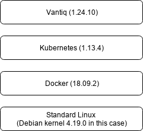

<!--

<br>
<br>
-->

# Deploy Kubernetes on Private OpenStack Cloud

<!-- TOC depthFrom:2 depthTo:4 withLinks:1 updateOnSave:1 orderedList:0 -->

- [Existing Environment](#existing-environment)
- [Security Hardening](#security-hardening)
		- [Operating System on Virtual Machine](#operating-system-on-virtual-machine)
		- [Update Hostname](#update-hostname)
		- [Turn-on Firewall](#turn-on-firewall)
		- [Harden SSHd, then ```systemctl restart sshd.service```](#harden-sshd-then-systemctl-restart-sshdservice)
		- [Create a non-root user and grant it ```sudo``` permission](#create-a-non-root-user-and-grant-it-sudo-permission)
- [Update other Nodes in the Environment](#update-other-nodes-in-the-environment)
		- [Network Topology](#network-topology)
		- [Update ```/etc/hosts``` on 1st host](#update-etchosts-on-1st-host)
		- [Setup all hostnames by using ```hostnamectl set-hostname```](#setup-all-hostnames-by-using-hostnamectl-set-hostname)
		- [Setup network to allow other hosts go internet](#setup-network-to-allow-other-hosts-go-internet)
- [Docker](#docker)
		- [Install](#install)
		- [Use China local image repo. Modify ```/etc/docker/daemon.json```](#use-china-local-image-repo-modify-etcdockerdaemonjson)
		- [Grant non-root to control Docker](#grant-non-root-to-control-docker)
- [Kubernetes](#kubernetes)
		- [Using China local repo for install](#using-china-local-repo-for-install)
		- [Pull images while using local repo](#pull-images-while-using-local-repo)
		- [Start K8S by root](#start-k8s-by-root)
		- [Grant non-root user to control K8S](#grant-non-root-user-to-control-k8s)
		- [Check the status by non-root user](#check-the-status-by-non-root-user)
		- [Install ```flannel``` network](#install-flannel-network)
		- [Install and configure Docker and K8S on other hosts](#install-and-configure-docker-and-k8s-on-other-hosts)
- [Appendix](#appendix)
		- [Output of ```kubeadm init```](#output-of-kubeadm-init)

<!-- /TOC -->

## Objective
- Create a standard Kubernetes cluster for production
- Specify how to create Persistent Volume and Persistent Volume Claim

## Existing Environment

CPU 核 | Memory (G) 内存 | OS Disk (G) | IP | External Disk (G) 外挂磁盘
-- | -- | -- | -- | --
4 | 16 | 40 | 10.100.100.11 |
4 | 16 | 40 | 10.100.100.12 | 500 (MongoDB)
4 | 16 | 40 | 10.100.100.13 | 500 (MongoDB)
4 | 16 | 40 | 10.100.100.14 | 10 (Grafana)/ 10 (GrafanaDB)/ 150 (InfluxDB) 分别生成，共3个
4 | 16 | 40 | 10.100.100.15 |
4 | 16 | 40 | 10.100.100.16 |

## Security Hardening

#### Operating System on Virtual Machine

```
root@vantiq01:~# cat /etc/lsb-release
DISTRIB_ID=Ubuntu
DISTRIB_RELEASE=18.04
DISTRIB_CODENAME=bionic
DISTRIB_DESCRIPTION="Ubuntu 18.04.1 LTS"
```

#### Update Hostname
```
hostnamectl set-hostname vantiq01
```

#### Turn-on Firewall
```
ufw allow ssh
ufw enable
```

#### Harden SSHd, then ```systemctl restart sshd.service```
```
PermitRootLogin prohibit-password

PasswordAuthentication no
PermitEmptyPasswords no
```

#### Create a non-root user and grant it ```sudo``` permission
```
adduser ubuntu
usermod -aG sudo ubuntu
```

## Update other Nodes in the Environment

<center></center>

#### Network Topology
We're given total 6 virtual machines and one of 6 has access to internet


#### Update ```/etc/hosts``` on 1st host
```
10.100.100.11	vantiq01	vantiq01
10.100.100.12	vantiq02	vantiq02
10.100.100.13	vantiq03	vantiq03
10.100.100.14	vantiq04	vantiq04
10.100.100.15	vantiq05	vantiq05
10.100.100.16	vantiq06	vantiq06
```

#### Setup all hostnames by using ```hostnamectl set-hostname```

In Bash shell, run
```
for i in {2..6}; do ssh root@vantiq0$i -i ~/.ssh/Vantiq-key.pem "hostnamectl set-hostname vantiq0$i"; done
```

```
for i in {2..6}; do ssh root@vantiq0$i -i ~/.ssh/Vantiq-key.pem "hostname"; done
```

#### Setup network to allow other hosts go internet
Since the 1st host is the only one allowed to access internet and others are off the world, here are the steps to route network requests from other hosts through the 1st one to internet

On the 1st host as ```gateway```, use ```POSTROUTING``` rule to ```MASQUERADE``` all traffic from ```10.100.100.0/24``` pass through ```10.100.100.11``` to reach outside. If ```ufw``` is on, need to define a rule for incoming traffic from ```10.100.100.0/24```

```
iptables -t nat -A POSTROUTING -s 10.100.100.0/24 -j MASQUERADE
ufw allow in on eth0 from 10.100.100.0/24
```

Update 1st host's ```/etc/default/ufw``` configuration to allow forward, then ```systemctl restart ufw.service```
```
DEFAULT_FORWARD_POLICY="ACCEPT"
```

On other hosts
```
ip r add default via 10.100.100.11 dev eth0
```

> Note: you might have to delete the pre-configured default gateway. Caution: be careful when you do this and you know what exactly you're doing!

#### Block Device for Mount

```
for i in {2..4}; do ssh root@vantiq0$i -i ~/.ssh/Vantiq-key.pem 'hostname; lsblk'; done
vantiq02
NAME   MAJ:MIN RM  SIZE RO TYPE MOUNTPOINT
vda    252:0    0   40G  0 disk
└─vda1 252:1    0   40G  0 part /
vdb    252:16   0  530G  0 disk
└─vdb1 252:17   0  530G  0 part
vantiq03
NAME   MAJ:MIN RM  SIZE RO TYPE MOUNTPOINT
vda    252:0    0   40G  0 disk
└─vda1 252:1    0   40G  0 part /
vdb    252:16   0  530G  0 disk
vantiq04
NAME   MAJ:MIN RM  SIZE RO TYPE MOUNTPOINT
vda    252:0    0   40G  0 disk
└─vda1 252:1    0   40G  0 part /
vdb    252:16   0   20G  0 disk
vdc    252:32   0  160G  0 disk
vdg    252:96   0   20G  0 disk
```

## Docker

#### Install
> Reference > https://docs.docker.com/install/linux/docker-ce/ubuntu/

```
sudo apt install apt-transport-https ca-certificates curl software-properties-common
curl -fsSL https://download.docker.com/linux/ubuntu/gpg | sudo apt-key add -
sudo add-apt-repository "deb [arch=amd64] https://download.docker.com/linux/ubuntu $(lsb_release -cs) stable"
sudo apt update
sudo apt install docker-ce
```

#### Use China local image repo. Modify ```/etc/docker/daemon.json```
> Reference > https://www.docker-cn.com/registry-mirror
```
{
  "registry-mirrors": ["https://registry.docker-cn.com"]
}
```

#### Using ```systemd``` to control the Docker daemon
Overriding Defaults for the Docker Daemon

```
sudo systemctl edit docker
```

The above command generates ```/etc/systemd/system/docker.service.d``` and ```override.conf``` under it

```
[Service]
ExecStart=
ExecStart=/usr/bin/dockerd -H tcp://0.0.0.0:2375 -H unix:///var/run/docker.sock
```

```
systemctl daemon-reload
systemctl restart docker.service
```

Remember to do this on all other hosts

Bonus: if you prefer ```vi``` as default editor on Ubuntu, run ```update-alternatives --config editor```

#### Grant non-root to control Docker
```
sudo gpasswd -a $USER docker
```

## Kubernetes

> Reference > https://kubernetes.io/docs/reference/kubectl/cheatsheet/

#### Using China local repo for install
```
apt-get update && apt-get install -y apt-transport-https
curl https://mirrors.aliyun.com/kubernetes/apt/doc/apt-key.gpg | apt-key add -
cat <<EOF >/etc/apt/sources.list.d/kubernetes.list
deb https://mirrors.aliyun.com/kubernetes/apt/ kubernetes-xenial main EOF
apt-get update
apt-get install -y kubelet kubeadm kubectl
```

#### (optional) Pull images while using local repo (if you have this challenge)

```
images=(
    kube-apiserver:v1.14.0
    kube-controller-manager:v1.14.0
    kube-scheduler:v1.14.0
    kube-proxy:v1.14.0
    pause:3.1
    etcd:3.3.10
    coredns:1.3.1
)

for imageName in ${images[@]} ; do
    docker pull registry.cn-hangzhou.aliyuncs.com/google_containers/$imageName
    docker tag registry.cn-hangzhou.aliyuncs.com/google_containers/$imageName k8s.gcr.io/$imageName
    docker rmi registry.cn-hangzhou.aliyuncs.com/google_containers/$imageName
done
```

#### Start K8S by root

Check network pre-requisite before proceeding
> Reference > https://github.com/coreos/flannel/blob/master/Documentation/kubernetes.md
and https://kubernetes.io/docs/setup/independent/create-cluster-kubeadm/

```
kubeadm init --pod-network-cidr=10.244.0.0/16
```

#### Grant non-root user access to control K8S
```
mkdir -p $HOME/.kube
sudo cp -i /etc/kubernetes/admin.conf $HOME/.kube/config
sudo chown $(id -u):$(id -g) $HOME/.kube/config
```

- ```kubectl``` AutoComplete
```
source <(kubectl completion bash)
echo "source <(kubectl completion bash)" >> ~/.bashrc
```

#### Check the status by non-root user
```
kubectl get pods -o wide --all-namespaces
```

And the expected output looks like
```
NAMESPACE     NAME                               READY   STATUS    RESTARTS   AGE   IP              NODE       NOMINATED NODE   READINESS GATES
kube-system   coredns-86c58d9df4-k9s4z           0/1     Pending   0          12m   <none>          <none>     <none>           <none>
kube-system   coredns-86c58d9df4-nqs4d           0/1     Pending   0          12m   <none>          <none>     <none>           <none>
kube-system   etcd-vantiq01                      1/1     Running   0          11m   10.100.100.11   vantiq01   <none>           <none>
kube-system   kube-apiserver-vantiq01            1/1     Running   0          11m   10.100.100.11   vantiq01   <none>           <none>
kube-system   kube-controller-manager-vantiq01   1/1     Running   0          10m   10.100.100.11   vantiq01   <none>           <none>
kube-system   kube-proxy-4dghc                   1/1     Running   0          12m   10.100.100.11   vantiq01   <none>           <none>
kube-system   kube-scheduler-vantiq01            1/1     Running   0          11m   10.100.100.11   vantiq01   <none>           <none>
```

#### Install ```flannel``` network
> Reference > https://kubernetes.io/docs/setup/independent/create-cluster-kubeadm/

- Pre-requisite
	- For flannel to work correctly, you MUST pass ```--pod-network-cidr=10.244.0.0/16``` to ```kubeadm init```.
	- Set ```/proc/sys/net/bridge/bridge-nf-call-iptables``` to ```1``` by running ```sysctl net.bridge.bridge-nf-call-iptables=1``` to pass bridged IPv4 traffic to iptables’ chains. ...

```
kubectl apply -f https://raw.githubusercontent.com/coreos/flannel/master/Documentation/kube-flannel.yml
```

- After install, check status
```
kubectl get pods --all-namespaces
```

```
NAMESPACE     NAME                               READY   STATUS    RESTARTS   AGE
kube-system   coredns-86c58d9df4-d56gz           1/1     Running   1          91m
kube-system   coredns-86c58d9df4-vkshj           1/1     Running   1          91m
kube-system   etcd-vantiq01                      1/1     Running   0          90m
kube-system   kube-apiserver-vantiq01            1/1     Running   0          90m
kube-system   kube-controller-manager-vantiq01   1/1     Running   0          90m
kube-system   kube-flannel-ds-amd64-kc8m2        1/1     Running   0          6m10s
kube-system   kube-proxy-sbsp6                   1/1     Running   0          91m
kube-system   kube-scheduler-vantiq01            1/1     Running   0          90m
```

#### Install and Configure Docker and K8S on other hosts

- Instasll Docker

```
for i in {2..6}; do ssh root@vantiq0$i -i ~/.ssh/Vantiq-key.pem "apt install apt-transport-https ca-certificates curl software-properties-common"; done

for i in {2..6}; do ssh root@vantiq0$i -i ~/.ssh/Vantiq-key.pem "curl -fsSL https://download.docker.com/linux/ubuntu/gpg | sudo apt-key add -"; done

for i in {2..6}; do ssh root@vantiq0$i -i ~/.ssh/Vantiq-key.pem 'add-apt-repository "deb [arch=amd64] https://download.docker.com/linux/ubuntu $(lsb_release -cs) stable"'; done

for i in {2..6}; do ssh root@vantiq0$i -i ~/.ssh/Vantiq-key.pem 'hostname; apt install docker-ce'; done
```

> Note: you should NOT pass ```-y``` when installing to prevent automatically upgrade without your permission

- Check ```docker --version```

```
for i in {1..6}; do ssh root@vantiq0$i -i ~/.ssh/Vantiq-key.pem 'hostname; docker --version'; done
```

- Copy ```/etc/docker/daemon.json``` from host01 to all other hosts then restart docker
```
for i in {2..6}; do scp -i ~/.ssh/Vantiq-key.pem /etc/docker/daemon.json root@vantiq0$i:/etc/docker/; done
for i in {1..6}; do ssh root@vantiq0$i -i ~/.ssh/Vantiq-key.pem 'hostname; systemctl restart docker.service'; done
```

- Update ```/etc/systemd/system/docker.service.d/override.conf```

```
for i in {2..6}; do ssh root@vantiq0$i -i ~/.ssh/Vantiq-key.pem 'mkdir -p /etc/systemd/system/docker.service.d/'; done
for i in {2..6}; do scp -i ~/.ssh/Vantiq-key.pem /etc/systemd/system/docker.service.d/override.conf root@vantiq0$i:/etc/systemd/system/docker.service.d/; done
for i in {2..4}; do ssh root@vantiq0$i -i ~/.ssh/Vantiq-key.pem 'systemctl daemon-reload; systemctl restart docker.service'; done
```

- Copy ```/etc/apt/sources.list.d/kubernetes.list``` to other hosts
```
for i in {2..6}; do scp -i ~/.ssh/Vantiq-key.pem kubernetes.list root@vantiq0$i:/etc/apt/sources.list.d/; done
for i in {2..6}; do ssh root@vantiq0$i -i ~/.ssh/Vantiq-key.pem 'curl https://mirrors.aliyun.com/kubernetes/apt/doc/apt-key.gpg | apt-key add -'; done
for i in {2..6}; do ssh root@vantiq0$i -i ~/.ssh/Vantiq-key.pem 'apt update'; done
```

- Install K8S
```
for i in {2..6}; do ssh root@vantiq0$i -i ~/.ssh/Vantiq-key.pem 'apt install kubelet kubeadm kubectl'; done
```

- Modify ```ufw``` on 1st host which has access to the world
```
sudo ufw status numbered
Status: active

     To                         Action      From
     --                         ------      ----
[ 1] OpenSSH                    ALLOW IN    Anywhere
[ 2] 22/tcp                     ALLOW IN    Anywhere
[ 3] 6443                       ALLOW IN    Anywhere
```

Generally, the rule should cover the following access requirements

1. Request from ```10.100.100.0/24``` to ```10.100.100.11:6443```
2. Request from ```10.224.0.0/24``` to  ```10.100.100.11:6443```
3. The incoming from random Github IPs to ```10.100.100.11:6443```, associated to outgoing traffic when image download is initialized

- Pull docker images on each of hosts, including ```flannel```

```
images=(
    kube-apiserver:v1.14.0
    kube-controller-manager:v1.14.0
    kube-scheduler:v1.14.0
    kube-proxy:v1.14.0
    pause:3.1
    etcd:3.3.10
    coredns:1.3.1
)

for imageName in ${images[@]} ; do
    docker pull registry.cn-hangzhou.aliyuncs.com/google_containers/$imageName
    docker tag  registry.cn-hangzhou.aliyuncs.com/google_containers/$imageName k8s.gcr.io/$imageName
    docker rmi  registry.cn-hangzhou.aliyuncs.com/google_containers/$imageName
done
```

Since I couldn't find ```flannel:v0.11.0``` at the time I create this document, I use ```flannel:v0.10.0``` instead

```
docker pull registry.cn-hangzhou.aliyuncs.com/kuberimages/flannel:v0.10.0-amd64
docker tag  registry.cn-hangzhou.aliyuncs.com/kuberimages/flannel:v0.10.0-amd64 quay.io/coreos/flannel:v0.10.0-amd64
```

- Join K8S cluster

```
kubeadm join 10.100.100.11:6443 --token 7li01q.z4d1rcdlowkr7m42     --discovery-token-ca-cert-hash sha256:bbad2c92df60b77d1bb91c5cc56c762b4a736ca942d4c5674eae8b8a634b91f8
```

> Tips: in case you receive the following error message
```
[preflight] FYI: You can look at this config file with 'kubectl -n kube-system get cm kubeadm-config -oyaml'
error execution phase preflight: unable to fetch the kubeadm-config ConfigMap: failed to get config map: Unauthorized
```

You can check
```
date
Sun Mar 31 20:17:58 CST 2019

kubeadm token list
TOKEN                     TTL         EXPIRES                     USAGES                   DESCRIPTION                                                EXTRA GROUPS
7li01q.z4d1rcdlowkr7m42   <invalid>   2019-03-30T18:49:00+08:00   authentication,signing   The default bootstrap token generated by 'kubeadm init'.   system:bootstrappers:kubeadm:default-node-token
```

You can see the token expires already, then create a new one
```
kubeadm token create
bgd6cx.2x0fxxqw6cx3l0q4
```

And re-join by using the new token

#### Label Nodes

```
ubuntu@vantiq01:~$ kubectl label node vantiq03 node-role.kubernetes.io/worker=worker
```

## Install Vantiq Product

Below are steps of installing Vantiq software, which requires the access to Vantiq private repo at Github.com

#### Clone the Code
```
git clone https://github.com/Vantiq/k8sdeploy_setup.git
```

#### Execute Setup
```
../k8sdeploy_setup/vantiq-setup.sh -u vantiqreadonly -p <SECRET_CODE>
```

#### Create ```./config/kubeadm.properties``` manually

Create 4 name-pair values of
```
cluster_address=
cluster_certificate=
client_certificate=
client_key=
```

> Note: Their corresponding values, according to current K8S environment, can be found in ```~/.kube/config```

#### Check the Available ```clusterInfo```

```
./vantiq-deploy clusterInfo -Pprovider=kubeadm
```

#### configureClient

- Pre-requisite

```
sudo chmod go+rw /var/run/docker.sock
```

- Reconfigure ```ufw``` or Turn it off

- Install

```
./vantiq-deploy configureClient -Pprovider=kubeadm
```

The output looks like

```
ubuntu@vantiq01:~/k8sdeploy_setup$ ./vantiq-deploy configureClient -Pprovider=kubeadm
Already on 'master'
Your branch is up to date with 'origin/master'.
Warning: Permanently added the RSA host key for IP address '13.250.177.223' to the list of known hosts.
Already up to date.
No cluster set, using 'default'.
Configured access to cluster 'default' provided by 'kubeadm'
Creating /root/.helm/repository/repositories.yaml
Adding stable repo with URL: https://kubernetes-charts.storage.googleapis.com
Adding local repo with URL: http://127.0.0.1:8879/charts
$HELM_HOME has been configured at /root/.helm.
Not installing Tiller due to 'client-only' flag having been set
Happy Helming!
"vantiq" has been added to your repositories
Client Version: v1.10.2
Server Version: v1.14.0
Cluster access verified -- have fun deploying Vantiq!
```

#### Install Tiller within GFW

```
./helm init --upgrade -i registry.cn-hangzhou.aliyuncs.com/google_containers/tiller:v2.12.2 --stable-repo-url https://kubernetes.oss-cn-hangzhou.aliyuncs.com/charts

./helm init --client-only --stable-repo-url https://aliacs-app-catalog.oss-cn-hangzhou.aliyuncs.com/charts/
./helm repo add incubator https://aliacs-app-catalog.oss-cn-hangzhou.aliyuncs.com/charts-incubator/
./helm repo update
```

#### Pre-requisite for Product Install

- Install OpenJAVA

```
sudo apt install openjdk-8-jre-headless

ubuntu@vantiq01:~$ java -version
openjdk version "1.8.0_191"
OpenJDK Runtime Environment (build 1.8.0_191-8u191-b12-2ubuntu0.18.04.1-b12)
OpenJDK 64-Bit Server VM (build 25.191-b12, mixed mode)
```

- Git version
```
ubuntu@vantiq01:~$ git version
git version 2.17.1
```

- Docker version and controllable by a non-root user
```
ubuntu@vantiq01:~$ docker version
Client:
 Version:           18.09.3
 API version:       1.39
 Go version:        go1.10.8
 Git commit:        774a1f4
 Built:             Thu Feb 28 06:53:11 2019
 OS/Arch:           linux/amd64
 Experimental:      false

Server: Docker Engine - Community
 Engine:
  Version:          18.09.3
  API version:      1.39 (minimum version 1.12)
  Go version:       go1.10.8
  Git commit:       774a1f4
  Built:            Thu Feb 28 05:59:55 2019
  OS/Arch:          linux/amd64
  Experimental:     false
```

## Exception Received during Deployment

#### ```coredns``` STATUS= ```CrashLoopBackOff```

Symptom:
```
ubuntu@vantiq01:/etc$ kubectl get pods -n=kube-system
NAME                               READY   STATUS             RESTARTS   AGE
coredns-fb8b8dccf-5kz2v            0/1     CrashLoopBackOff   741        2d20h
coredns-fb8b8dccf-8ggcf            0/1     CrashLoopBackOff   741        2d20h
...
```

Some explanation from official web
```
https://kubernetes.io/docs/setup/independent/troubleshooting-kubeadm/#coredns-pods-have-crashloopbackoff-or-error-state
```

The proposed workaround
```
https://github.com/coredns/coredns/tree/master/plugin/loop#troubleshooting-loops-in-kubernetes-clusters
```

and another good summary and fix
```
https://stackoverflow.com/questions/53075796/coredns-pods-have-crashloopbackoff-or-error-state/53414041#53414041
```

Basically to disable ```systemd-resolved.service``` then use native ```network-manager.service``` instead, on Ubuntu 18.04 LTS. Here are my steps

Update ```/etc/NetworkManager/NetworkManager.conf``` and add
```
dns=default
```

then restart daemons
```
sudo systemctl disable systemd-resolved.service
sudo systemctl stop systemd-resolved.service
sudo systemctl restart network-manager.service
```

Check ```/etc/resolv.conf```
```
ubuntu@vantiq01:/etc$ cat /etc/resolv.conf
# Generated by NetworkManager
search openstacklocal
nameserver 208.67.222.222
nameserver 208.67.220.220
```

Delete and restart ```coredns``` pod, then its status again
```
kubectl delete pod -n=kube-system coredns-fb8b8dccf-8ggcf

ubuntu@vantiq01:~$ kubectl get pods -n=kube-system
NAME                               READY   STATUS    RESTARTS   AGE
coredns-fb8b8dccf-fwbl4            1/1     Running   0          17m
coredns-fb8b8dccf-kpq75            1/1     Running   0          18m
etcd-vantiq01                      1/1     Running   0          2d21h
kube-apiserver-vantiq01            1/1     Running   0          2d21h
kube-controller-manager-vantiq01   1/1     Running   0          2d21h
kube-flannel-ds-amd64-f4w6k        1/1     Running   0          19h
kube-flannel-ds-amd64-fd6tc        1/1     Running   0          2d21h
kube-flannel-ds-amd64-jtvbl        1/1     Running   0          19h
kube-flannel-ds-amd64-nsmzn        1/1     Running   0          2d20h
kube-flannel-ds-amd64-sncvq        1/1     Running   0          2d21h
kube-flannel-ds-amd64-wttjw        1/1     Running   0          20h
kube-proxy-5xxk6                   1/1     Running   0          2d21h
kube-proxy-8rdt7                   1/1     Running   0          19h
kube-proxy-j5fgw                   1/1     Running   0          2d21h
kube-proxy-p8rzl                   1/1     Running   0          19h
kube-proxy-thpgm                   1/1     Running   0          20h
kube-proxy-vhgvr                   1/1     Running   0          2d20h
kube-scheduler-vantiq01            1/1     Running   0          2d21h
```


## Appendix

#### Output of ```kubeadm init```
```
root@vantiq01:~# kubeadm init --pod-network-cidr=10.244.0.0/16
I0326 20:17:20.716172   24509 version.go:94] could not fetch a Kubernetes version from the internet: unable to get URL "https://dl.k8s.io/release/stable-1.txt": Get https://storage.googleapis.com/kubernetes-release/release/stable-1.txt: net/http: request canceled while waiting for connection (Client.Timeout exceeded while awaiting headers)
I0326 20:17:20.716238   24509 version.go:95] falling back to the local client version: v1.13.4
[init] Using Kubernetes version: v1.13.4
[preflight] Running pre-flight checks
	[WARNING SystemVerification]: this Docker version is not on the list of validated versions: 18.09.3. Latest validated version: 18.06
[preflight] Pulling images required for setting up a Kubernetes cluster
[preflight] This might take a minute or two, depending on the speed of your internet connection
[preflight] You can also perform this action in beforehand using 'kubeadm config images pull'
[kubelet-start] Writing kubelet environment file with flags to file "/var/lib/kubelet/kubeadm-flags.env"
[kubelet-start] Writing kubelet configuration to file "/var/lib/kubelet/config.yaml"
[kubelet-start] Activating the kubelet service
[certs] Using certificateDir folder "/etc/kubernetes/pki"
[certs] Generating "etcd/ca" certificate and key
[certs] Generating "etcd/peer" certificate and key
[certs] etcd/peer serving cert is signed for DNS names [vantiq01 localhost] and IPs [10.100.100.11 127.0.0.1 ::1]
[certs] Generating "etcd/server" certificate and key
[certs] etcd/server serving cert is signed for DNS names [vantiq01 localhost] and IPs [10.100.100.11 127.0.0.1 ::1]
[certs] Generating "etcd/healthcheck-client" certificate and key
[certs] Generating "apiserver-etcd-client" certificate and key
[certs] Generating "front-proxy-ca" certificate and key
[certs] Generating "front-proxy-client" certificate and key
[certs] Generating "ca" certificate and key
[certs] Generating "apiserver-kubelet-client" certificate and key
[certs] Generating "apiserver" certificate and key
[certs] apiserver serving cert is signed for DNS names [vantiq01 kubernetes kubernetes.default kubernetes.default.svc kubernetes.default.svc.cluster.local] and IPs [10.96.0.1 10.100.100.11]
[certs] Generating "sa" key and public key
[kubeconfig] Using kubeconfig folder "/etc/kubernetes"
[kubeconfig] Writing "admin.conf" kubeconfig file
[kubeconfig] Writing "kubelet.conf" kubeconfig file
[kubeconfig] Writing "controller-manager.conf" kubeconfig file
[kubeconfig] Writing "scheduler.conf" kubeconfig file
[control-plane] Using manifest folder "/etc/kubernetes/manifests"
[control-plane] Creating static Pod manifest for "kube-apiserver"
[control-plane] Creating static Pod manifest for "kube-controller-manager"
[control-plane] Creating static Pod manifest for "kube-scheduler"
[etcd] Creating static Pod manifest for local etcd in "/etc/kubernetes/manifests"
[wait-control-plane] Waiting for the kubelet to boot up the control plane as static Pods from directory "/etc/kubernetes/manifests". This can take up to 4m0s
[apiclient] All control plane components are healthy after 17.501788 seconds
[uploadconfig] storing the configuration used in ConfigMap "kubeadm-config" in the "kube-system" Namespace
[kubelet] Creating a ConfigMap "kubelet-config-1.13" in namespace kube-system with the configuration for the kubelets in the cluster
[patchnode] Uploading the CRI Socket information "/var/run/dockershim.sock" to the Node API object "vantiq01" as an annotation
[mark-control-plane] Marking the node vantiq01 as control-plane by adding the label "node-role.kubernetes.io/master=''"
[mark-control-plane] Marking the node vantiq01 as control-plane by adding the taints [node-role.kubernetes.io/master:NoSchedule]
[bootstrap-token] Using token: jx059c.wrud9vy63apx8lg3
[bootstrap-token] Configuring bootstrap tokens, cluster-info ConfigMap, RBAC Roles
[bootstraptoken] configured RBAC rules to allow Node Bootstrap tokens to post CSRs in order for nodes to get long term certificate credentials
[bootstraptoken] configured RBAC rules to allow the csrapprover controller automatically approve CSRs from a Node Bootstrap Token
[bootstraptoken] configured RBAC rules to allow certificate rotation for all node client certificates in the cluster
[bootstraptoken] creating the "cluster-info" ConfigMap in the "kube-public" namespace
[addons] Applied essential addon: CoreDNS
[addons] Applied essential addon: kube-proxy

Your Kubernetes master has initialized successfully!

To start using your cluster, you need to run the following as a regular user:

  mkdir -p $HOME/.kube
  sudo cp -i /etc/kubernetes/admin.conf $HOME/.kube/config
  sudo chown $(id -u):$(id -g) $HOME/.kube/config

You should now deploy a pod network to the cluster.
Run "kubectl apply -f [podnetwork].yaml" with one of the options listed at:
  https://kubernetes.io/docs/concepts/cluster-administration/addons/

You can now join any number of machines by running the following on each node
as root:

kubeadm join 10.100.100.11:6443 --token 7li01q.z4d1rcdlowkr7m42 \
	--discovery-token-ca-cert-hash sha256:bbad2c92df60b77d1bb91c5cc56c762b4a736ca942d4c5674eae8b8a634b91f8
```
