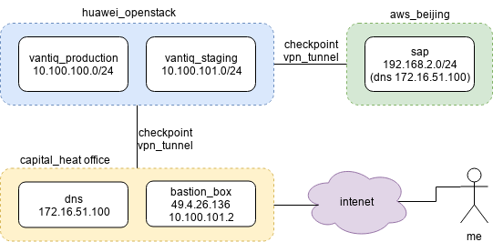

<!--

<br>
<br>
-->

# Deploy Vantiq Product on an Existing Kubernetes Cluster

<!-- TOC depthFrom:2 depthTo:2 withLinks:1 updateOnSave:1 orderedList:0 -->

- [Objective](#objective)
- [Install Vantiq Product](#install-vantiq-product)
- [Appendix](#appendix)

<!-- /TOC -->

## Objective
- Install Vantiq product on a standard Kubernetes cluster.
- Trying to document every step-by-step during deployment, including workaround and tricks

## Network Overview

<center></center>

## Install Vantiq Product

#### Pre-requisite

You need a Github ID, __granted access__ to Vantiq private repo at Github

- Install OpenJAVA

```
sudo apt install openjdk-8-jre-headless

ubuntu@vantiq01:~$ java -version
openjdk version "1.8.0_191"
OpenJDK Runtime Environment (build 1.8.0_191-8u191-b12-2ubuntu0.18.04.1-b12)
OpenJDK 64-Bit Server VM (build 25.191-b12, mixed mode)
```

- Git version
```
ubuntu@vantiq01:~$ git version
git version 2.17.1
```

- Docker version and controllable by a non-root user
```
ubuntu@vantiq01:~$ docker version
Client:
 Version:           18.09.3
 API version:       1.39
 Go version:        go1.10.8
 Git commit:        774a1f4
 Built:             Thu Feb 28 06:53:11 2019
 OS/Arch:           linux/amd64
 Experimental:      false

Server: Docker Engine - Community
 Engine:
  Version:          18.09.3
  API version:      1.39 (minimum version 1.12)
  Go version:       go1.10.8
  Git commit:       774a1f4
  Built:            Thu Feb 28 05:59:55 2019
  OS/Arch:          linux/amd64
  Experimental:     false
```

#### configureClient

- Download Code from Repo

```
git clone https://github.com/vantiq/k8sdeploy_tools.git (private repo)
```

- Check References

> Reference - check parameters setting before starting > https://github.com/Vantiq/k8sdeploy_setup

Once you are ready, perform the following steps:

- Change directory to the directory under which you want to deploy the tools.  We recommend that this be your home directory or some sub-directory thereof.  If you already have a directory in which you put other Git repositories, then that is a good candidate as well.
- Run the command ```git clone https://github.com/Vantiq/k8sdeploy_tools.git```.  This will create a directory called ```k8sdeploy_tools``` in your current directory.  Depending on whether this is the first time you have used Git you may or may not be prompted for your credentials.
- Change directory to the newly create ```k8sdeploy_tools``` directory.  Unless otherwise specified, all commands are run from this directory.
- Run the command ```./gradlew configureClient```.  This command needs to download quite a bit of software, so depending on the speed of your network connection it may take some time to complete.  When it completes you should see something like this (there may be more text about welcome to Gradle, but these should be the last few lines of output):

```
  Starting a Gradle Daemon (subsequent builds will be faster)
  $HELM_HOME has been configured at /root/.helm.
  Not installing Tiller due to 'client-only' flag having been set
  Happy Helming!
  "vantiq" has been added to your repositories

  BUILD SUCCESSFUL in 20s
  3 actionable tasks: 3 executed
```

If you get an error, stop and contact Vantiq operations.

- Edit the file ```.gradle/gradle.properties```.  You should see the following contents:

```
  gitUsername=
  gitPassword=
```

Set the properties to be your GitHub username and password.  Remember that if you have two factor authentication (2FA) enabled for your account you will need to use a personal access key instead of your password.

#### configureVantiqSystem
- Run the command ```./gradlew configureVantiqSystem```.  If you see an error, stop and contact Vantiq operations.  This should create the directories ```vantiqSystem``` and ```targetCluster```.

You would need the access to https://github.com/Vantiq/k8sdeploy.git before the above command gets executed successfully

> Reference (this is an internal URL!) > Vantiq Kubernetes Deployment https://vantiq.sharepoint.com/:w:/r/_layouts/15/doc2.aspx?sourcedoc=%7Bd432b2c3-77bb-47f4-8ee2-0e3eeb3ccce3%7D&action=default&cid=6b0fbd49-a355-45cc-9fbe-bacb087dca88

```
git pull
./gradlew -- stop
./gradlew configureVantiqSystem
```

- Execute ```./gradlew configureVantiqSystem```

Create ```targetCluster``` and ```vantiqSystem```

Sample of ```./targetCluster/cluster.properties``` in customer's env at the moment the env is deployed.
```
# Property definitions for this cluster

# Select a provider for the cluster
provider=kubeadm
# Uncomment if the cluster comes with Helm already installed
#helm_installed=true
# Uncomment if you need to use a non-default version of the K8s clients
#kube_image_tag=2.11.0

# What version and configuration of the Vantiq system are we using
vantiq_system_release=1.1.3
deployment=development
vantiq.installation=eda

# Uncomment this if you intend to manage the definition of this cluster "locally" (aka on this machine only)
requireRemote=false
```

#### Install Product

> Reference > k8sdeploy_tools https://github.com/Vantiq/k8sdeploy_tools/blob/master/README.md

- Create a Git branch

```
cd k8sdeploy_tools/targetCluster
git checkout -b capheat
```

> Note: ```capheat``` is whatever ```clusterName``` you want, which is equal to ```Pcluster=```

- Create ```kubeconfig```

```
cp ~/.kube/config  ~/k8sdeploy_tools/targetCluster/kubeconfig
```

- Managing Cluster Definitions Locally

> Reference > Managing Cluster Definitions Locally https://github.com/Vantiq/k8sdeploy_tools/blob/master/docs/LocallyManagedDefinition.md

```
./gradlew -Pcluster=capheat clusterInfo

./gradlew -Pcluster=capheat setupCluster
```

- Install ```tiller```

```
./helm init --upgrade -i registry.cn-hangzhou.aliyuncs.com/google_containers/tiller:v2.12.2 --stable-repo-url http://mirror.azure.cn/kubernetes/charts/

```

#### Create Block Disks for Persistent Volume (PV)

On ```vantiq04```, where to install the following components

func | size in G | blk device | mount_point under /mnt/disks-by-id
--| -- | -- | --
postgresql for KeyCloak | 20 | vdb | disk0
influxDB | 160 | vdc |
grafana | 20 | vdd |
grafanaDB | 20 | vdg |

```
root@vantiq04:/mnt/disks-by-id# lsblk
NAME   MAJ:MIN RM  SIZE RO TYPE MOUNTPOINT
vda    252:0    0   40G  0 disk
└─vda1 252:1    0   40G  0 part /
vdb    252:16   0   20G  0 disk
└─vdb1 252:17   0   20G  0 part
vdc    252:32   0  160G  0 disk
└─vdc1 252:33   0  160G  0 part
vdd    252:48   0   20G  0 disk
└─vdd1 252:49   0   20G  0 part
vdg    252:96   0   20G  0 disk
└─vdg1 252:97   0   20G  0 part
root@vantiq04:/mnt/disks-by-id#
```

```
root@vantiq04:/mnt/disks-by-id# pwd
/mnt/disks-by-id
root@vantiq04:/mnt/disks-by-id# ls
disk0  disk1  disk2  disk3
```

Format then mount as
```
lsblk
NAME   MAJ:MIN RM  SIZE RO TYPE MOUNTPOINT
vda    252:0    0   40G  0 disk
└─vda1 252:1    0   40G  0 part /
vdb    252:16   0   20G  0 disk
└─vdb1 252:17   0   20G  0 part /mnt/disks-by-id/disk0
vdc    252:32   0   20G  0 disk
vdd    252:48   0   20G  0 disk
vde    252:64   0  160G  0 disk
```

As long as one of the disks gets mounted, you should be able to view

```
ubuntu@vantiq2-test01:~/k8sdeploy_tools$ kubectl -n default get all
...
NAME                                      DESIRED   CURRENT   READY   UP-TO-DATE   AVAILABLE   NODE SELECTOR   AGE
daemonset.apps/local-volume-provisioner   3         3         3       3            3           <none>          6d1h

NAME                                        READY   AGE
statefulset.apps/my-pg-release-postgresql   1/1     5m3s
```
and

```
ubuntu@vantiq2-test01:~$ kubectl get pv
NAME                CAPACITY   ACCESS MODES   RECLAIM POLICY   STATUS      CLAIM   STORAGECLASS    REASON   AGE
local-pv-7e0c864c   19Gi       RWO            Retain           Available           local-storage            14s
```

#### Deploy PostgreSQL by Helm

- Install Postgres
```
./helm install --name my-pg-release --set postgresqlDatabase=keycloak,postgresqlPassword=password,postgresqlUsername=keycloak,persistence.storageClass=local-storage stable/postgresql
```

- Helm delete and it also delete all associated resources, such as deployment

```
ubuntu@vantiq01:~/k8sdeploy_tools$ ./helm delete --purge my-pg-release
```

> Reference > https://github.com/helm/charts/tree/master/stable/postgresql

What we have about Postgres
```
ubuntu@vantiq01:~/k8sdeploy_tools$ kubectl get service
NAME                       TYPE        CLUSTER-IP      EXTERNAL-IP   PORT(S)    AGE
kubernetes                 ClusterIP   10.96.0.1       <none>        443/TCP    20d
my-pg-release-postgresql   ClusterIP   10.98.172.253   <none>        5432/TCP   4m51s
```

#### Prepare an SMTP Service, example

- Customer's SMTP Configuration for reference. Specify in ```deploy.yaml```

protocol | server addr | port | ssl | starttls
-- | -- | -- | -- | --
POP | pop.qiye.163.com | 110 | 995
SMTP | smtp.qiye.163.com | 25 | 994 | 587
IMAP | imap.qiye.163.com | 143 | 993

#### deployNginx

```
ubuntu@vantiq2-test01:~/k8sdeploy_tools$ ./gradlew -Pcluster=ch2 deployNginx
configmap/telegraf-nginx-config created
secret/vantiq-cert created
Hang tight while we grab the latest from your chart repositories...
...Skip local chart repository
...Successfully got an update from the "stable" chart repository
...Successfully got an update from the "vantiq" chart repository
Update Complete. ⎈ Happy Helming!⎈
Release "ch2-lb" does not exist. Installing it now.
NAME:   ch2-lb
LAST DEPLOYED: Mon May 20 02:51:38 2019
NAMESPACE: default
STATUS: DEPLOYED

RESOURCES:
==> v1/ConfigMap
NAME                             AGE
ch2-lb-nginx-ingress-controller  0s

==> v1/ServiceAccount
ch2-lb-nginx-ingress  0s

==> v1beta1/ClusterRoleBinding
ch2-lb-nginx-ingress  0s

==> v1beta1/Role
ch2-lb-nginx-ingress  0s

==> v1/Service
ch2-lb-nginx-ingress-controller        0s
ch2-lb-nginx-ingress-controller-stats  0s
ch2-lb-nginx-ingress-default-backend   0s

==> v1beta1/ClusterRole
ch2-lb-nginx-ingress  0s

==> v1beta1/RoleBinding
ch2-lb-nginx-ingress  0s

==> v1beta1/DaemonSet
ch2-lb-nginx-ingress-controller  0s

==> v1beta1/Deployment
ch2-lb-nginx-ingress-default-backend  0s

==> v1/Pod(related)

NAME                                                   READY  STATUS             RESTARTS  AGE
ch2-lb-nginx-ingress-controller-92xxw                  0/2    ContainerCreating  0         0s
ch2-lb-nginx-ingress-controller-b25s4                  0/2    ContainerCreating  0         0s
ch2-lb-nginx-ingress-controller-xtk4n                  0/2    ContainerCreating  0         0s
ch2-lb-nginx-ingress-default-backend-84645757c8-q2rs8  0/1    ContainerCreating  0         0s


NOTES:
The nginx-ingress controller has been installed.
Get the application URL by running these commands:
  export HTTP_NODE_PORT=$(kubectl --namespace default get services -o jsonpath="{.spec.ports[0].nodePort}" ch2-lb-nginx-ingress-controller)
  export HTTPS_NODE_PORT=$(kubectl --namespace default get services -o jsonpath="{.spec.ports[1].nodePort}" ch2-lb-nginx-ingress-controller)
  export NODE_IP=$(kubectl --namespace default get nodes -o jsonpath="{.items[0].status.addresses[1].address}")

  echo "Visit http://$NODE_IP:$HTTP_NODE_PORT to access your application via HTTP."
  echo "Visit https://$NODE_IP:$HTTPS_NODE_PORT to access your application via HTTPS."

An example Ingress that makes use of the controller:

  apiVersion: extensions/v1beta1
  kind: Ingress
  metadata:
    annotations:
      kubernetes.io/ingress.class: nginx
    name: example
    namespace: foo
  spec:
    rules:
      - host: www.example.com
        http:
          paths:
            - backend:
                serviceName: exampleService
                servicePort: 80
              path: /
    # This section is only required if TLS is to be enabled for the Ingress
    tls:
        - hosts:
            - www.example.com
          secretName: example-tls

If TLS is enabled for the Ingress, a Secret containing the certificate and key must also be provided:

  apiVersion: v1
  kind: Secret
  metadata:
    name: example-tls
    namespace: foo
  data:
    tls.crt: <base64 encoded cert>
    tls.key: <base64 encoded key>
  type: kubernetes.io/tls


> Task :vantiqSystem:showIngressHost

Ingress LB Host:
BUILD SUCCESSFUL in 23s
11 actionable tasks: 11 executed
```

We can see Nginx ingress load-balance being created

```
service/ch2-lb-nginx-ingress-controller         NodePort    10.106.108.103   <none>        80:32488/TCP,443:30397/TCP   40s
```

Check the whole status

```
ubuntu@vantiq2-test01:~$ kubectl -n default get all
NAME                                                        READY   STATUS    RESTARTS   AGE
pod/busybox                                                 1/1     Running   47         47h
pod/ch2-lb-nginx-ingress-controller-92xxw                   2/2     Running   0          40s
pod/ch2-lb-nginx-ingress-controller-b25s4                   2/2     Running   0          40s
pod/ch2-lb-nginx-ingress-controller-xtk4n                   1/2     Running   0          40s
pod/ch2-lb-nginx-ingress-default-backend-84645757c8-q2rs8   1/1     Running   0          40s
pod/local-volume-provisioner-89z6d                          1/1     Running   0          8d
pod/local-volume-provisioner-jnlkz                          1/1     Running   0          8d
pod/local-volume-provisioner-m647f                          1/1     Running   0          8d
pod/my-pg-release-postgresql-0                              1/1     Running   0          2d13h

NAME                                            TYPE        CLUSTER-IP       EXTERNAL-IP   PORT(S)                      AGE
service/ch2-lb-nginx-ingress-controller         NodePort    10.106.108.103   <none>        80:32488/TCP,443:30397/TCP   40s
service/ch2-lb-nginx-ingress-controller-stats   ClusterIP   10.111.3.102     <none>        18080/TCP                    40s
service/ch2-lb-nginx-ingress-default-backend    ClusterIP   10.104.56.68     <none>        80/TCP                       40s
service/kubernetes                              ClusterIP   10.96.0.1        <none>        443/TCP                      10d
service/my-pg-release-postgresql                ClusterIP   10.100.116.94    <none>        5432/TCP                     2d13h
service/my-pg-release-postgresql-headless       ClusterIP   None             <none>        5432/TCP                     2d13h

NAME                                             DESIRED   CURRENT   READY   UP-TO-DATE   AVAILABLE   NODE SELECTOR   AGE
daemonset.apps/ch2-lb-nginx-ingress-controller   3         3         2       3            2           <none>          40s
daemonset.apps/local-volume-provisioner          3         3         3       3            3           <none>          8d

NAME                                                   READY   UP-TO-DATE   AVAILABLE   AGE
deployment.apps/ch2-lb-nginx-ingress-default-backend   1/1     1            1           40s

NAME                                                              DESIRED   CURRENT   READY   AGE
replicaset.apps/ch2-lb-nginx-ingress-default-backend-84645757c8   1         1         1       40s

NAME                                        READY   AGE
statefulset.apps/my-pg-release-postgresql   1/1     2d13h
ubuntu@vantiq2-test01:~$
```

#### deployShared

```
ubuntu@vantiq01:~/k8sdeploy_tools$ ./gradlew -Pcluster=capheat deployShared
Hang tight while we grab the latest from your chart repositories...
...Skip local chart repository
...Successfully got an update from the "vantiq" chart repository
...Successfully got an update from the "stable" chart repository
Update Complete. ⎈ Happy Helming!⎈
Release "grafanadb" does not exist. Installing it now.
NAME:   grafanadb
LAST DEPLOYED: Thu Apr 18 23:14:15 2019
NAMESPACE: shared
STATUS: DEPLOYED

RESOURCES:
==> v1beta1/Deployment
NAME             DESIRED  CURRENT  UP-TO-DATE  AVAILABLE  AGE
grafanadb-mysql  1        1        1           0          0s

==> v1/Pod(related)
NAME                              READY  STATUS   RESTARTS  AGE
grafanadb-mysql-59976d47bf-rchl8  0/1    Pending  0         0s

==> v1/Secret
NAME             TYPE    DATA  AGE
grafanadb-mysql  Opaque  2     0s

==> v1/ConfigMap
NAME                  DATA  AGE
grafanadb-mysql-test  1     0s

==> v1/PersistentVolumeClaim
NAME             STATUS   VOLUME         CAPACITY  ACCESS MODES  STORAGECLASS  AGE
grafanadb-mysql  Pending  local-storage  0s

==> v1/Service
NAME             TYPE       CLUSTER-IP      EXTERNAL-IP  PORT(S)   AGE
grafanadb-mysql  ClusterIP  10.108.123.238  <none>       3306/TCP  0s


NOTES:
MySQL can be accessed via port 3306 on the following DNS name from within your cluster:
grafanadb-mysql.shared.svc.cluster.local

To get your root password run:

    MYSQL_ROOT_PASSWORD=$(kubectl get secret --namespace shared grafanadb-mysql -o jsonpath="{.data.mysql-root-password}" | base64 --decode; echo)

To connect to your database:

1. Run an Ubuntu pod that you can use as a client:

    kubectl run -i --tty ubuntu --image=ubuntu:16.04 --restart=Never -- bash -il

2. Install the mysql client:

    $ apt-get update && apt-get install mysql-client -y

3. Connect using the mysql cli, then provide your password:
    $ mysql -h grafanadb-mysql -p

To connect to your database directly from outside the K8s cluster:
    MYSQL_HOST=127.0.0.1
    MYSQL_PORT=3306

    # Execute the following command to route the connection:
    kubectl port-forward svc/grafanadb-mysql 3306

    mysql -h ${MYSQL_HOST} -P${MYSQL_PORT} -u root -p${MYSQL_ROOT_PASSWORD}


Release "grafana" does not exist. Installing it now.
NAME:   grafana
LAST DEPLOYED: Thu Apr 18 23:14:18 2019
NAMESPACE: shared
STATUS: DEPLOYED

RESOURCES:
==> v1/Pod(related)
NAME                      READY  STATUS   RESTARTS  AGE
grafana-568bd6cb5b-72hxt  0/1    Pending  0         0s

==> v1/Secret
NAME     TYPE    DATA  AGE
grafana  Opaque  3     0s

==> v1beta1/Role
NAME     AGE
grafana  0s

==> v1beta1/RoleBinding
NAME     AGE
grafana  0s

==> v1/ServiceAccount
NAME     SECRETS  AGE
grafana  1        0s

==> v1/ClusterRole
NAME                 AGE
grafana-clusterrole  0s

==> v1/ClusterRoleBinding
NAME                        AGE
grafana-clusterrolebinding  0s

==> v1/Service
NAME     TYPE       CLUSTER-IP     EXTERNAL-IP  PORT(S)  AGE
grafana  ClusterIP  10.109.69.150  <none>       80/TCP   0s

==> v1beta2/Deployment
NAME     DESIRED  CURRENT  UP-TO-DATE  AVAILABLE  AGE
grafana  1        1        1           0          0s

==> v1beta1/PodSecurityPolicy
NAME     PRIV   CAPS      SELINUX   RUNASUSER  FSGROUP   SUPGROUP  READONLYROOTFS  VOLUMES
grafana  false  RunAsAny  RunAsAny  RunAsAny   RunAsAny  false     configMap,emptyDir,projected,secret,downwardAPI,persistentVolumeClaim

==> v1/ConfigMap
NAME     DATA  AGE
grafana  1     0s

==> v1/PersistentVolumeClaim
NAME     STATUS   VOLUME         CAPACITY  ACCESS MODES  STORAGECLASS  AGE
grafana  Pending  local-storage  0s


NOTES:
1. Get your 'admin' user password by running:

   kubectl get secret --namespace shared grafana -o jsonpath="{.data.admin-password}" | base64 --decode ; echo

2. The Grafana server can be accessed via port 80 on the following DNS name from within your cluster:

   grafana.shared.svc.cluster.local

   Get the Grafana URL to visit by running these commands in the same shell:

     export POD_NAME=$(kubectl get pods --namespace shared -l "app=grafana,release=grafana" -o jsonpath="{.items[0].metadata.name}")
     kubectl --namespace shared port-forward $POD_NAME 3000

3. Login with the password from step 1 and the username: admin

Release "influxdb" does not exist. Installing it now.
NAME:   influxdb
LAST DEPLOYED: Thu Apr 18 23:14:25 2019
NAMESPACE: shared
STATUS: DEPLOYED

RESOURCES:
==> v1beta1/Deployment
NAME               DESIRED  CURRENT  UP-TO-DATE  AVAILABLE  AGE
influxdb-influxdb  1        1        1           0          0s

==> v1/Pod(related)
NAME                                READY  STATUS   RESTARTS  AGE
influxdb-influxdb-8499b69bc5-xfk7r  0/1    Pending  0         0s

==> v1/ConfigMap
NAME               DATA  AGE
influxdb-influxdb  1     0s

==> v1/PersistentVolumeClaim
NAME               STATUS   VOLUME         CAPACITY  ACCESS MODES  STORAGECLASS  AGE
influxdb-influxdb  Pending  local-storage  0s

==> v1/Service
NAME               TYPE       CLUSTER-IP     EXTERNAL-IP  PORT(S)            AGE
influxdb-influxdb  ClusterIP  10.105.37.117  <none>       8086/TCP,8088/TCP  0s


NOTES:
InfluxDB can be accessed via port 8086 on the following DNS name from within your cluster:

- http://influxdb-influxdb.shared:8086

You can easily connect to the remote instance with your local influx cli. To forward the API port to localhost:8086 run the following:

- kubectl port-forward --namespace shared $(kubectl get pods --namespace shared -l app=influxdb-influxdb -o jsonpath='{ .items[0].metadata.name }') 8086:8086

You can also connect to the influx cli from inside the container. To open a shell session in the InfluxDB pod run the following:

- kubectl exec -i -t --namespace shared $(kubectl get pods --namespace shared -l app=influxdb-influxdb -o jsonpath='{.items[0].metadata.name}') /bin/sh

To tail the logs for the InfluxDB pod run the following:

- kubectl logs -f --namespace shared $(kubectl get pods --namespace shared -l app=influxdb-influxdb -o jsonpath='{ .items[0].metadata.name }')

secret/keycloakdb created
Release "keycloak" does not exist. Installing it now.
NAME:   keycloak
LAST DEPLOYED: Thu Apr 18 23:14:33 2019
NAMESPACE: shared
STATUS: DEPLOYED

RESOURCES:
==> v1/Service
NAME               TYPE       CLUSTER-IP      EXTERNAL-IP  PORT(S)  AGE
keycloak-headless  ClusterIP  None            <none>       80/TCP   0s
keycloak-http      ClusterIP  10.111.157.238  <none>       80/TCP   0s

==> v1beta1/StatefulSet
NAME      DESIRED  CURRENT  AGE
keycloak  1        1        0s

==> v1beta1/Ingress
NAME      HOSTS  ADDRESS  PORTS  AGE
keycloak  *      80       0s

==> v1/Pod(related)
NAME        READY  STATUS             RESTARTS  AGE
keycloak-0  0/1    ContainerCreating  0         0s

==> v1/Secret
NAME           TYPE    DATA  AGE
keycloak-http  Opaque  1     0s

==> v1/ConfigMap
NAME           DATA  AGE
keycloak       2     0s
keycloak-test  1     0s


NOTES:

Keycloak can be accessed:

* Within your cluster, at the following DNS name at port 80:

  keycloak-http.shared.svc.cluster.local

* From outside the cluster:
  - http://

Login with the following credentials:
Username: keycloak

To retrieve the initial user password run:
kubectl get secret --namespace shared keycloak-http -o jsonpath="{.data.password}" | base64 --decode; echo

Release "telegraf-ds" does not exist. Installing it now.
NAME:   telegraf-ds
LAST DEPLOYED: Thu Apr 18 23:14:35 2019
NAMESPACE: shared
STATUS: DEPLOYED

RESOURCES:
==> v1/ConfigMap
NAME                     DATA  AGE
telegraf-ds-telegraf-ds  1     1s

==> v1beta1/DaemonSet
NAME                     DESIRED  CURRENT  READY  UP-TO-DATE  AVAILABLE  NODE SELECTOR  AGE
telegraf-ds-telegraf-ds  0        0        0      0           0          <none>         1s

==> v1/Pod(related)
NAME                           READY  STATUS             RESTARTS  AGE
telegraf-ds-telegraf-ds-85dkt  0/1    ContainerCreating  0         1s
telegraf-ds-telegraf-ds-9k5xq  0/1    ContainerCreating  0         1s
telegraf-ds-telegraf-ds-s69t5  0/1    ContainerCreating  0         1s
telegraf-ds-telegraf-ds-stjdd  0/1    Pending            0         1s
telegraf-ds-telegraf-ds-wfr56  0/1    Pending            0         1s
telegraf-ds-telegraf-ds-xfpvg  0/1    Pending            0         1s


NOTES:
To open a shell session in the container running Telegraf run the following:

- kubectl exec -i -t --namespace shared $(kubectl get pods --namespace shared -l app=telegraf-ds-telegraf-ds -o jsonpath='{.items[0].metadata.name}') /bin/sh

To tail the logs for a Telegraf pod in the Daemonset run the following:

- kubectl logs -f --namespace shared $(kubectl get pods --namespace shared -l app=telegraf-ds-telegraf-ds -o jsonpath='{ .items[0].metadata.name }')

To list the running Telegraf instances run the following:

- kubectl get pods --namespace shared -l app=telegraf-ds-telegraf-ds -w

BUILD SUCCESSFUL in 32s
12 actionable tasks: 9 executed, 3 up-to-date
```

- Mount the block disks from small size. Check whether pods of ```grafana```, and ```grafana-mysql``` (20GB each) are launched successfully prior to mounting large disk for ```influxdb``` (150GB). The mount the disks for Mongo, which requires 500GB. This prevents ```grafana``` from attaching the big disk!!!

- Status check (example)

```
ubuntu@vantiq2-test01:~/k8sdeploy_tools/vantiqSystem/deploy/shared$ kubectl -n shared get all
NAME                                     READY   STATUS    RESTARTS   AGE
pod/grafana-568bd6cb5b-r28hz             1/1     Running   2          3m50s
pod/grafanadb-mysql-59976d47bf-4q2zr     1/1     Running   0          3m54s
pod/influxdb-influxdb-8499b69bc5-xq25b   1/1     Running   0          3m47s
pod/keycloak-0                           1/1     Running   0          3m41s
pod/telegraf-ds-telegraf-ds-25jxm        1/1     Running   0          3m40s
pod/telegraf-ds-telegraf-ds-ggftn        1/1     Running   0          3m40s
pod/telegraf-ds-telegraf-ds-kz47g        1/1     Running   0          3m40s

NAME                        TYPE        CLUSTER-IP       EXTERNAL-IP   PORT(S)             AGE
service/grafana             ClusterIP   10.101.219.99    <none>        80/TCP              3m50s
service/grafanadb-mysql     ClusterIP   10.107.255.112   <none>        3306/TCP            3m54s
service/influxdb-influxdb   ClusterIP   10.104.199.77    <none>        8086/TCP,8088/TCP   3m47s
service/keycloak-headless   ClusterIP   None             <none>        80/TCP              3m41s
service/keycloak-http       ClusterIP   10.105.157.47    <none>        80/TCP              3m41s

NAME                                     DESIRED   CURRENT   READY   UP-TO-DATE   AVAILABLE   NODE SELECTOR   AGE
daemonset.apps/telegraf-ds-telegraf-ds   3         3         3       3            3           <none>          3m40s

NAME                                READY   UP-TO-DATE   AVAILABLE   AGE
deployment.apps/grafana             1/1     1            1           3m50s
deployment.apps/grafanadb-mysql     1/1     1            1           3m54s
deployment.apps/influxdb-influxdb   1/1     1            1           3m47s

NAME                                           DESIRED   CURRENT   READY   AGE
replicaset.apps/grafana-568bd6cb5b             1         1         1       3m50s
replicaset.apps/grafanadb-mysql-59976d47bf     1         1         1       3m54s
replicaset.apps/influxdb-influxdb-8499b69bc5   1         1         1       3m47s

NAME                        READY   AGE
statefulset.apps/keycloak   1/1     3m41s
```

#### Download ```defaultbackend``` image on all other node

This workaround is optional if ```gcr.io``` unaccessible
```
imageName=defaultbackend:1.4
docker pull registry.cn-hangzhou.aliyuncs.com/google_containers/$imageName
docker tag  registry.cn-hangzhou.aliyuncs.com/google_containers/$imageName k8s.gcr.io/$imageName
docker rmi  registry.cn-hangzhou.aliyuncs.com/google_containers/$imageName
```

#### deployVantiq

```
ubuntu@vantiq01:~/k8sdeploy_tools$ ./gradlew -Pcluster=capheat deployvantiq
Hang tight while we grab the latest from your chart repositories...
...Skip local chart repository
...Successfully got an update from the "vantiq" chart repository
...Unable to get an update from the "stable" chart repository (https://kubernetes-charts.storage.googleapis.com):
        read tcp 172.17.0.2:53572->216.58.200.240:443: read: connection reset by peer
Update Complete. ⎈ Happy Helming!⎈
Release "vantiq-eda" does not exist. Installing it now.
NAME:   vantiq-eda
LAST DEPLOYED: Fri Apr 19 23:21:16 2019
NAMESPACE: eda
STATUS: DEPLOYED

RESOURCES:
==> v1/ConfigMap
NAME                     DATA  AGE
telegraf-mongodb-config  1     0s
loadmodel-config         3     0s
vantiq-config            8     0s

==> v1/RoleBinding
NAME        AGE
vantiq-eda  0s

==> v1/Service
NAME                TYPE          CLUSTER-IP      EXTERNAL-IP                             PORT(S)    AGE
vantiq-eda-mongodb  ClusterIP     10.106.98.1     <none>                                  27017/TCP  0s
keycloak-http       ExternalName  <none>          keycloak-http.shared.svc.cluster.local  80/TCP     0s
vantiq-headless     ClusterIP     None            <none>                                  8080/TCP   0s
vantiq              ClusterIP     10.102.143.167  <none>                                  8080/TCP   0s

==> v1beta1/CronJob
NAME         SCHEDULE  SUSPEND  ACTIVE  LAST SCHEDULE  AGE
mongobackup  @daily    False    0       <none>         0s

==> v1beta1/Ingress
NAME        HOSTS           ADDRESS  PORTS  AGE
vantiq-eda  eda.vantiq.com  80, 443  0s

==> v1/Pod(related)
NAME                                READY  STATUS    RESTARTS  AGE
vantiq-eda-mongodb-bc79ff5c8-nwpgl  0/2    Pending   0         0s
vantiq-eda-0                        0/1    Init:0/3  0         0s

==> v1/Secret
NAME            TYPE                            DATA  AGE
vantiq-cert     kubernetes.io/tls               2     0s
keycloak-init   Opaque                          4     0s
vantiq-mongodb  Opaque                          2     0s
regcred         kubernetes.io/dockerconfigjson  1     0s

==> v1/PersistentVolumeClaim
NAME                STATUS   VOLUME         CAPACITY  ACCESS MODES  STORAGECLASS  AGE
vantiq-eda-mongodb  Pending  local-storage  0s

==> v1/ServiceAccount
NAME        SECRETS  AGE
vantiq-eda  1        0s

==> v1/Role
NAME        AGE
vantiq-eda  0s

==> v1beta1/Deployment
NAME                DESIRED  CURRENT  UP-TO-DATE  AVAILABLE  AGE
vantiq-eda-mongodb  1        1        1           0          0s

==> v1beta2/StatefulSet
NAME        DESIRED  CURRENT  AGE
vantiq-eda  1        1        0s


NOTES:
1. Get the application URL by running these commands:


> Task :vantiqSystem:deployVantiqServerForeda
NO VERSION given for chart ./vantiqSystem/build/deploy/vantiq/vantiq, installing latest stable version.

BUILD SUCCESSFUL in 4m 34s
7 actionable tasks: 4 executed, 3 up-to-date

```

- download vantiq-server manually on node5/6 with docker login

```
kubectl -n eda edit statefulsets.apps vantiq-eda
```

- Edit ```imagePullPolicy``` replace ```Always``` with ```IfNotPresent```

```
containers:
- args:
	- -Dio.vantiq.installation=eda
	image: vantiq/vantiq-server:1.24.12
	imagePullPolicy: IfNotPresent
```

- You can manually download the required images if image pull failed. Mostly the failure is caused by incorrect credentials in download session.

```
docker pull bitnami/mongodb:4.0.3-debian-9
docker pull vantiq/keycloak:4.2.1.Final
docker pull vantiq/vantiq-server:1.25.6
```
> vantiq/keycloak is the image from private repo


```
ubuntu@vantiq01:~/k8sdeploy_tools$ cat keycloak_token.txt
fDMXDOTxPTNV1U0SrWJxUhlfUhN1Zv5COFoeXAtb8OM=
ubuntu@vantiq01:~/k8sdeploy_tools$ kubectl get all -n eda
NAME                                     READY   STATUS    RESTARTS   AGE
pod/mongobackup-1555718400-4t9qs         0/1     Error     0          34m
pod/mongobackup-1555718400-6qplz         0/1     Error     0          27m
pod/mongobackup-1555718400-hlpph         0/1     Error     0          32m
pod/mongobackup-1555718400-l7dcx         0/1     Error     0          31m
pod/mongobackup-1555718400-pctcq         0/1     Error     0          33m
pod/mongobackup-1555718400-rkkrp         0/1     Error     0          32m
pod/mongobackup-1555718400-tw4j8         0/1     Error     0          30m
pod/vantiq-eda-0                         1/1     Running   0          4m22s
pod/vantiq-eda-mongodb-bc79ff5c8-p6g2s   2/2     Running   0          43m

NAME                         TYPE           CLUSTER-IP       EXTERNAL-IP                              PORT(S)     AGE
service/keycloak-http        ExternalName   <none>           keycloak-http.shared.svc.cluster.local   80/TCP      43m
service/vantiq               ClusterIP      10.97.117.2      <none>                                   8080/TCP    43m
service/vantiq-eda-mongodb   ClusterIP      10.102.235.102   <none>                                   27017/TCP   43m
service/vantiq-headless      ClusterIP      None             <none>                                   8080/TCP    43m

NAME                                 READY   UP-TO-DATE   AVAILABLE   AGE
deployment.apps/vantiq-eda-mongodb   1/1     1            1           43m

NAME                                           DESIRED   CURRENT   READY   AGE
replicaset.apps/vantiq-eda-mongodb-bc79ff5c8   1         1         1       43m

NAME                          READY   AGE
statefulset.apps/vantiq-eda   1/1     43m

NAME                               COMPLETIONS   DURATION   AGE
job.batch/mongobackup-1555718400   0/1           34m        34m

NAME                        SCHEDULE   SUSPEND   ACTIVE   LAST SCHEDULE   AGE
cronjob.batch/mongobackup   @daily     False     0        34m             43m

```

#### Check the status
- kube-system
```
ubuntu@vantiq2-test01:~$ kubectl -n kube-system get all
NAME                                         READY   STATUS    RESTARTS   AGE
pod/coredns-d5947d4b-9shhz                   1/1     Running   0          8d
pod/coredns-d5947d4b-psnhp                   1/1     Running   0          8d
pod/etcd-vantiq2-test01                      1/1     Running   0          8d
pod/kube-apiserver-vantiq2-test01            1/1     Running   0          8d
pod/kube-controller-manager-vantiq2-test01   1/1     Running   0          8d
pod/kube-flannel-ds-amd64-7m6z9              1/1     Running   1          8d
pod/kube-flannel-ds-amd64-85chm              1/1     Running   0          8d
pod/kube-flannel-ds-amd64-td9hp              1/1     Running   0          8d
pod/kube-flannel-ds-amd64-zqqs5              1/1     Running   0          8d
pod/kube-proxy-2c8l5                         1/1     Running   0          8d
pod/kube-proxy-ktpzf                         1/1     Running   0          8d
pod/kube-proxy-qlk4w                         1/1     Running   0          8d
pod/kube-proxy-xf82t                         1/1     Running   0          8d
pod/kube-scheduler-vantiq2-test01            1/1     Running   0          8d
pod/tiller-deploy-59b99695d8-pdmhs           1/1     Running   0          4d9h

NAME                    TYPE        CLUSTER-IP      EXTERNAL-IP   PORT(S)                  AGE
service/kube-dns        ClusterIP   10.96.0.10      <none>        53/UDP,53/TCP,9153/TCP   8d
service/tiller-deploy   ClusterIP   10.105.58.231   <none>        44134/TCP                6d13h

NAME                                     DESIRED   CURRENT   READY   UP-TO-DATE   AVAILABLE   NODE SELECTOR                     AGE
daemonset.apps/kube-flannel-ds-amd64     4         4         4       4            4           beta.kubernetes.io/arch=amd64     8d
daemonset.apps/kube-flannel-ds-arm       0         0         0       0            0           beta.kubernetes.io/arch=arm       8d
daemonset.apps/kube-flannel-ds-arm64     0         0         0       0            0           beta.kubernetes.io/arch=arm64     8d
daemonset.apps/kube-flannel-ds-ppc64le   0         0         0       0            0           beta.kubernetes.io/arch=ppc64le   8d
daemonset.apps/kube-flannel-ds-s390x     0         0         0       0            0           beta.kubernetes.io/arch=s390x     8d
daemonset.apps/kube-proxy                4         4         4       4            4           <none>                            8d

NAME                            READY   UP-TO-DATE   AVAILABLE   AGE
deployment.apps/coredns         2/2     2            2           8d
deployment.apps/tiller-deploy   1/1     1            1           6d13h

NAME                                       DESIRED   CURRENT   READY   AGE
replicaset.apps/coredns-d5947d4b           2         2         2       8d
replicaset.apps/tiller-deploy-59b99695d8   1         1         1       4d10h
replicaset.apps/tiller-deploy-5fbf5bcb96   0         0         0       6d13h
```

- default
```
ubuntu@vantiq2-test01:~$ kubectl -n default get all
NAME                                 READY   STATUS    RESTARTS   AGE
pod/local-volume-provisioner-89z6d   1/1     Running   0          6d13h
pod/local-volume-provisioner-jnlkz   1/1     Running   0          6d13h
pod/local-volume-provisioner-m647f   1/1     Running   0          6d13h
pod/my-pg-release-postgresql-0       1/1     Running   0          11h

NAME                                        TYPE        CLUSTER-IP      EXTERNAL-IP   PORT(S)    AGE
service/kubernetes                          ClusterIP   10.96.0.1       <none>        443/TCP    8d
service/my-pg-release-postgresql            ClusterIP   10.100.116.94   <none>        5432/TCP   11h
service/my-pg-release-postgresql-headless   ClusterIP   None            <none>        5432/TCP   11h

NAME                                      DESIRED   CURRENT   READY   UP-TO-DATE   AVAILABLE   NODE SELECTOR   AGE
daemonset.apps/local-volume-provisioner   3         3         3       3            3           <none>          6d13h

NAME                                        READY   AGE
statefulset.apps/my-pg-release-postgresql   1/1     11h
```

- shared
```
ubuntu@vantiq01:~$ kubectl get all -n shared
NAME                                     READY   STATUS    RESTARTS   AGE
pod/grafana-568bd6cb5b-72hxt             1/1     Running   0          39h
pod/grafanadb-mysql-59976d47bf-rchl8     1/1     Running   0          39h
pod/influxdb-influxdb-8499b69bc5-xfk7r   1/1     Running   0          39h
pod/keycloak-0                           1/1     Running   42         38h
pod/telegraf-ds-telegraf-ds-85dkt        1/1     Running   0          39h
pod/telegraf-ds-telegraf-ds-9k5xq        1/1     Running   0          39h
pod/telegraf-ds-telegraf-ds-s69t5        1/1     Running   0          39h
pod/telegraf-ds-telegraf-ds-stjdd        1/1     Running   0          39h
pod/telegraf-ds-telegraf-ds-wfr56        1/1     Running   0          39h
pod/telegraf-ds-telegraf-ds-xfpvg        1/1     Running   0          39h

NAME                        TYPE        CLUSTER-IP       EXTERNAL-IP   PORT(S)             AGE
service/grafana             ClusterIP   10.109.69.150    <none>        80/TCP              39h
service/grafanadb-mysql     ClusterIP   10.108.123.238   <none>        3306/TCP            39h
service/influxdb-influxdb   ClusterIP   10.105.37.117    <none>        8086/TCP,8088/TCP   39h
service/keycloak-headless   ClusterIP   None             <none>        80/TCP              39h
service/keycloak-http       ClusterIP   10.111.157.238   <none>        80/TCP              39h

NAME                                     DESIRED   CURRENT   READY   UP-TO-DATE   AVAILABLE   NODE SELECTOR   AGE
daemonset.apps/telegraf-ds-telegraf-ds   6         6         6       6            6           <none>          39h

NAME                                READY   UP-TO-DATE   AVAILABLE   AGE
deployment.apps/grafana             1/1     1            1           39h
deployment.apps/grafanadb-mysql     1/1     1            1           39h
deployment.apps/influxdb-influxdb   1/1     1            1           39h

NAME                                           DESIRED   CURRENT   READY   AGE
replicaset.apps/grafana-568bd6cb5b             1         1         1       39h
replicaset.apps/grafanadb-mysql-59976d47bf     1         1         1       39h
replicaset.apps/influxdb-influxdb-8499b69bc5   1         1         1       39h

NAME                        READY   AGE
statefulset.apps/keycloak   1/1     39h
```

- vantiq-eda
```
ubuntu@vantiq2-test01:~$ kubectl -n eda-dev get all
NAME                                          READY   STATUS    RESTARTS   AGE
pod/vantiq-eda-dev-0                          1/1     Running   0          10h
pod/vantiq-eda-dev-mongodb-775cf9c77d-pldrj   2/2     Running   0          11h

NAME                             TYPE           CLUSTER-IP      EXTERNAL-IP                              PORT(S)     AGE
service/keycloak-http            ExternalName   <none>          keycloak-http.shared.svc.cluster.local   80/TCP      11h
service/vantiq                   ClusterIP      10.107.109.44   <none>                                   8080/TCP    11h
service/vantiq-eda-dev-mongodb   ClusterIP      10.107.104.49   <none>                                   27017/TCP   11h
service/vantiq-headless          ClusterIP      None            <none>                                   8080/TCP    11h

NAME                                     READY   UP-TO-DATE   AVAILABLE   AGE
deployment.apps/vantiq-eda-dev-mongodb   1/1     1            1           11h

NAME                                                DESIRED   CURRENT   READY   AGE
replicaset.apps/vantiq-eda-dev-mongodb-775cf9c77d   1         1         1       11h

NAME                              READY   AGE
statefulset.apps/vantiq-eda-dev   1/1     11h

NAME                               COMPLETIONS   DURATION   AGE
job.batch/mongobackup-1558137600   0/1           46m        46m
```

Test the result

```
for i in {1..6}; do echo "hostname=1$i"; curl -v http://10.100.100.1$i:31978/healthz; done
```

## Appendix

#### Catpure token after install

```
kubectl -n eda log pod/vantiq-eda-0
```

The token to setup KeyCloak can be found at the end of output, for example
```
01ZcoLZrTEi5LZlI-Vd82mbYyqAOA_CLYYJ2TnReQBs=
```

#### Tiny persistent volume tutorial

- Mount a 20G block device to ```/mnt/disks-by-id/disk0``` on any of node in K8S cluster

```
kubectl create ns test
kubectl apply -f testPvc.yaml
```

```
ubuntu@vantiq01:~/k8sdeploy_tools$ kubectl get pvc
NAME                STATUS   VOLUME              CAPACITY   ACCESS MODES   STORAGECLASS    AGE
my-pvc-test-pvc-0   Bound    local-pv-c66a60be   520Gi      RWO            local-storage   7m20s
```

The PVC will be bound to the 1st seen disk. So if you manually do this, you would have to mount and verify the claimed PVC one-by-one in manual steps

Don't forget to delete the test PV and PVC in the tutorial

```
kubectl delete pvc xxx
kubectl delete pv  xxx
```

#### SSL Keys

- Create self-signed key

```
openssl req -newkey rsa:2048 -new -nodes -x509 -days 3650 -keyout key.pem -out cert.pem
```

- Get serial number from a certificate

```
openssl x509 -in cert.pem -serial -noout
```

- Get a public key from a certificate

```
openssl x509 -inform pem -in cert.pem -pubkey -noout
```

#### Re-deploy

For any case, if you need to redeploy the environment, you possibly need to do as what I did

```
./gradlew -Pcluster=capheat undeployNginx
./gradlew -Pcluster=capheat undeployvantiq
./gradlew -Pcluster=capheat clean
./gradlew -Pcluster=capheat deployNginx
./gradlew -Pcluster=capheat deployvantiq
```

#### Setup front-end load-balancer

Here is the example of env on Huawei OpenStack at customer

- The single IP to access https://eda.cptheat.come
```
  10.100.100.200
```

- IPs of Kubernetes cluster, that maps to front-end IP

```
  10.100.100.11
  10.100.100.12
  10.100.100.13
  10.100.100.14
  10.100.100.15
  10.100.100.16
```

- NotePort, from ```kubectl -n default get all```
```
  80:30820/TCP,443:30413/TCP
```

- Use ```TCP``` instead of ```HTTP``` in configuration of Load-Balancer front-end

- Provide self-signed key to OpenStack administrator who configures Load-Balancer

#### Setup role-based access control for Helm

> Reference > https://helm.sh/docs/using_helm/#tiller-and-role-based-access-control

- Create ```rbac-config.yaml```

```
apiVersion: v1
kind: ServiceAccount
metadata:
  name: tiller
  namespace: kube-system
---
apiVersion: rbac.authorization.k8s.io/v1
kind: ClusterRoleBinding
metadata:
  name: tiller
roleRef:
  apiGroup: rbac.authorization.k8s.io
  kind: ClusterRole
  name: cluster-admin
subjects:
  - kind: ServiceAccount
    name: tiller
    namespace: kube-system
```

- Create

```
kubectl create -f rback-config.yaml
```

- Update Helm with ```service-account``` defined

```
./helm init --service-account tiller --upgrade -i registry.cn-hangzhou.aliyuncs.com/google_containers/tiller:v2.12.2 --stable-repo-url https://aliacs-app-catalog.oss-cn-hangzhou.aliyuncs.com/charts/ --force-upgrade
```

#### Disks and PVs

All disks for ```shared``` are located on ```vantiq-test04``` node

```
ubuntu@vantiq-test04:/mnt/disks-by-id$ lsblk
NAME   MAJ:MIN RM  SIZE RO TYPE MOUNTPOINT
vda    252:0    0   40G  0 disk
└─vda1 252:1    0   40G  0 part /
vdb    252:16   0   20G  0 disk
└─vdb1 252:17   0   20G  0 part /var/lib/kubelet/pods/05b0c8cf-7129-11e9-a3a8-fa163edae6af/volumes/kubernetes.io~local-volume/local-p
vdc    252:32   0   20G  0 disk
└─vdc1 252:33   0   20G  0 part /var/lib/kubelet/pods/06dabac1-7129-11e9-a3a8-fa163edae6af/volumes/kubernetes.io~local-volume/local-p
vdd    252:48   0   20G  0 disk
└─vdd1 252:49   0   20G  0 part /var/lib/kubelet/pods/973d59f7-7126-11e9-a3a8-fa163edae6af/volumes/kubernetes.io~local-volume/local-p
vde    252:64   0  160G  0 disk
└─vde1 252:65   0  160G  0 part /var/lib/kubelet/pods/0961ecac-7129-11e9-a3a8-fa163edae6af/volumes/kubernetes.io~local-volume/local-p
```

```
ubuntu@vantiq-test01:~$ kubectl get pv
NAME                CAPACITY   ACCESS MODES   RECLAIM POLICY   STATUS   CLAIM                                     STORAGECLASS    REASON   AGE
local-pv-6e62dbcb   19Gi       RWO            Retain           Bound    shared/grafanadb-mysql                    local-storage            29h
local-pv-700d0498   19Gi       RWO            Retain           Bound    shared/grafana                            local-storage            29h
local-pv-ae57100f   19Gi       RWO            Retain           Bound    default/data-my-pg-release-postgresql-0   local-storage            4h15m
local-pv-d744676a   156Gi      RWO            Retain           Bound    shared/influxdb-influxdb                  local-storage            3h27m
ubuntu@vantiq-test01:~$ kubectl get pvc
NAME                              STATUS   VOLUME              CAPACITY   ACCESS MODES   STORAGECLASS    AGE
data-my-pg-release-postgresql-0   Bound    local-pv-ae57100f   19Gi       RWO            local-storage   3h58m
```

#### Exception

```
ubuntu@vantiq2-test01:~/k8sdeploy_tools$ ./gradlew configureVantiqSystem
> Task :configureVantiqSystem FAILED

FAILURE: Build failed with an exception.

* Where:
Build file '/home/ubuntu/k8sdeploy_tools/build.gradle' line: 197

* What went wrong:
Execution failed for task ':configureVantiqSystem'.
> org.eclipse.jgit.api.errors.RefNotFoundException: Ref origin/new-master cannot be resolved

* Try:
Run with --stacktrace option to get the stack trace. Run with --info or --debug option to get more log output. Run with --scan to get full insights.

* Get more help at https://help.gradle.org

BUILD FAILED in 3s
1 actionable task: 1 executed
```

```
ubuntu@vantiq2-test01:~/k8sdeploy_tools$ ./gradlew -Pcluster=ch2 setupCluster
$HELM_HOME has been configured at /root/.helm.
Error: error when upgrading: current Tiller version is newer, use --force-upgrade to downgrade
> Task :initHelmServer FAILED

FAILURE: Build failed with an exception.

* What went wrong:
Execution failed for task ':initHelmServer'.
> COMMAND: vantiq_helm init --service-account tiller --upgrade

* Try:
Run with --stacktrace option to get the stack trace. Run with --info or --debug option to get more log output. Run with --scan to get full insights.

* Get more help at https://help.gradle.org

BUILD FAILED in 7s
5 actionable tasks: 2 executed, 3 up-to-date
```

Workaround:

```
./helm init --service-account tiller --force-upgrade --upgrade
```

#### Clean-up the installed environment and redeploy

- undeploy
```
cd ~/k8sdeploy_tools
./gradlew -Pcluster=<CLUSTER_NAME> undeployvantiq
./gradlew -Pcluster=<CLUSTER_NAME> undeployShared
./gradlew -Pcluster=<CLUSTER_NAME> undeployNginx
```

- clean
```
./gradlew -Pcluster=<CLUSTER_NAME> clean
```

- ```rm -fr``` mounted persistent volumes very carefully

- umount mounted persistent volumes

- redeploy
```
./gradlew -Pcluster=<CLUSTER_NAME> deployNginx
./gradlew -Pcluster=<CLUSTER_NAME> deployShared
./gradlew -Pcluster=<CLUSTER_NAME> deployVantiq
```

#### "./vantiqSystem/build/deploy/nginx/telegraf-nginx-config.yaml" does not exist

```
ubuntu@vantiq2-test01:~/k8sdeploy_tools$ ./gradlew -Pcluster=ch2 undeployNginx
error: the path "./vantiqSystem/build/deploy/nginx/telegraf-nginx-config.yaml" does not exist
> Task :vantiqSystem:deleteTelegrafConfig FAILED

FAILURE: Build failed with an exception.

* What went wrong:
Execution failed for task ':vantiqSystem:deleteTelegrafConfig'.
> COMMAND: vantiq_kubectl delete -f ./vantiqSystem/build/deploy/nginx/telegraf-nginx-config.yaml --namespace default

* Try:
Run with --stacktrace option to get the stack trace. Run with --info or --debug option to get more log output. Run with --scan to get full insights.

* Get more help at https://help.gradle.org

BUILD FAILED in 7s
2 actionable tasks: 2 executed
ubuntu@vantiq2-test01:~/k8sdeploy_tools$ ./gradlew -Pcluster=ch2 clean

BUILD SUCCESSFUL in 4s
2 actionable tasks: 2 executed
ubuntu@vantiq2-test01:~/k8sdeploy_tools$
```

Its actual path
```
ubuntu@vantiq2-test01:~/k8sdeploy_tools$ find . -type f -name telegraf-nginx-config.yaml
./vantiqSystem/deploy/nginx/telegraf-nginx-config.yaml
```

#### Delete persistent volume (PV) for re-deploy
```
ubuntu@vantiq2-test01:~$ kubectl get pv
NAME                CAPACITY   ACCESS MODES   RECLAIM POLICY   STATUS     CLAIM                                     STORAGECLASS    REASON   AGE
local-pv-476bb852   19Gi       RWO            Retain           Released   shared/grafana                            local-storage            2d13h
local-pv-7e0c864c   19Gi       RWO            Retain           Bound      default/data-my-pg-release-postgresql-0   local-storage            2d13h
local-pv-bf67d9f3   19Gi       RWO            Retain           Released   shared/grafanadb-mysql                    local-storage            2d13h
local-pv-d90de49d   156Gi      RWO            Retain           Released   shared/influxdb-influxdb                  local-storage            2d13h
ubuntu@vantiq2-test01:~$ kubectl delete pv local-pv-bf67d9f3
persistentvolume "local-pv-bf67d9f3" deleted
ubuntu@vantiq2-test01:~$ kubectl delete pv local-pv-476bb852
persistentvolume "local-pv-476bb852" deleted
ubuntu@vantiq2-test01:~$ kubectl delete pv local-pv-d90de49d
persistentvolume "local-pv-d90de49d" deleted
ubuntu@vantiq2-test01:~$ kubectl get pv
NAME                CAPACITY   ACCESS MODES   RECLAIM POLICY   STATUS      CLAIM                                     STORAGECLASS    REASON   AGE
local-pv-476bb852   19Gi       RWO            Retain           Available                                             local-storage            12s
local-pv-7e0c864c   19Gi       RWO            Retain           Bound       default/data-my-pg-release-postgresql-0   local-storage            2d13h
local-pv-bf67d9f3   19Gi       RWO            Retain           Available                                             local-storage            22s
local-pv-d90de49d   156Gi      RWO            Retain           Available                                             local-storage            2s
```

#### Use "stable" chart

```
ubuntu@vantiq2-test01:~/k8sdeploy_tools$ ./gradlew -Pcluster=ch2 deployShared
Hang tight while we grab the latest from your chart repositories...
...Skip local chart repository
...Successfully got an update from the "vantiq" chart repository
...Unable to get an update from the "stable" chart repository (https://kubernetes-charts.storage.googleapis.com):
        Get https://kubernetes-charts.storage.googleapis.com/index.yaml: read tcp 172.17.0.2:44004->172.217.24.48:443: read: connection reset by peer
Update Complete. ⎈ Happy Helming!⎈
```
