# Stress-Test of Vantiq Product

## Project Overview

To simulate several business scenarios to generate workload, in order to monitor and capture the response behaviors of our product which has been deployed in production-grade cluster

- Monitoring spec
  - product
  - system
- Capacity
- Bottleneck
- Performance tuning

## Environment and Architecture

- 6 VMs as K8S work nodes (-1 as of master)
- __4vCPU, 16G memory__, each node
- 3* MongoDB (1 arbitor, 1 primary, 1 secondary), standard disk
- 3* Vantiq-server (__1.25.13__)
- 3* Keycloak

## Configuration

#### Product Edition

```
kubectl -n eda-dev describe pod/vantiq-eda-dev-0 | grep vantiq-server | grep Image:
    Image:          vantiq/vantiq-server:1.25.13
```

#### System Env Setting

To grant the access from Gatling to Vantiq system

```
ubuntu@vantiq2-test01:~/stress_test/gatlingTestInfra3/loadTest$ cat ~/.vantiq/profile
 {
// url = 'http://eda-dev.profile_name.com:8080'
url = 'https://eda-dev.profile_name.com'
// user 'test' in system
// vantiq -s docs1 load document /tmp/vantiq-docs
token = 'kxJDu_UDE7pHHGmBsdW6mMk7YOVL5ZneRs4ZqRU9TvA='
}
```

#### How to config SSL for Nodes to ignore SSL challenge

- In both "Deployment" and "Operations", Deploy -> Nodes
- Create or Select one
- Under [Client Options] add configure

```
{
    "trustAll" : true
}
```

#### Configure Products

To enable Modelo in product: Operations > Administer > Organizations > Actions > Configure Products

```
{
    "Pronto": {
        "enabled": true,
        "maxEventCatalogs": 1
    },
    "Modelo": {
        "enabled": true
    }
}
```

#### Modify Quota

Operations > Administer > Organizations > Actions > Edit Quotas (default: percentage = 20) > update ```"receiveMessage": 30000``` according to actual resource and ```"percentage": 100```

```
{
    "rates": {
        "execution": 20010,
        "receiveMessage": 20000
    },
    "credit": {
        "default": {
            "percentage": 100,
            "queueRatio": 10
        }
    }
}
```

Another sample from Paul
```
{​
    “rates”: {​
        “execution”: 1000,​
        “stream” : 250000,​
        “receiveMessage: 1000​
    },​
    “credit”: {​
        “default”: {​
            “percentage” : 20,​
            “queueRatio”: 2​
        }​
    },​
    “limits”: {​
        “stackDepth”: 200,​
        “errorBreaker”: {​
            “sample”: 20,​
            “failurePercent”: 20​,
            “retrySample”: 2,​
            “retryAfter: “1 minute”​
        },​
        “executionTime”: “2 minutes”,​
        “reservedGroups”: 2048 * 10
    }​,
    “auditFrequency”: “10 minutes”,​
    “errorReportingFrequency”: “30 minutes”​
}
```

#### Update Vantiq ConfigMap

Change to increase ```"executionCredit": 150```

```
kubectl -n eda-dev edit cm vantiq-config
```

```
apiVersion: v1
data:
  io.vantiq.monitoring.MonitoringManager.json: |-
    {
      "config": {
        "grafana": {
          "host": "grafana.shared.svc.cluster.local",
          "port": 80,
          "influxDbHost": "influxdb-influxdb"
        },
        "influxDb": {
          "host": "influxdb-influxdb.shared.svc.cluster.local"
        }
      }
    }
  io.vantiq.rulemgr.RuleManager.json: |-
    {
      "config": {
        "executionCredit": 150
                }
    }
```

Then re-scale to take the above change effective
```
kubectl -n eda-dev scale --replicas=0 statefulset vantiq-eda-dev
kubectl -n eda-dev scale --replicas=3 statefulset vantiq-eda-dev
```

## Grafana dataSources Configuration

Create the following dataSources

- mongoDB
<center>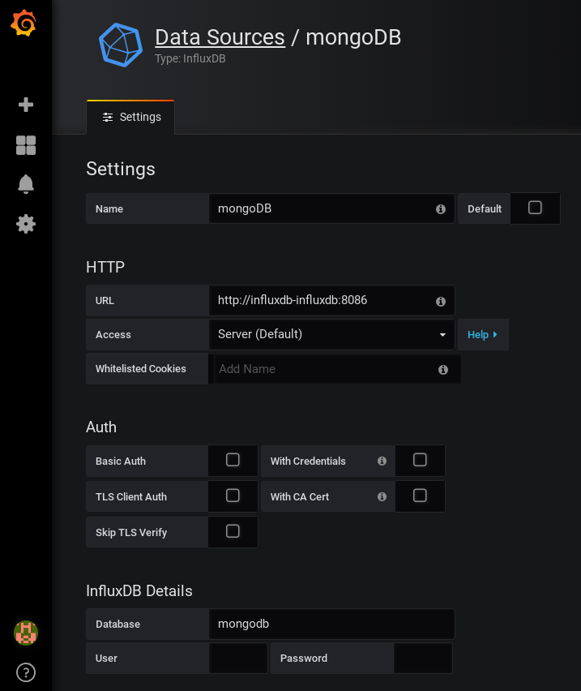</center>

- systemDB
  - Name: systemDB
  - URL: http://influxdb-influxdb:8086
  - influxDB Details > Database = system

- vantiqServer
  - Name: vantiqServer
  - URL: http://influxdb-influxdb:8086
  - influxDB Details > Database = vantiq_server

- kubernetes
  - Name: kubernetes
  - URL: http://influxdb-influxdb:8086
  - influxDB Details > Database = kubernetes

- internals
  - Name: internals
  - URL: http://influxdb-influxdb:8086
  - influxDB Details > Database = \_internal

After finishing, the home dashboard looks like

<center>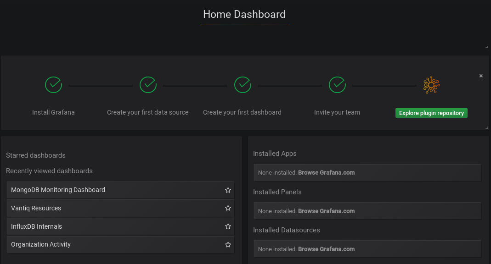</center>

<div style="page-break-after: always;"></div>


## Test-Case 1: LimitLiftsSim

#### Description:
- 5K/sec update for status update
- 1K/min upsert for status history storage
- 500 users, 3 event / user
- 1,500 elevators/ second, upsert/ second in collection ```realtimeData``` (value the same as ```StatisticData_Derived```)
- 1,500 insert/ minute in ```realtimeData_his``` (history)

#### Script

```
cat ~/.vantiq/profile
```

```
XXX {
// url = 'http://eda-dev.cptheat.com:8080'
url = 'https://eda-dev.cptheat.com'
// user 'test' in system
// vantiq -s docs1 load document /tmp/vantiq-docs
token = 'olog2XOpHW5eMa52mwjinLVHjBQKVFVviG-mSoy_MZU='
}
```

Simulation code is located

```
~/stress_test/gatlingTestInfra3/loadTest/src/gatling/resources/namespaces
```

```
cd ~/stress_test/gatlingTestInfra3/loadTest

../gradlew --console=plain gatlingRun-LimitLiftsSim -Pvantiq.system=XXX \
  -Pgatling.users=500 -Pgatling.duration="10 minutes" \
  -Pvantiq.namespace.create=false -Pvantiq.namespace.save=true
```

<div style="page-break-after: always;"></div>

#### Test Output
```
================================================================================
---- Global Information --------------------------------------------------------
> request count                                     822825 (OK=822825 KO=0     )
> min response time                                      0 (OK=0      KO=-     )
> max response time                                    713 (OK=713    KO=-     )
> mean response time                                    17 (OK=17     KO=-     )
> std deviation                                         28 (OK=28     KO=-     )
> response time 50th percentile                          6 (OK=6      KO=-     )
> response time 75th percentile                         18 (OK=18     KO=-     )
> response time 95th percentile                         67 (OK=67     KO=-     )
> response time 99th percentile                        132 (OK=132    KO=-     )
> mean requests/sec                                1371.375 (OK=1371.375 KO=-  )
---- Response Time Distribution ------------------------------------------------
> t < 800 ms                                        822825 (100%)
> 800 ms < t < 1200 ms                                   0 (  0%)
> t > 1200 ms                                            0 (  0%)
> failed                                                 0 (  0%)
================================================================================
```

<div style="page-break-after: always;"></div>

###### Statistic from Grafana
<center>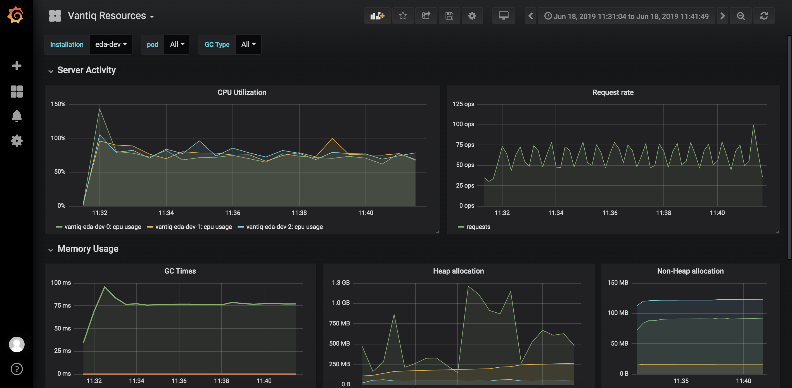</center>

Analysis Conclusion:

- Reduced concurrent user from 1000 down to 500
- Network ~450K/s input and output. Busy
- Vantiq Resources reached to ~80%. Quite heavy

<center>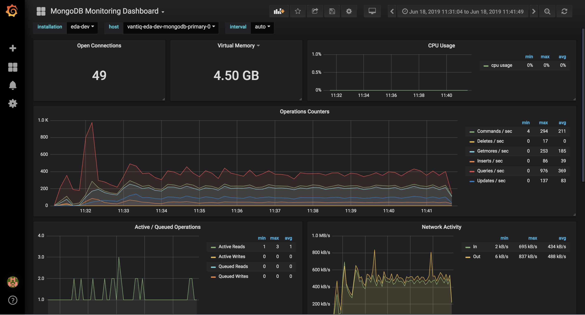</center>

Analysis Conclusion:

- MongoDB: 49 connections and up to 4.5G memory usage (busy). Transaction per second:
  ```
  query= 369
  insert= 39
  update= 83
  ```
- realtimeData table in MongoDB:
  ```vantiq:PRIMARY> db.realtimeData_his__myfirstnamespace.count() = 105335```
  (not that high as expected. Some cap possibly limits this)

###### Statistic from Gatling
<center>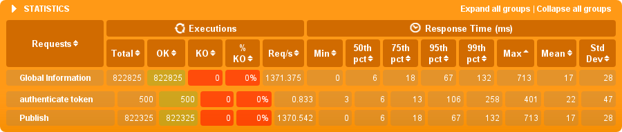</center>

Analysis Conclusion:

- Total 822,825 requests completed 100% in success, including 500 token accesses, about 1,371 req/s (not bad)
- Response-time: 99th pct = 132 ms (good enough for production. The less the better)

<center>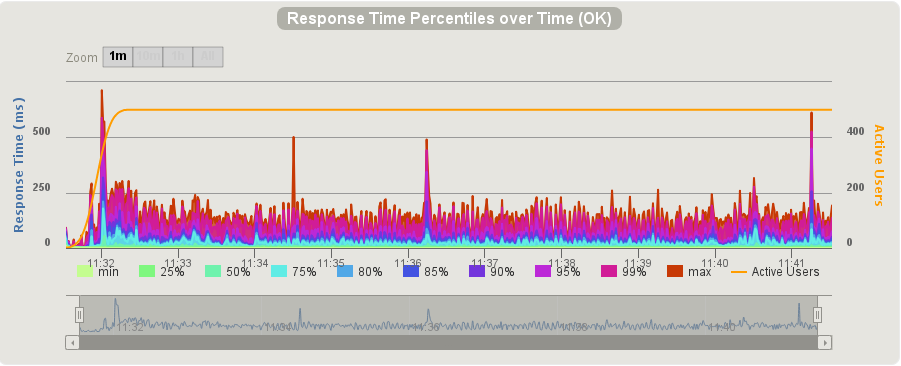</center>

###### Statistic from MongoDB

```
vantiq:PRIMARY> db.realtimeData_his__myfirstnamespace.count()
105335
```

#### Check MongoDB

action | command
-- | --
log into mongo | ```kubectl -n eda-dev exec -it vantiq-eda-dev-mongodb-primary-0 /bin/bash```
log into database on primary | ```mongo ars02 -u ars -p ars```
list database | ```show dbs```
use database | ```use ars02```
list all tables | ```show collections```
query table | ```db.realtimeData_his__myfirstnamespace.count() = 105335```

<div style="page-break-after: always"></div>

## Test-Case 2: DB_InsertSim

#### Description:
- 50 concurrent users
- insert 1000 rows into MongoDB over and over
- 10 minutes running

#### Script
```
ubuntu@vantiq2-test01:~/stress_test/gatlingTestInfra3/loadTest$ pwd
/home/ubuntu/stress_test/gatlingTestInfra3/loadTest

../gradlew --console=plain gatlingRun-DB_InsertSim -Pvantiq.system=cptheat -Pgatling.users=50 \
  -Pgatling.duration="10 minutes" -Pvantiq.namespace.create=false -Pvantiq.namespace.save=true
```

#### Test Output

```bash
================================================================================
---- Global Information --------------------------------------------------------
> request count                                       3823 (OK=3823   KO=0     )
> min response time                                      7 (OK=7      KO=-     )
> max response time                                  23298 (OK=23298  KO=-     )
> mean response time                                  7625 (OK=7625   KO=-     )
> std deviation                                       6442 (OK=6442   KO=-     )
> response time 50th percentile                       4403 (OK=4403   KO=-     )
> response time 75th percentile                      13806 (OK=13806  KO=-     )
> response time 95th percentile                      19891 (OK=19891  KO=-     )
> response time 99th percentile                      21387 (OK=21387  KO=-     )
> mean requests/sec                                  6.361 (OK=6.361  KO=-     )
---- Response Time Distribution ------------------------------------------------
> t < 800 ms                                            44 (  1%)
> 800 ms < t < 1200 ms                                  50 (  1%)
> t > 1200 ms                                         3729 ( 98%)
> failed                                                 0 (  0%)
================================================================================
```

<div style="page-break-after: always"></div>

#### Statistic of Vantiq_Resource

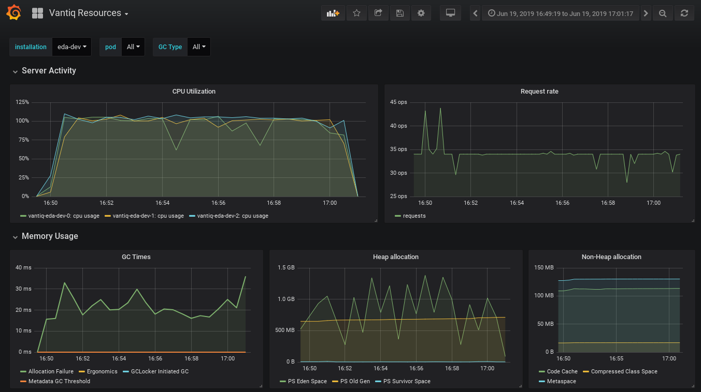

Analysis Conclusion:

- CPU up to 100% for Vantiq-servers (very busy)
- Req 35 ops (operation/ second)

<div style="page-break-after: always;"></div>

#### Statistic of MongoDB

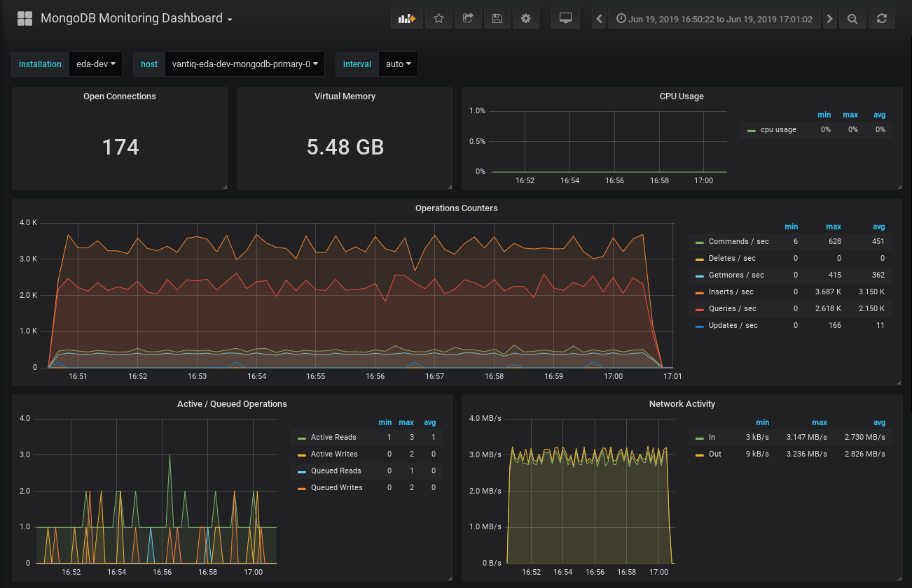

Analysis Conclusion:

- Insert __3,150/sec__ and Query __2,150/sec__ (slower than on AWS)
- 174 connections (looks good)
- Memory usage 5.48G
- Network IO close to 3MB/s (busy)

<div style="page-break-after: always;"></div>

#### Statistic of Vantiq Resource_Usage > API > VAIL

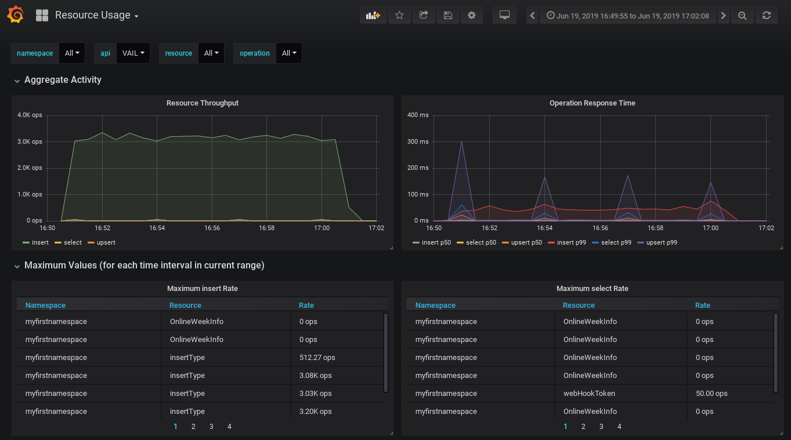

Analysis Conclusion:

- insert p99 avg = 50ms (very good)

<div style="page-break-after: always;"></div>

#### Statistic of Gatling

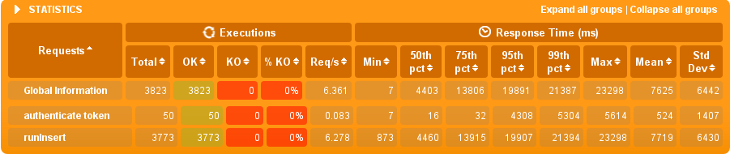

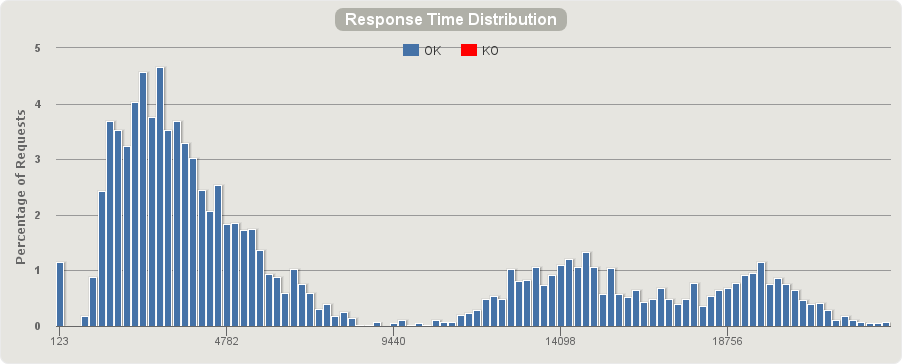

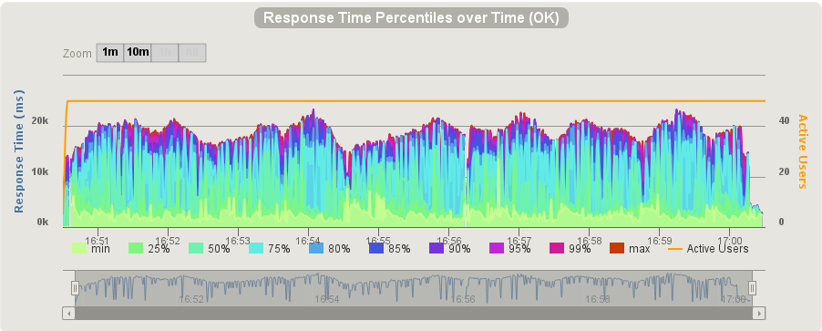

Analysis Conclusion:

- 95% of response completed within 20kms = 20 second, with avg 40 concurrent users!!! (__quite busy__)

<div style="page-break-after: always;"></div>

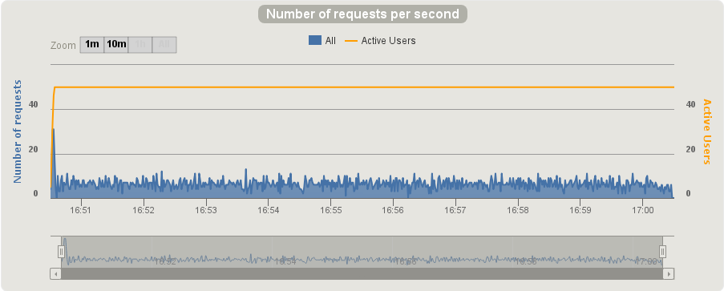

Analysis Conclusion:
- Avg ~= 10 req

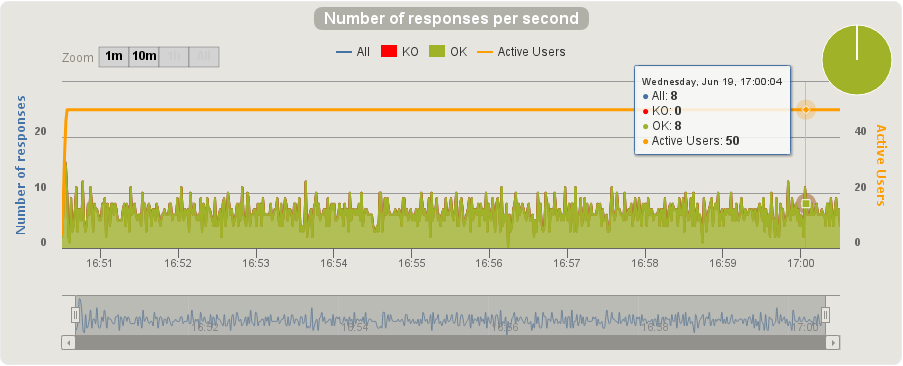

Analysis Conclusion:

- Avg = 10 response/ second

## Test-Case 3: DB_UpdateSim

#### Description
With Cho Lee on Tuesday, Aug 20, 2019, we executed this test-case 3: DB_UpdateSim.

- 500 concurrent users update database in 1 minute

#### Script

```
ubuntu@vantiq2-test01:~/stress_test/gatlingTestInfra3/loadTest$ ../gradlew \
  --console=plain gatlingRun-DB_UpdateSim \
  -Pvantiq.system=cptheat -Pgatling.users=500 -Pgatling.duration="1 minute" \
  -Pvantiq.namespace.create=false -Pvantiq.namespace.save=true
```

#### Output

```
Simulation DB_UpdateSim completed in 60 seconds
Parsing log file(s)...
Parsing log file(s) done
Generating reports...

================================================================================
---- Global Information --------------------------------------------------------
> request count                                        500 (OK=500    KO=0     )
> min response time                                      3 (OK=3      KO=-     )
> max response time                                  11154 (OK=11154  KO=-     )
> mean response time                                  1184 (OK=1184   KO=-     )
> std deviation                                       2935 (OK=2935   KO=-     )
> response time 50th percentile                         16 (OK=16     KO=-     )
> response time 75th percentile                        244 (OK=244    KO=-     )
> response time 95th percentile                       9157 (OK=9157   KO=-     )
> response time 99th percentile                      10268 (OK=10268  KO=-     )
> mean requests/sec                                 41.667 (OK=41.667 KO=-     )
---- Response Time Distribution ------------------------------------------------
> t < 800 ms                                           438 ( 88%)
> 800 ms < t < 1200 ms                                   0 (  0%)
> t > 1200 ms                                           62 ( 12%)
> failed                                                 0 (  0%)
================================================================================

Reports generated in 0s.
Please open the following file: /home/ubuntu/stress_test/gatlingTestInfra3/loadTest/build/reports/gatling/db-updatesim-20190820072604211/index.html

BUILD SUCCESSFUL in 1m 21s
4 actionable tasks: 1 executed, 3 up-to-date
```

We also tried 800 concurrent users and to keep this running up to 10 minutes. But both failed due to ```The organization wide request credit has been exceeded.``` Therefore we analyze what we got

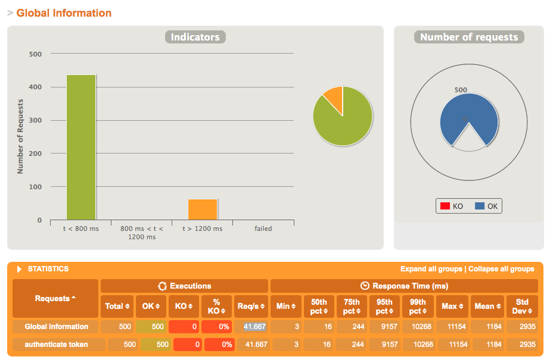

Analysis Conclusion:
- All requests go through successfully
- Total 438 reqs, 88%, completed within 0.8 sec, while the rest 62 (12%) taking longer than 12 sec

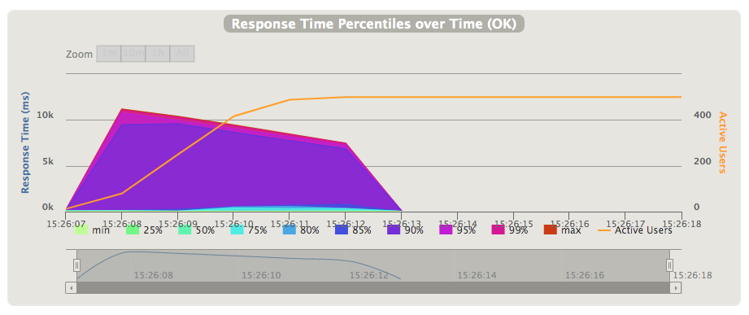

Analysis Conclusion:

- 500 concurrent/ active users are being set and it grows from zero up to 500 in 3~ 4 sec
- Within 1 minute load, 90th percentile response time is close to 10 sec and finishes in 6 sec totally.

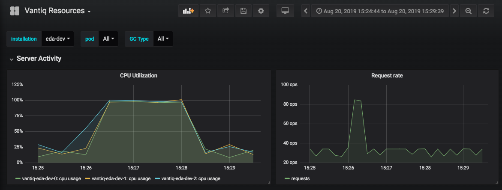

Analysis Conclusion:

- CPU goes up to 100% for 3 Vantiq servers, reaching its highest capacity, even Request Rate =~ 80 ops (operation per second)

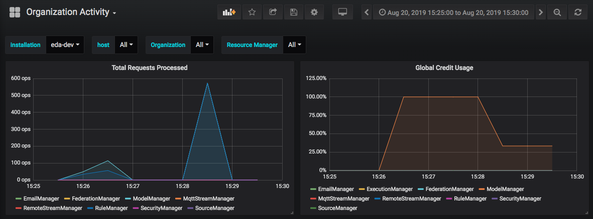

Analysis Conclusion:

- During total reqs being processed, "Global Credit Usage" reaches 100%.
- Associating with the previous "Vantiq Resources" data, increasing "Global Credit" might not be able to give better performance, as Vantiq servers' CPU are already full.


## Appendix

## Stress-test Strategy and Plan Proposal

As my understanding of statistic collected at an elevator operation company, I can try the load-test simply simulated to it. The pattern of load, generally looks like
* Event rate: 1 event per elevator per every 1~ 3 second (configurable in real case. Currently it's set 1 sec, but it might be too frequent)
* 5K update per 1 or 3 second for 1 event (elevator real-time status data)
* 1K accumulative insert per minute (elevator history data) for each elevator

Would possibly increase load every 2 thousand elevators, one increase for every 2 hours (too short? Usually we ran load-test for 48 hours before) till performance obviously drops. During the load, capture the data of behavior of our database response and other computing layers relatively.
* I/O of Mongo
* Response rate from Vantiq
* Load of Kubernetes and CPU/ memory from VM underneath
* JVM?

Currently the hardware we're going to use for test
* 4 vCPU, 16G ram, normal I/O VM/ memory/ disk (could be upgraded to high I/O disk if required)
* 4 VMs across Kubernetes cluster, OpenStack on Huawei hardware
* Enough disk space to be allocated to Mongo if needed

The load-test data would be the starting-point of performance tuning.
