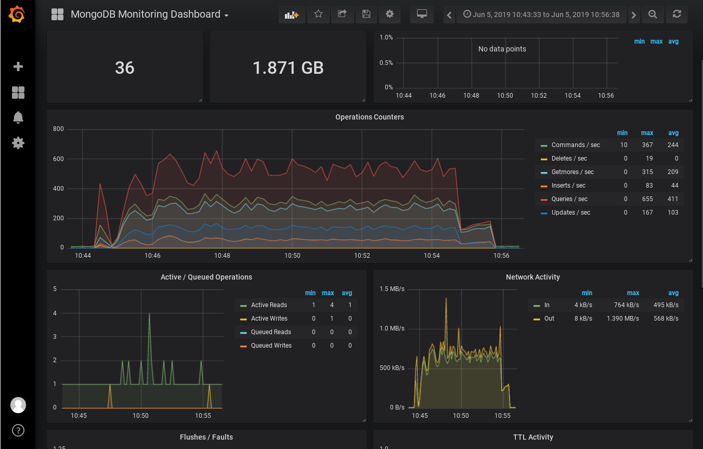

# Stress-Test of Vantiq Product

## Project Overview
- Monitoring spec
  - product
  - system
- Capacity
- Bottleneck
- Performance

## Environment and Architecture

- 6 VMs as K8S work nodes (-1 as of master)
- 4vCPU, 16Gram
- 3 MongoDB (1 arbitor, 1 primary, 1 secondary), standard disk
- 3 Vantiq
- 3 Keycloak

## Configuration

#### System Env Setting
```
ubuntu@vantiq2-test01:~/stress_test/gatlingTestInfra3/loadTest$ cat ~/.vantiq/profile
 {
// url = 'http://eda-dev.profile_name.com:8080'
url = 'https://eda-dev.profile_name.com'
// user 'test' in system
// vantiq -s docs1 load document /tmp/vantiq-docs
token = 'kxJDu_UDE7pHHGmBsdW6mMk7YOVL5ZneRs4ZqRU9TvA='
}
```

#### Pronto and Modelo
- namespace
- project
- organization

#### Grafana dataSource

- mongoDB
<center></center>

- systemDB
  - Name: systemDB
  - URL: http://influxdb-influxdb:8086
  - influxDB Details > Database = system

- vantiqServer
  - Name: vantiqServer
  - URL: http://influxdb-influxdb:8086
  - influxDB Details > Database = vantiq_server

- internals
  - Name: internals
  - URL: http://influxdb-influxdb:8086
  - influxDB Details > Database = \_internal

After finishing, the home dashboard looks like

<center></center>

## Stress-Test Result

#### Scenario in Stress
- 5K update per second for status update
- 1K upsert per minute for status history storage

#### Script

```
../gradlew --console=plain gatlingRun-LimitLiftsSim -Pvantiq.system=profile_name \
  -Pgatling.users=700 -Pgatling.duration="10 minutes" -Pvantiq.namespace.create=false \ -Pvantiq.namespace.save=true
```

#### Output 
```
================================================================================
2019-06-05 10:54:38                                         602s elapsed
---- Requests ------------------------------------------------------------------
> Global                                                   (OK=1156209 KO=0     )
> authenticate token                                       (OK=700    KO=0     )
> Publish                                                  (OK=1155509 KO=0     )

---- LimitLiftsSim -------------------------------------------------------------
[--------------------------------------------------------------------------]  0%
          waiting: 0      / active: 700    / done: 0     
================================================================================

Simulation LimitLiftsSim completed in 600 seconds
Parsing log file(s)...
Parsing log file(s) done
Generating reports...

================================================================================
---- Global Information --------------------------------------------------------
> request count                                    1156209 (OK=1156209 KO=0     )
> min response time                                      0 (OK=0      KO=-     )
> max response time                                   5104 (OK=5104   KO=-     )
> mean response time                                    12 (OK=12     KO=-     )
> std deviation                                         28 (OK=28     KO=-     )
> response time 50th percentile                          6 (OK=6      KO=-     )
> response time 75th percentile                         14 (OK=14     KO=-     )
> response time 95th percentile                         40 (OK=40     KO=-     )
> response time 99th percentile                         79 (OK=79     KO=-     )
> mean requests/sec                                1923.809 (OK=1923.809 KO=-     )
---- Response Time Distribution ------------------------------------------------
> t < 800 ms                                       1155835 (100%)
> 800 ms < t < 1200 ms                                 371 (  0%)
> t > 1200 ms                                            3 (  0%)
> failed                                                 0 (  0%)
================================================================================

Reports generated in 16s.
Please open the following file: /home/ubuntu/stress_test/gatlingTestInfra3/loadTest/build/reports/gatling/limitliftssim-20190605024436333/index.html
```
- data stat from Gatling
<center></center>

- data stat from Grafana
<center></center>
