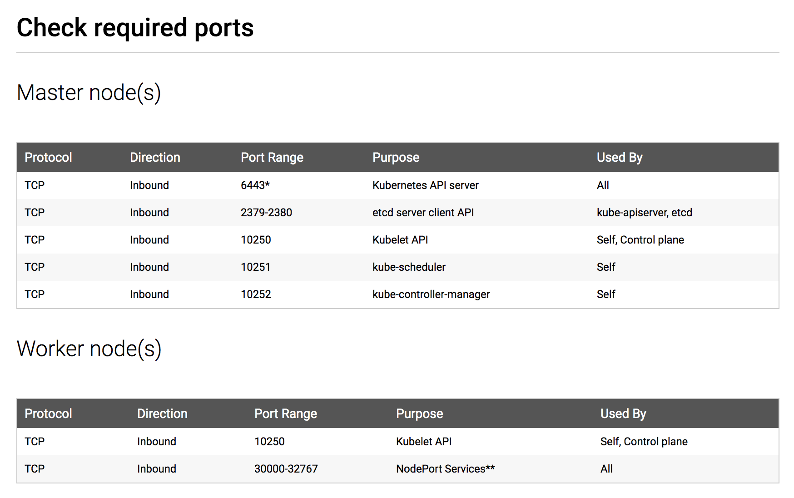

# Kubernet Environment Description

## Specification

- Kubernet cluster = 10.216.78.21 = 192.168.0.70
- Successfully joined node = 10.216.78.19
- Kubernetes --apiserver-advertise-address=192.168.0.70

## Syntax of ```kubeadm join```

```
kubeadm join 192.168.0.70:6443 --token 7li01q.z4d1rcdlowkr7m42 \
  --discovery-token-ca-cert-hash sha256:bbad2c92df60b77d1bb91c5cc56c762b4a736ca942d4c5674eae8b8a634b91f8
```

Regen token, for example
```
kubeadm token create

7li01q.z4d1rcdlowkr7m42
```

And retrieve token-ca-cert-hash
```
openssl x509 -pubkey -in /etc/kubernetes/pki/ca.crt | openssl rsa -pubin -outform der 2>/dev/null | openssl dgst -sha256 -hex | sed 's/^.* //'

bbad2c92df60b77d1bb91c5cc56c762b4a736ca942d4c5674eae8b8a634b91f8
```

## Required Ports



Reference > https://v1-12.docs.kubernetes.io/docs/setup/independent/install-kubeadm/
