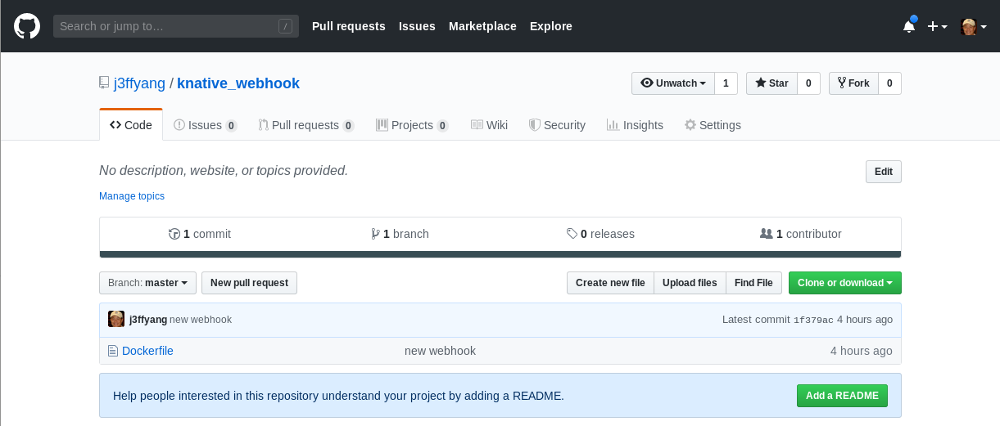
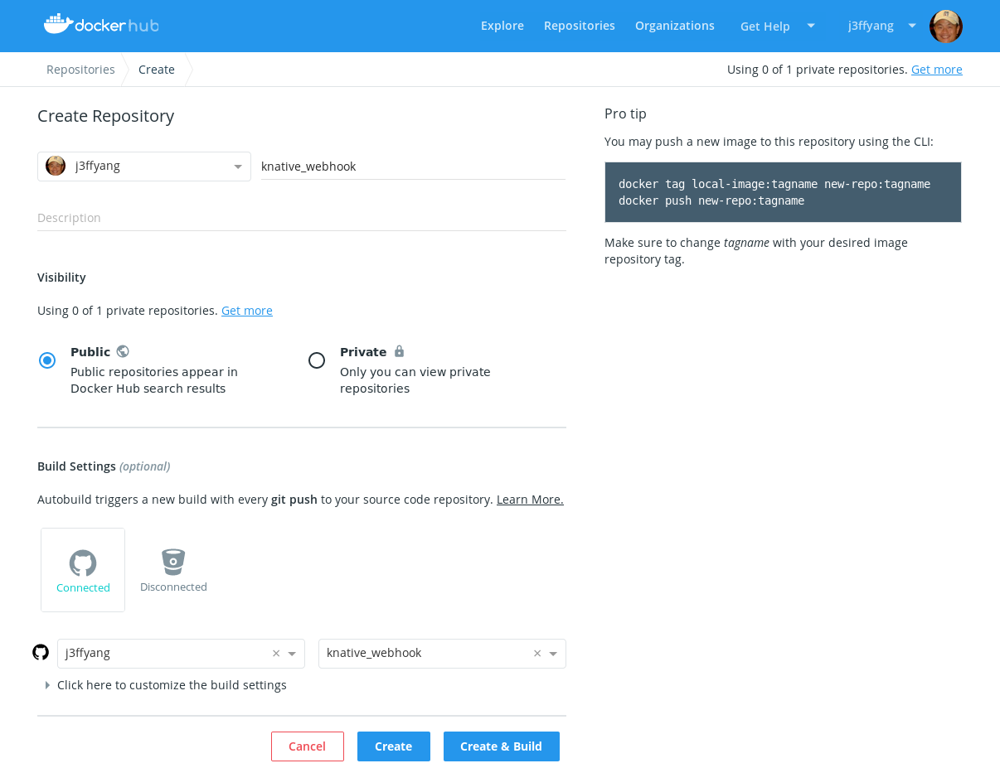
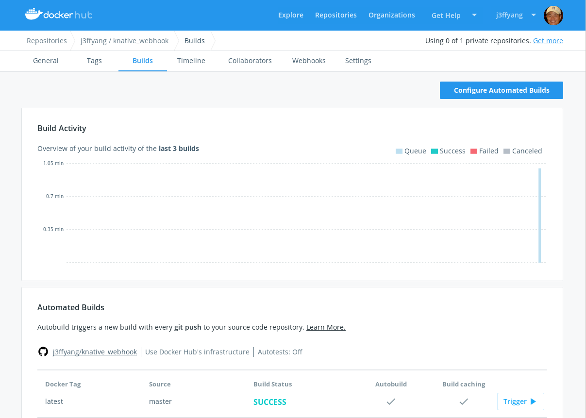

# istio serviceMesh and knative integration

#### Document Objective

- Install ```istio``` and ```knative```
- Build an alternative registry to workaround downloading image from gcr.io, which is not available in China

> Reference > https://github.com/istio/istio/tree/master/install/kubernetes/helm/istio

## istio

- add repo

  ```
  helm repo add istio.io https://storage.googleapis.com/istio-release/releases/1.2.2/charts/
  ```

- create namespace

  ```
  kubectl create namespace istio-system
  ```

- init

  ```
  helm install --name istio-init --namespace istio-system istio.io/istio-init
  ```

- check status

  ```
  kubectl get crds | grep 'istio.io\|certmanager.k8s.io' | wc -l
  23
  ```

- install

  ```
  ./helm install --name istio --namespace istio-system istio.io/istio
  ```

Reference >
https://www.digitalocean.com/community/tutorials/how-to-install-and-use-istio-with-kubernetes
https://istio.io/docs/setup/kubernetes/install/helm/


## knative

```
kubectl apply --selector knative.dev/crd-install=true \
   --filename https://github.com/knative/serving/releases/download/v0.7.0/serving.yaml \
   --filename https://github.com/knative/build/releases/download/v0.7.0/build.yaml \
   --filename https://github.com/knative/eventing/releases/download/v0.7.0/release.yaml \
   --filename https://github.com/knative/serving/releases/download/v0.7.0/monitoring.yaml
```


## Build an alternative registry to gcr.io

#### Some of POD are in status = ```ImagePullBackoff```, as example

```
ubuntu@vantiq2-test01:~$ kubectl -n knative-eventing get all
NAME                                                READY   STATUS             RESTARTS   AGE
pod/eventing-controller-5f58b67bf7-dpsqd            1/1     Running            0          13m
pod/eventing-webhook-df476b899-btbmb                1/1     Running            0          6m53s
pod/imc-controller-66b897c887-hsjhw                 1/1     Running            0          2m28s
pod/imc-dispatcher-7b69ccd5d8-xr577                 0/1     ImagePullBackOff   0          33d
pod/in-memory-channel-controller-85dc669f69-sq5mw   0/1     ImagePullBackOff   0          33d
pod/in-memory-channel-dispatcher-7f896c7d85-xsmdq   0/1     ImagePullBackOff   0          33d
pod/sources-controller-7b7579bc94-ht9x4             0/1     ImagePullBackOff   0          2d12h

NAME                         TYPE        CLUSTER-IP      EXTERNAL-IP   PORT(S)    AGE
service/eventing-webhook     ClusterIP   10.98.215.98    <none>        443/TCP    33d
service/imc-dispatcher       ClusterIP   10.101.238.45   <none>        80/TCP     33d
service/sources-controller   ClusterIP   10.102.48.168   <none>        9090/TCP   33d

NAME                                           READY   UP-TO-DATE   AVAILABLE   AGE
deployment.apps/eventing-controller            1/1     1            1           33d
deployment.apps/eventing-webhook               1/1     1            1           33d
deployment.apps/imc-controller                 1/1     1            1           33d
deployment.apps/imc-dispatcher                 0/1     1            0           33d
deployment.apps/in-memory-channel-controller   0/1     1            0           33d
deployment.apps/in-memory-channel-dispatcher   0/1     1            0           33d
deployment.apps/sources-controller             0/1     1            0           33d
deployment.apps/webhook                        0/0     0            0           33d

NAME                                                      DESIRED   CURRENT   READY   AGE
replicaset.apps/eventing-controller-569448686c            0         0         0       33d
replicaset.apps/eventing-controller-5f58b67bf7            1         1         1       13m
replicaset.apps/eventing-webhook-6d6795d497               0         0         0       33d
replicaset.apps/eventing-webhook-df476b899                1         1         1       6m53s
replicaset.apps/imc-controller-66b897c887                 1         1         1       2m28s
replicaset.apps/imc-controller-77f4776c99                 0         0         0       33d
replicaset.apps/imc-dispatcher-7b69ccd5d8                 1         1         0       33d
replicaset.apps/in-memory-channel-controller-85dc669f69   1         1         0       33d
replicaset.apps/in-memory-channel-dispatcher-7f896c7d85   1         1         0       33d
replicaset.apps/sources-controller-7b7579bc94             1         1         0       33d
replicaset.apps/webhook-759f9d67c9                        0         0         0       33d

NAME                                                       READY   REASON   AGE
clusterchannelprovisioner.eventing.knative.dev/in-memory                    33d
```

#### Find the image candidate

```
kubectl -n knative-eventing describe deployment.apps/webhook
```

Look for value of ```Image```

```
Pod Template:
  Labels:           app=webhook
                    role=webhook
  Annotations:      sidecar.istio.io/inject: false
  Service Account:  eventing-webhook
  Containers:
   webhook:
    Image: gcr.io/knative-releases/github.com/knative/eventing/cmd/webhook@sha256:3b5de8074f00469c393910fd0fbac70cec10838a858c94ad755af1b6bd6712fd
```

#### Create a repo in your personal github.com and in such repo, create ```Dockerfile``` then push the code

```
jeff@debian:~/github/knative/knative_webhook$ cat Dockerfile

FROM gcr.io/knative-releases/github.com/knative/eventing/cmd/webhook@sha256:3b5de8074f00469c393910fd0fbac70cec10838a858c94ad755af1b6bd6712fd
```



#### Create a repo in hub.docker.com, connect to your repo at github.com, then trigger build





#### Download image manually and find image's SHA256 digest

- Download the image to each node of Kubernetes cluster

  ```
  for i in {01..06}; do ssh k8s_node$i "docker pull j3ffyang/knative_webhook"; done
  ```

- Find image attribute and its SHA256 digest

  ```
  docker inspect --format='{{index .RepoDigests 0}}' 01572a35430f
  j3ffyang/knative_webhook@sha256:ea22c674cf21d7bfcec982d5054c7f83fbdd68d3c0d2fee3529097d34c8701c0
  ```

  or

  ```
  docker inspect --format='{{.RepoDigests}}' 01572a35430f
  ```

#### Edit deployment and replace the image with downloaded image's ID and its SHA256 digest

  ```
  kubectl -n knative-eventing edit deployment.apps/webhook
  ```

  ```
  spec:
    containers:
    - env:
    ...
      image: j3ffyang/knative_webhook@sha256:ea22c674cf21d7bfcec982d5054c7f83fbdd68d3c0d2fee3529097d34c8701c0
      imagePullPolicy: IfNotPresent
  ```

#### Use registry at ```azk8s.cn```

Reference > https://github.com/Azure/container-service-for-azure-china/tree/master/aks

For ```k8s.gcr.io/elasticsearch:v5.6.4```

```
docker pull gcr.azk8s.cn/google_containers/elasticsearch:v5.6.4

```
