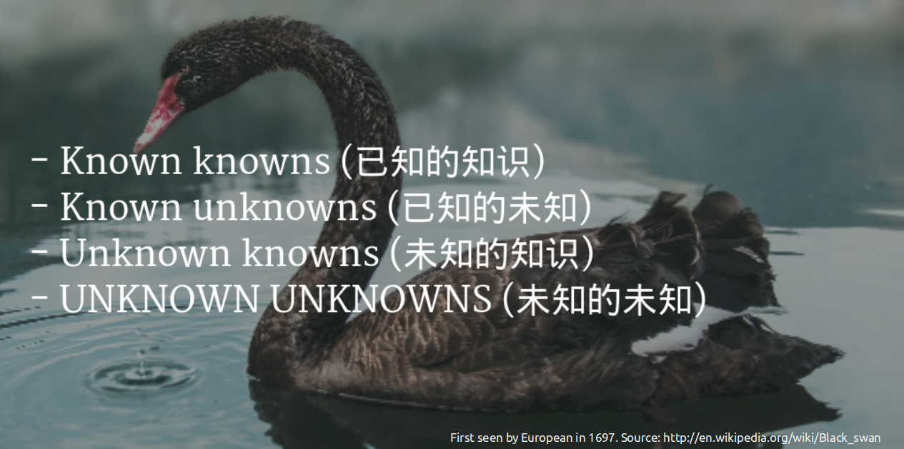
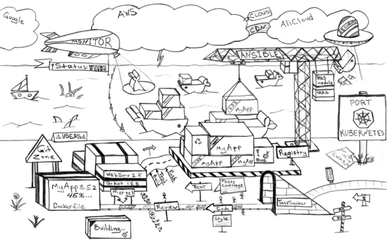
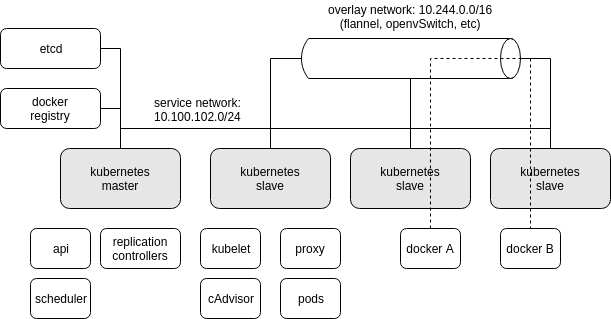
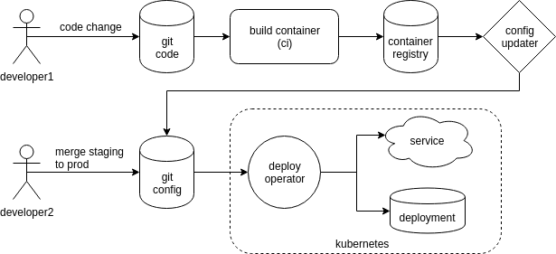
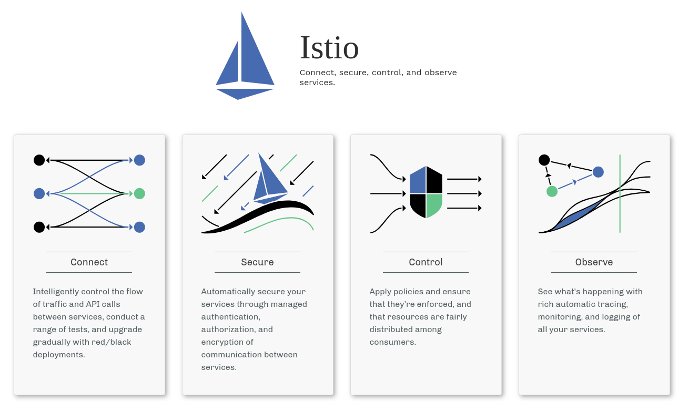
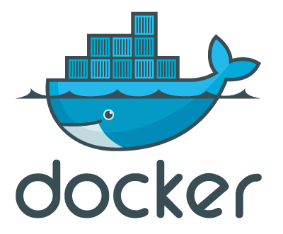
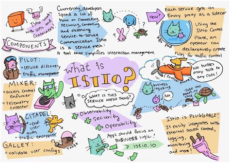

---

## DevOps and Kubernetes

  Source: hackernoon.com

---

## Kubernetes

- docker and dockerization
- Workload as Service_Oriented_Architecture (SOA)
	- vCPU, memory, disk and network
	- Componentized - Postgres, MySQL, MongoDB, ...
	- statefulset, daemonset, configmap, deployment, replicaset, service...
- Horizontal in process and automation 
	- dev > test > staging > production > mon > ops & maintenance
	- dev & ops model changed much
- Vertical 
 	- IaaS, platform (HA/ LB/ FT), persistent_vol, SDN

---

## Kubernetes Architecture

--- 

## Kubernetes Eco-system

Source > dzone.com

---

## Kubernetes Provides ...

- microService
- Infrastructure as Code (IaC)
- HA - who provides?
- Container provisioning and maintaining the state of running containers
- Distribute application load evenly - LB
- Handling container persistent storage
- Network plugins - SDN
- Application rolling out updates - DevOps

Reference > https://www.magalix.com/blog/kubernetes-101-concepts-and-why-it-matters

---

## What We Learn

- Workload Standardization
	- Componentization
	- The way to consume computing resource
- LIfe-cycle of development and operation 

---

## Git > K8S > DevOps

- Config is code
- Code must be version controlled and so must Config
- What can be described can be automated
- Describe everything: code, config, monitoring & policy; and then keep it in version control

Reference > https://dzone.com/articles/gitops-for-istio-manage-istio-config-like-code

---

## KubeCon 2019 Shanghai (my personal focus)

item | technology
-- | -- 
serviceMesh/ microService | istio
dataPipelining | istio + knative
ci/ cd | tekton.dev
database | kubeDB
tensorFlow | kubeFlow
IoT | kubeEdge and (k3s + gitops)
Encryption and Auth | 

---

---

## Istio and serviceMesh

- Keep the services themselves from having to deal with the nitty-gritty (本质) of managing network traffic - load balancing, routing, retries, etc.
- Provide a layer of abstraction for admins, making it easy to enact high-level decisions about network traffic in the cluster—policy controls, metrics and logging, service discovery, secure inter-service communications via TLS, and so on.

Reference > https://www.infoworld.com/article/3328817/what-is-istio-the-kubernetes-service-mesh-explained.html

---

## (Kubernetes + Istio) with Docker

<!--

--> 

<table style="margin: 0px auto;">
  <tr>
    <td>

    </td>
    <td>
    </td>
    <td>

    </td>
    
  </tr>
  <tr>
    <td>
      <li>Orchestration
      <li>Deployment
      <li>Scaling
      <li>Data Plane
    </td>
    <td>
    </td>
    <td>
      <li>Policy Enforcement
      <li>Traffic Management
      <li>Telemetry
      <li>Control Plane
    </td>
  </tr>
</table>

---

## Istio Components

  
Istio works as a service mesh by providing two basic pieces of architecture for your cluster, a __data plane__ and a __control plane__.

The __data plane__ handles network traffic between the services in the mesh. All of this traffic is intercepted and redirected by a network proxying system. In Istio’s case, the proxy is provided by an open source project called __Envoy__. A second component in the data plane, __Mixer__, gathers telemetry and statistics from Envoy and the flow of service-to-service traffic.

The __control plane__, Istio’s core, manages and secures the data plane. It configures both the Envoy proxies and the Mixers that enforce the network policies for the services, such as who gets to talk to whom and when. The control plane also provides a programmatic abstraction layer for the data plane and all of its behaviors.

---

## Istio Abstract Architecture

	Source:_katacoda.com

---

Image Source > Jimmy Song's Istio Handbook

--- 

## Istio serviceMesh

Source > https://dzone.com/articles/metadata-management-in-big-data-systems-a-complete-1

---

## Knative

Source > cloudtp.com

---

## tekton.dev

---

## kubeDB

---

## k3s

---

### CI/ CD

- Git
- Gerrit
- Jenkins
- Jira
- ...

Reference > https://cloud.google.com/kubernetes-engine/docs/tutorials/gitops-cloud-build
