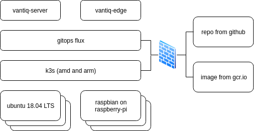
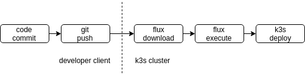
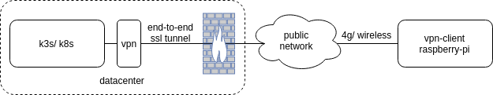
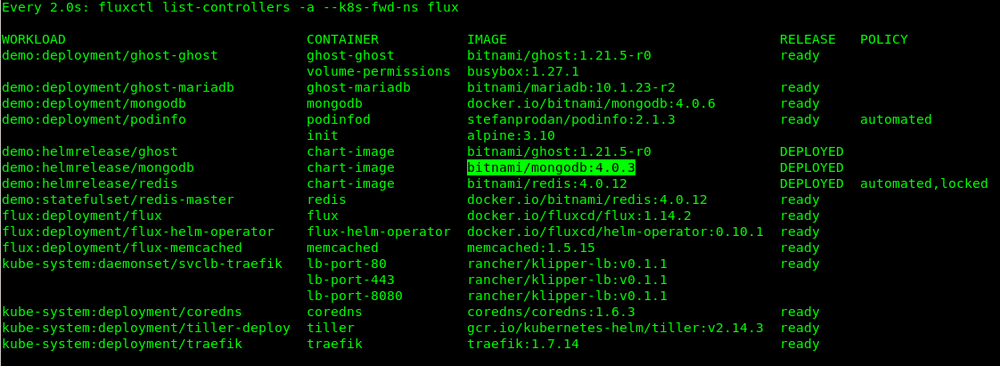
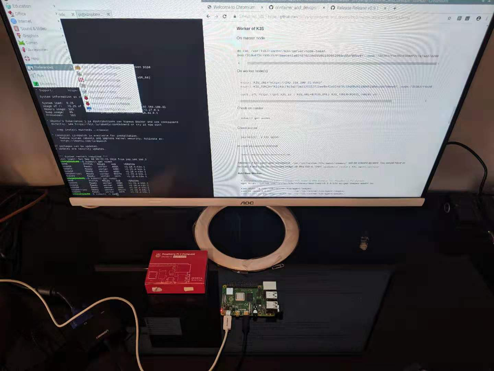

# An IoT Solution by K3S+ GitOps on Raspberry-Pi

<!-- TOC depthFrom:2 depthTo:6 withLinks:1 updateOnSave:1 orderedList:0 -->

- [Solution Objective](#solution-objective)
- [Features](#features)
- [Architecture](#architecture)
		- [Overview](#overview)
		- [Infrastructure](#infrastructure)
		- [Workflow](#workflow)
		- [Network](#network)
		- [Security](#security)
		- [High-Availability](#high-availability)
		- [Monitoring](#monitoring)
- [Installation and Configuration](#installation-and-configuration)
		- [On ALL Nodes, if within GFW](#on-all-nodes-if-within-gfw)
		- [Master](#master)
		- [Worker](#worker)
		- [Add New Worker](#add-new-worker)
		- [Bash Auto Completion](#bash-auto-completion)
		- [Install ```helm``` (tiller)](#install-helm-tiller)
		- [Check Tiller's status and find the following error due to GFW](#check-tillers-status-and-find-the-following-error-due-to-gfw)
		- [Install ```fluxcd```](#install-fluxcd)
		- [Install and Configure ```fluxctl```](#install-and-configure-fluxctl)
- [Why K3S](#why-k3s)

<!-- /TOC -->

<div style="page-break-after: always;"></div>

## Solution Highlights

- IoT, lightweight and isolate application from infrastructure
- You declaratively describe the entire desired state of your system in git
- Automate everything and you manage code rather than container
- Less maintenance with high tolerance
- Native CI/ CD

## Architecture

#### Infrastructure

- K3S + GitOps
- Raspberry-Pi software stack

<center></center>

#### Workflow

- The flow of code change then update

<center></center>

- GitOps' fluxcd = automated git -> cluster synchronisation

> Reference > https://docs.fluxcd.io/en/latest/introduction.html

<center></center>

> Image source > https://github.com/fluxcd/flux

#### Security and Network

<center></center>

- SSL, managed by k3s
- Software-firewall being used
- Extra VPN might be required, software or hardware ones

I'm considering to replace ```openvpn``` with ```wireguard``` to establish and maintain the encryption tunnel between k3s master and raspberrypi end-point as k3s worker.

#### Security - Container Level

- Isolated namespace: ```flux``` and ```demo``` (deployment target sample)
- Cluster access control: ```sudo chmod 644 /etc/rancher/k3s/k3s.yaml```
- Access toke to Git = ```kubectl secret```

#### High-Availability

> Reference > https://www.danielstechblog.io/running-a-kubernetes-cluster-with-k3s-on-raspbian/

Currently k3s does not support HA masters, we can have only one master right now. Really?

#### Monitoring

https://github.com/billimek/k8s-gitops/tree/master/monitoring

#### Deployment and Maintenance

- ```helm``` and ```tiller``` - simplify and standardize install and deployment
- ```fluxctl``` - change code, instead of container
- ```git``` - centralized repo

<div style="page-break-after: always;"></div>

## Installation and Configuration

#### On ALL Nodes of K3S, if within GFW

> Reference > https://rancher.com/docs/k3s/latest/en/running/

- A pre-requisite step on __ALL__ nodes, if within GFW or air-gap env, before install starts and if adding new node, this is a must as well

  ```bash

  # Download the appropriate release
  wget https://github.com/rancher/k3s/releases/download/v0.9.0/k3s-airgap-images-amd64.tar

  sudo mkdir -p /var/lib/rancher/k3s/agent/images/
  sudo cp pause-3.1.tar               /var/lib/rancher/k3s/agent/images/
  sudo cp k3s-airgap-images-amd64.tar /var/lib/rancher/k3s/agent/images/
  ```

#### Master of K3S

- Make ```kubeconfig``` readable to non-root user,

  ```bash
  curl -sfL https://get.k3s.io | sh -s - --write-kubeconfig-mode 644
  ```

  or
    ```bash
    curl -sfL https://get.k3s.io | K3S_KUBECONFIG_MODE="644" sh -s -
    ```

  or if you want to use ```docker``` instead of ```containerd```

    ```bash
    curl -sfL https://get.k3s.io | INSTALL_K3S_EXEC="--docker" sh -
    ```

#### Worker of K3S

On master node

```bash
sudo cat /var/lib/rancher/k3s/server/node-token
K104dcf919a073e2335312f1bee5e41a024d76c19d86d91190661069cd8df80ee6f::node:7353837f5b3029369df7c7a7ad27d280
```

On worker node(s)
```bash
export K3S_URL="https://192.168.100.31:6443"
export K3S_TOKEN="K104dcf919a073e2335312f1bee5e41a024d76c19d86d91190661069cd8df80ee6f::node:7353837f5b3029369df7c7a7ad27d280"

curl -sfL https://get.k3s.io | K3S_URL=${K3S_URL} K3S_TOKEN=${K3S_TOKEN} sh -
```

Check on master
```bash
kubectl get nodes
```

Check journal
```bash
journalctl -u k3s-agent
```

In case you want to uninstall
```bash
/usr/local/bin/k3s-uninstall.sh
```

Attention: if k3s-agent gets uninstalled, ```/var/lib/rancher/k3s/agent/images/``` will be erased as well. You would have to recreate it and copy the necessary image.tar files into it. Then ```systemctl restart k3s-agent.service```

#### Add New Worker

```bash
# Download the appropriate release. You need arm64 binary for Raspberry-Pi device
wget https://github.com/rancher/k3s/releases/download/v0.9.0/k3s-airgap-images-amd64.tar

sudo mkdir -p /var/lib/rancher/k3s/agent/images/
sudo cp pause-3.1.tar               /var/lib/rancher/k3s/agent/images/
sudo cp k3s-airgap-images-amd64.tar /var/lib/rancher/k3s/agent/images/
```

#### Bash Auto Completion

- Setup env

  ```bash
  source <(kubectl completion bash)
  echo "source <(kubectl completion bash)" >> ~/.bashrc

  alias k=kubectl
  complete -F __start_kubectl k
  ```

<div style="page-break-after: always;"></div>

#### Install ```helm``` (```tiller```)

```bash
cp /etc/rancher/k3s/k3s.yaml ~/.kube/config
```

```bash
$ curl -LO https://git.io/get_helm.sh
$ chmod 700 get_helm.sh
$ ./get_helm.sh
```

```bash
# Create a service account for tiller
kubectl -n kube-system create sa tiller

# Create a cluster role binding for tiller
kubectl create clusterrolebinding tiller-cluster-rule \
  --clusterrole=cluster-admin \
  --serviceaccount=kube-system:tiller

# Deploy tiller to kube-system
helm init --skip-refresh --upgrade --service-account tiller --history-max 20
```

#### Check ```tiller``` status and find the following error due to GFW

```bash
kubectl -n kube-system describe pod tiller-deploy-75f6c87b87-4f8zc

Events:
  Type     Reason     Age                From               Message
  ----     ------     ----               ----               -------
  Normal   Scheduled  57s                default-scheduler  Successfully assigned kube-system/tiller-deploy-75f6c87b87-4f8zc to node05
  Warning  Failed     26s                kubelet, node05    Failed to pull image "gcr.io/kubernetes-helm/tiller:v2.14.3": rpc error: code = Unknown desc = failed to resolve image "gcr.io/kubernetes-helm/tiller:v2.14.3": no available registry endpoint: failed to do request: Head https://gcr.io/v2/kubernetes-helm/tiller/manifests/v2.14.3: dial tcp 74.125.23.82:443: i/o timeout
  Warning  Failed     26s                kubelet, node05    Error: ErrImagePull
  Normal   BackOff    25s                kubelet, node05    Back-off pulling image "gcr.io/kubernetes-helm/tiller:v2.14.3"
  Warning  Failed     25s                kubelet, node05    Error: ImagePullBackOff
  Normal   Pulling    13s (x2 over 56s)  kubelet, node05    Pulling image "gcr.io/kubernetes-helm/tiller:v2.14.3"
```

The __workaround__ is to place ```tiller.tar``` into _specific_ k3s' images path ```/var/lib/rancher/k3s/agent/images/``` on __each__ agent/ worker
```bash
docker pull sapcc/tiller:v2.14.3
docker tag sapcc/tiller:v2.14.3 gcr.io/kubernetes-helm/tiller:v2.14.3
docker save gcr.io/kubernetes-helm/tiller:v2.14.3 > ./tiller.tar
sudo cp tiller.tar /var/lib/rancher/k3s/agent/images/
sudo systemctl restart k3s-agent.service
```

<div style="page-break-after: always;"></div>

#### Install ```fluxcd```

> Reference > https://docs.fluxcd.io/en/latest/tutorials/get-started-helm.html

```bash
kubectl -n kube-system create sa tiller
kubectl create clusterrolebinding tiller-cluster-rule \
  --clusterrole=cluster-admin \
  --serviceaccount=kube-system:tiller

# Deploy tiller in cluster
helm init --skip-refresh --upgrade --service-account tiller --history-max 10

# Add repo
helm repo add fluxcd https://charts.fluxcd.io

# Apply the Helm Release CRD
kubectl apply -f https://raw.githubusercontent.com/fluxcd/flux/helm-0.10.1/deploy-helm/flux-helm-release-crd.yaml
```

Fork ```fluxcd/flux-get-started``` on GitHub and replace the ```fluxcd``` with your GitHub username

> Reference > https://docs.fluxcd.io/en/latest/tutorials/get-started-helm.html#install-flux

```bash
helm upgrade -i flux \
  --set helmOperator.create=true \
  --set helmOperator.createCRD=false \
  --set git.url=git@github.com:j3ffyang/flux-get-started \
  --namespace flux fluxcd/flux
```

You would have

```bash
kubectl -n flux get all
NAME                                      READY   STATUS    RESTARTS   AGE
pod/flux-memcached-b8f88949-zsnhm         1/1     Running   0          4m47s
pod/flux-helm-operator-6bcb497545-dkpcm   1/1     Running   0          4m47s
pod/flux-7c4c75f86-kt68f                  1/1     Running   0          4m47s


NAME                     TYPE        CLUSTER-IP      EXTERNAL-IP   PORT(S)     AGE
service/flux-memcached   ClusterIP   10.43.240.190   <none>        11211/TCP   4m47s
service/flux             ClusterIP   10.43.136.163   <none>        3030/TCP    4m47s


NAME                                 READY   UP-TO-DATE   AVAILABLE   AGE
deployment.apps/flux-memcached       1/1     1            1           4m47s
deployment.apps/flux-helm-operator   1/1     1            1           4m47s
deployment.apps/flux                 1/1     1            1           4m47s

NAME                                            DESIRED   CURRENT   READY   AGE
replicaset.apps/flux-memcached-b8f88949         1         1         1       4m47s
replicaset.apps/flux-helm-operator-6bcb497545   1         1         1       4m47s
replicaset.apps/flux-7c4c75f86                  1         1         1       4m47s
```

#### Install and Configure ```fluxctl```

```bash
https://github.com/fluxcd/flux/releases/download/1.14.2/fluxctl_linux_amd64

sudo cp fluxctl_linux_amd64 /usr/local/bin/fluxctl
sudo chmod 755 /usr/local/bin/fluxctl
fluxctl --k8s-fwd-ns=flux list-workloads
```

Get the access key

```bash
fluxctl identity --k8s-fwd-ns flux
```

In order to sync your cluster state with git you need to copy the public key and create a deploy key with write access on your GitHub repository.

Open GitHub, navigate to your fork, go to ```Settings``` > ```Deploy keys```, click on ```Add deploy key```, give it a ```Title```, check ```Allow write access```, paste the Flux public key and click ```Add key```.

(Or replace YOURUSER with your GitHub ID in this url: https://github.com/YOURUSER/flux-get-started/settings/keys/new and paste the key there.)

```bash
helm list --namespace demo

NAME   	REVISION	UPDATED                 	STATUS  	CHART        	APP VERSION	NAMESPACE
mongodb	1       	Wed Sep 25 18:31:56 2019	DEPLOYED	mongodb-4.9.0	4.0.3      	demo     
```

#### Commit a Change

```bash
git clone git@github.com:j3ffyang/flux-get-started.git
```

```bash
cd flux-get-started
vi releases/mongodb.yaml
```

```yaml
  values:
    image:
      repository: bitnami/mongodb
      tag: 4.0.6
```

Then commit
```bash
git add --all; git commit --message "upgrade mongo tag from 403 to 406"; git push
```

Check the Change
```bash
kubectl -n flux logs deployment/flux -f
kubectl describe -n demo deployment/mongodb | grep Image
kubectl -n demo get all
```

You would see
```bash
kubectl describe -n demo deployment/mongodb | grep Image
    Image:      docker.io/bitnami/mongodb:4.0.6
```

Check Status
```bash
fluxctl list-controllers -a --k8s-fwd-ns flux
```

This is the screenshot of that I switched MongoDB's tag from ```4.0.6``` back to ```4.0.3```. The change took ~2 minutes to complete.



<div style="page-break-after: always;"></div>

## Raspberry-Pi (3B+ and 4)

<center></center>

#### Install Raspbian

On my Debian laptop,

```bash
jeff@debian:~/Downloads$ lsblk
NAME                    MAJ:MIN RM   SIZE RO TYPE  MOUNTPOINT
sda                       8:0    1  14.9G  0 disk  
├─sda1                    8:1    1   256M  0 part  
└─sda2                    8:2    1   5.8G  0 part  
nvme0n1                 259:0    0   477G  0 disk  
├─nvme0n1p1             259:1    0   243M  0 part  /boot
├─nvme0n1p2             259:2    0     1K  0 part  
└─nvme0n1p5             259:3    0 476.7G  0 part  
  └─nvme0n1p5_crypt     254:0    0 476.7G  0 crypt
    ├─debian--vg-root   254:1    0    28G  0 lvm   /
    ├─debian--vg-swap_1 254:2    0  15.6G  0 lvm   [SWAP]
    └─debian--vg-home   254:3    0 433.1G  0 lvm   /home
```

Download and load the image (be careful and you understand what you're doing when using ```dd```)

```bash
sudo dd bs=4M if=2019-07-10-raspbian-buster-full.img of=/dev/sda conv=fsync status=progress
```

Power up Raspberry-Pi

Login and install ```ssh-server``` and ```systemctl enable ssh.service``` then ```systemctl start ssh.service```

```bash
pi@raspberrypi:~ $ uname -a
Linux raspberrypi 4.19.66-v7l+ #1253 SMP Thu Aug 15 12:02:08 BST 2019 armv7l GNU/Linux
```

#### Install Docker (optional)

```bash
curl -fsSL get.docker.com -o get-docker.sh && sh get-docker.sh

sudo gpasswd -a $USER docker
```

#### Install K3S and Join K3S Cluster

Download airgap binary for __arm__ and place it into ```/var/lib/rancher/k3s/agent/images``` if the device doesn't have access to ```gcr.io``` and/ or ```googleapis.com```

```bash
pi@raspberrypi:~ $ pwd
/home/pi
pi@raspberrypi:~ $ ls
 Downloads         k3s-airgap-images-arm64.tar  
pi@raspberrypi:~ $ sudo mkdir -p /var/lib/rancher/k3s/agent/images
pi@raspberrypi:~ $ sudo cp k3s-airgap-images-arm64.tar /var/lib/rancher/k3s/agent/images
```

Configure K3S on Raspberry

```bash
# on K3S master
sudo cat /var/lib/rancher/k3s/server/node-token
K104dcf919a073e2335312f1bee5e41a024d76c19d86d91190661069cd8df80ee6f::node:7353837f5b3029369df7c7a7ad27d280

# on Raspberry
export K3S_URL="https://192.168.100.31:6443"
export K3S_TOKEN="K104dcf919a073e2335312f1bee5e41a024d76c19d86d91190661069cd8df80ee6f::node:7353837f5b3029369df7c7a7ad27d280"

curl -sfL https://get.k3s.io | K3S_URL=${K3S_URL} K3S_TOKEN=${K3S_TOKEN} sh -
```

#### Troubleshooting
1. If you need to uninstall ```/usr/local/bin/k3s-agent-uninstall.sh```, all ```/var/lib/rancher/``` will be removed. You would have to recreate

	```bash
	pi@raspberrypi:~ $ sudo mkdir -p /var/lib/rancher/k3s/agent/images
	pi@raspberrypi:~ $ sudo cp k3s-airgap-images-arm64.tar /var/lib/rancher/k3s/agent/images
	```

2. If ```journalctl -u k3s-agent.service``` complains ```key may not match to server...```. You can find the correct key on master

	```bash
	sudo cat /var/lib/rancher/k3s/server/cred/node-passwd

	35f386b0221c7c6e6f024d73fdcc089f,node06
	02e6618e937ae3a925d8f8d04072f368,node05
	08e44c44157f1dfaa302cecc6268350d,node04
	8d2859b7c9a3a7d95155ba0343c5d1ce,node03
	5f52b394dcc6afe1cc8a1afac33ba4d6,raspberrypi
	```

	The last one is what you're looking for, then edit ```/var/lib/rancher/k3s/agent/node-password.txt```


#### Uninstall

```bash
/usr/local/bin/k3s-uninstall.sh
```

Uninstall will erase ```/var/lib/rancher/k3s/agent/images``` or ```k3s-agent-uninstall.sh```

<div style="page-break-after: always;"></div>

## Why K3S

- Kubernetes orchestration
- Managing compute resource, network, volume and security
- Built-in high-availability, fault-tolerance and load-balancing, sort of self-healing feature
- Rich plugins like dark-launching/ A/B-testing
- Natural integration with CI/ CD
- Workload manageability

## Uncleared Situation

- The network performance over public network in between K3S master and Raspberry-Pi as end-point device remotely
