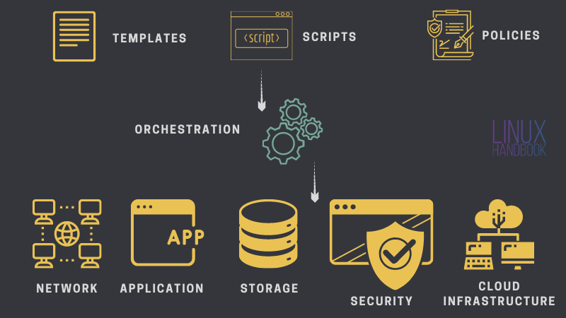
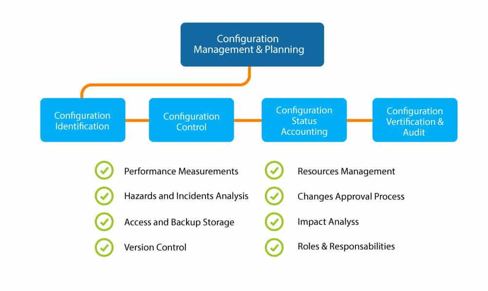

# Deployment Workflow

<!-- @import "[TOC]" {cmd="toc" depthFrom=2 depthTo=4 orderedList=false} -->
<!-- code_chunk_output -->

- [Objective](#objective)
- [Pre-requisite](#pre-requisite)
- [Architecture Overview](#architecture-overview)
- [Deployment Workflow](#deployment-workflow-1)
  - [Jumpbox (DMZ)](#jumpbox-dmz)
    - [System hardening](#system-hardening)
    - [Ansible](#ansible)
    - [Operating System](#operating-system)
    - [Upfront Nginx Web Server on VM](#upfront-nginx-web-server-on-vm)
    - [Docker and Kubernetes](#docker-and-kubernetes)
    - [Components on Kubernetes](#components-on-kubernetes)
    - [Nginx and Ingress Network Controller on Kubernetes](#nginx-and-ingress-network-controller-on-kubernetes)
    - [Block Disks](#block-disks)
    - [Beyond this point, VANTIQ deployment cat start](#beyond-this-point-vantiq-deployment-cat-start)
- [Appendix](#appendix)
    - [Full HA of Nginx](#full-ha-of-nginx)
    - [Comparison between `terraform` and `ansible`](#comparison-between-terraform-and-ansible)

<!-- /code_chunk_output -->

## Objective

- This is an environment for production and it is not an airgap scenario
- Simplify deployment of a Kubernetes platform and a bunch of common applications, such as Nginx, PostgreSQL, Prometheus, etc
- Deploy jumpbox (DMZ) and upfront Nginx webServer, manage system hardening, configure firewall
- Define a kind of standardized environment where VANTIQ product can be deployed, as well as operational and manage-able, other than conforming cloud service provider

## Pre-requisite

- An existing virtual_machine platform. Doesn't matter they're from OpenStack, or VMware, or AWS/ Azure (deploy-able by Ansible or Terraform)
- The virtual_machines are networked functionally. `jumpBox` and `vantiqSystem`, in the next figure, can be in separate sub-network (eg, `10.0.10.0/24` and `10.0.20.0/24`) or the same. If in separate networks, they must be accessible to each other
- Need several block-disks for MongoDB and others
- A DNS that can resolve service.domain.com, or a local `/etc/hosts` must be modified as well as `nging-ingress` accordingly

## Architecture Overview

```plantuml

cloud freeWorld

package jumpBox {
  package webServer {
    collections ELB
  }

  package vpn {
    collections wireGuard
  }

  webServer -[hidden]> vpn
}


package vantiqSystem {

  note "everything \nrunning on k8s" as N1

  collections nginx_ingress
  note bottom of nginx_ingress: ingress_controller \non each worker \nfrom k8s

  package vantiq {
    collections vantiqCluster
  }

  package mongo {
    database mongoCluster

    note "primary* 1\nsecondary* 2" as N2
    mongoCluster .[hidden].> N2
  }

  mongoCluster -[hidden]> monitoring

  package monitoring {
    agent grafana
    database influxdb
    database mysql
    grafana --> influxdb
    grafana --> mysql

    note bottom of influxdb: timeSeries\ndata
    note bottom of mysql: grafana\nconfiguration
  }


  nginx_ingress --> vantiqCluster

  vantiqCluster --> mongoCluster

  vantiqCluster --> grafana


  package identity {
    collections keycloak
    database postgresql
    keycloak -- postgresql
  }

  note top of identity: optional in\ndeployment

  vantiqCluster <-- keycloak
}

package operationSvc {

  component mongoBackup
  component kubernetesBackup
}


mongoBackup -[hidden]- kubernetesBackup

freeWorld -- webServer
webServer --> nginx_ingress

vantiqSystem -.- operationSvc

```

## Deployment Workflow

### Jumpbox (DMZ)

#### System hardening

- `/etc/ssh/sshd_config`
```sh
PermitRootLogin prohibit-password
PubkeyAuthentication yes
PasswordAuthentication no
```

- `firewalld`
  - `masquerade`
- Kernel tuning and enable `ip_forward` for `masquerade`


- Port open (VM level. Still need configuration in security group from cloud service provider):
  - TCP: `80`, `443`, `22`
  - UDP: `51823` for wireGuard

#### Ansible

- Setup accounts and access

Follow the instruction to setup a `master0` and two `worker0` and `worker1` in the environment. And copy sshKey from `master0` into two workers by `ssh-copy-id`, so you can access worker by `root`

```sh
ubuntu@master0:~$ ssh root@worker1
Welcome to Ubuntu 18.04.5 LTS (GNU/Linux 5.4.0-1041-azure x86_64)
...
*** System restart required ***
Last login: Thu Mar 25 11:02:14 2021 from 10.39.64.10
root@worker1:~#
```

- Install `ansible`, `python3`, and `pip3`

```sh
sudo apt-add-repository ppa:ansible/ansible
sudo apt update
sudo apt install ansible

sudo apt install -y python3-pip
```

```sh
ubuntu@master0:~/ansible$ python3 -V
Python 3.6.9
```

- Directory structure

tl;dr

```sh
ubuntu@master0:~/ansible$ tree
.
├── ansible.cfg
└── inventory
    └── hosts

1 directory, 2 files
ubuntu@master0:~/ansible$ cat ansible.cfg
[defaults]

inventory	= 	inventory/hosts
ubuntu@master0:~/ansible$ cat inventory/hosts
[worker]
worker0
worker1

[controller]
master0

[all:vars]
ansible_python_interpreter=/usr/bin/python3
```

- Test

```sh
ubuntu@master0:~/ansible$ ansible all -m ping -u root
worker0 | SUCCESS => {
    "changed": false,
    "ping": "pong"
}
worker1 | SUCCESS => {
    "changed": false,
    "ping": "pong"
}
master0 | SUCCESS => {
    "changed": false,
    "ping": "pong"
}
```

```sh
ubuntu@master0:~/ansible$ ansible all -a "df -h" -u root
master0 | CHANGED | rc=0 >>
Filesystem      Size  Used Avail Use% Mounted on
udev            2.0G     0  2.0G   0% /dev
tmpfs           394M  712K  393M   1% /run
/dev/sdb1       124G  2.2G  122G   2% /
tmpfs           2.0G  124K  2.0G   1% /dev/shm
tmpfs           5.0M     0  5.0M   0% /run/lock
tmpfs           2.0G     0  2.0G   0% /sys/fs/cgroup
/dev/sdb15      105M  6.1M   99M   6% /boot/efi
/dev/sda1        16G   45M   15G   1% /mnt
tmpfs           394M     0  394M   0% /run/user/1000
tmpfs           394M     0  394M   0% /run/user/0
worker0 | CHANGED | rc=0 >>
Filesystem      Size  Used Avail Use% Mounted on
udev            3.9G     0  3.9G   0% /dev
tmpfs           797M  684K  796M   1% /run
/dev/sda1       124G  1.7G  123G   2% /
tmpfs           3.9G     0  3.9G   0% /dev/shm
tmpfs           5.0M     0  5.0M   0% /run/lock
tmpfs           3.9G     0  3.9G   0% /sys/fs/cgroup
/dev/sda15      105M  6.1M   99M   6% /boot/efi
tmpfs           797M     0  797M   0% /run/user/0
worker1 | CHANGED | rc=0 >>
Filesystem      Size  Used Avail Use% Mounted on
udev            3.9G     0  3.9G   0% /dev
tmpfs           797M  684K  796M   1% /run
/dev/sda1       124G  1.7G  123G   2% /
tmpfs           3.9G     0  3.9G   0% /dev/shm
tmpfs           5.0M     0  5.0M   0% /run/lock
tmpfs           3.9G     0  3.9G   0% /sys/fs/cgroup
/dev/sda15      105M  6.1M   99M   6% /boot/efi
tmpfs           797M     0  797M   0% /run/user/0
```

> Reference > https://www.digitalocean.com/community/tutorials/how-to-install-and-configure-ansible-on-ubuntu-18-04


#### Operating System
- Create `nonroot` user and add into `sudoer`
- Modify `/etc/hosts`
- Setup `sshd` and `ssh-copy-id` to all worker-node
- Kernel tuning: `inode`, `ulimit`, etc


#### Upfront Nginx Web Server on VM
- HA. Refer to Full HA of Nginx in Appendix
- LB
- Perf tuning, caching

#### Docker and Kubernetes
- Install docker and kubernetes
- Grant appropriate access for nonroot user for both
- Create persistentVolume

#### Components on Kubernetes
- Use `helm3`
- `prometheus` for monitoring
- `postgreSQL` for Keycloak
- `cert-manager` for automated certificate issuing

#### Nginx and Ingress Network Controller on Kubernetes
- Apply custom SSL
- Apply VANTIQ license key

#### Block Disks
- Format disks into `xfs` for MongoDB and `ext4` filesystem format for other application
- Mount disks to respective virtual_machines

#### Beyond this point, VANTIQ deployment cat start
---


## Appendix

#### Full HA of Nginx

If there are 2 virtualIPs, bind them to both Nginx web server to maximize the utilization of 2 Nginx web servers simultaneously on production

```plantuml

cloud freeWorld

rectangle "dnsQuery: pis.truedigital.com" as dns

rectangle "publicVIP: 159.138.238.56" as pubvip

rectangle "priVIP: 10.0.20.13" as privip
rectangle "priVIP2: 10.0.20.14" as privip2

package nginx-web1 {
  rectangle "pubIP1: 159.138.254.213" as pubip1
  rectangle "internalIP1: 10.0.20.11" as intip1

  pubip1 -[hidden]- intip1
}

package nginx-web2 {
  rectangle "pubIP2: 159.138.235.98" as pubip2
  rectangle "internalIP2: 10.0.20.12" as intip2

  pubip2 -[hidden]- intip2
}

freeWorld --> dns
dns --> pubvip

pubvip --> privip
pubvip --> privip2

privip --> intip1
privip ..> intip2

privip2 ..> intip1
privip2 --> intip2
```

#### Comparison between `terraform` and `ansible`

Clarification: there is no intention to have them compete each other. Actually they're not competitors either. It's not that when one is preferred and another one would be completely wrong. The reason of picking one is that better fits scenario for both technical and business perspectives.

Even the decision made might not be proper for any reason for longer term, such as tool deprecated, community no longer supported, we would be able to manage the switching effort at an acceptable and reasonable cost, to avoid disruptive change.

Whenever picking one is not intentional to replace another. Both Ansible and Terraform tools do a lot of things pretty well.

> And my personal preference is to **use Terraform for orchestration/ provisioning and Ansible for configuration management**.





**There is still some overlapped functions**

> When it comes to orchestration you can use the orchestration tools to not only provision servers, but also databases, caches, load balancers, queues, monitoring, subnet configuration, firewall settings, routing rules, SSL certificates, and almost every other aspect of your infrastructure, mainly public cloud infrastructure.

I can't agree 100%
> Ansible uses procedural style where you write the code that specifies, step-by-step tasks in order to achieve desired end state.

> Ref > https://linuxhandbook.com/terraform-vs-ansible/

Because

> Ansible allows you to write is a declarative code. Even though it executes the tasks in a serial order, which is why a lot of people think its procedural in a way. Here are the reasons why I believe Ansible is declarative,

> - Ansible allows you to write tasks where you focus on WHAT you want rather than HOW to achieve it. These tasks are then mapped to some underlying code (typically python however you could create modules in any language), which is a procedural code and is platform specific.
> - Ansible uses YAML as the language to create the playbooks, its way to define infrastructure as a code. Inherently YAML is a declarative language. All the tools that use YAML are essentially creating a declarative interface for their users e.g. kubernetes, docker compose etc.

> Ref > https://www.quora.com/Is-Ansible-procedural-or-declarative


- Sample code to create a user

```sh
provisioner "remote-exec" {
    inline = [
        "useradd nonroot && echo nonroot:password123 | /usr/sbin/chpasswd",
        "chmod +w /etc/sudoers && echo \"nonroot ALL=(ALL)       NOPASSWD: ALL\" >> /etc/sudoers && chmod -w /etc/sudoers",
    ]
    connection {
        user = "myadmin"
        agent = false
    }
    on_failure = "continue"
}
```

```sh
---
 - name: Create a login user
     user:
      name: nonroot
      password: 'password123'
      groups: # Empty by default, here we give it some groups
       - docker
       - sudo
      state: present
      shell: /bin/bash       # Defaults to /bin/bash
      system: no             # Defaults to no
      createhome: yes        # Defaults to yes
      home: /home/nonroot  # Defaults to /home/<username>
```

>
